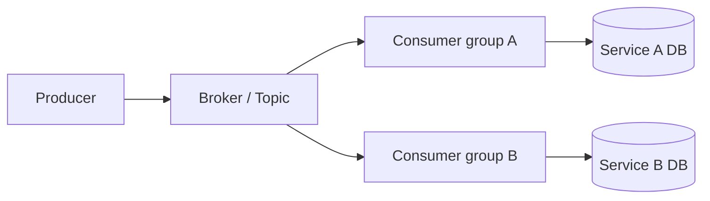

# MQ 基础模型

消息队列用于解耦、削峰、异步化和跨服务事件传递。代价是引入延迟、重复消息、乱序、积压和一致性问题。

## 后续扩写

- Kafka、RabbitMQ、RocketMQ 的模型差异。
- topic、partition、consumer group。
- at-most-once、at-least-once、effectively-once。

## 延伸阅读

- [Apache Kafka Documentation](https://kafka.apache.org/documentation/)
- [RabbitMQ Tutorials](https://www.rabbitmq.com/tutorials)
