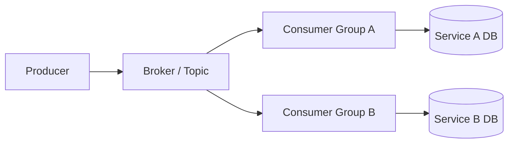
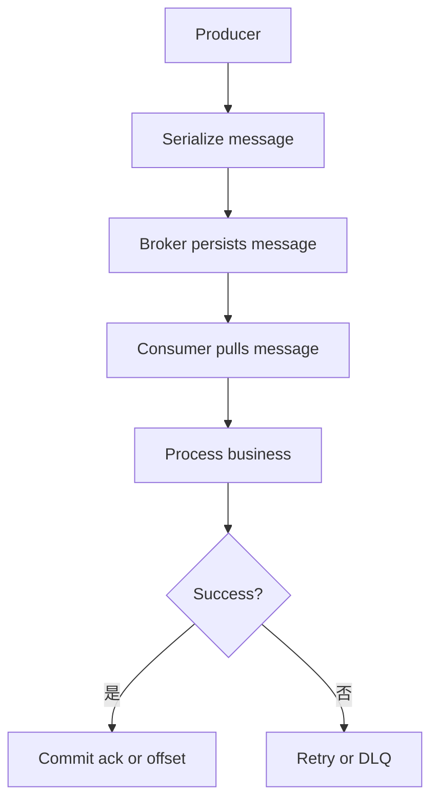
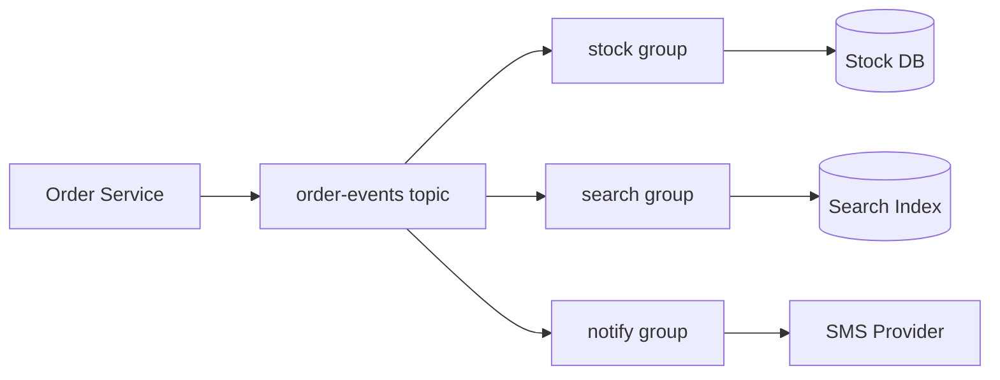

import Tabs from '@theme/Tabs';
import TabItem from '@theme/TabItem';

# MQ 基础模型

消息队列用于解耦、削峰、异步化和跨服务事件传递。它把同步调用改成“生产者发送消息，消费者异步处理”，代价是引入延迟、重复消息、乱序、积压和最终一致性问题。



## 它是什么

MQ 是一种在服务之间传递消息的中间件。生产者把事件或命令写入 broker，消费者从 broker 拉取或接收消息并处理。

常见模型包括：

- **队列模型**：一条消息通常被一个消费者处理，适合任务分发。
- **发布订阅模型**：一条消息可以被多个订阅者处理，适合事件广播。
- **日志模型**：消息按追加日志保存，消费者通过 offset 控制读取位置，Kafka 是代表。

## 为什么需要它

同步 RPC 会让调用方直接承担下游延迟和故障。订单创建后如果同步调用库存、积分、通知、搜索索引，任何一个下游慢都会拖慢主链路。

MQ 可以把主链路和非核心副作用拆开：核心事务先完成，后续动作异步消费，系统在流量高峰时也能通过积压缓冲压力。

## 它解决什么问题

- 服务解耦：生产者不需要知道所有消费者。
- 削峰填谷：高峰流量进入队列，消费者按能力处理。
- 异步化：缩短用户请求关键路径。
- 广播事件：多个业务系统独立订阅同一事件。
- 可恢复处理：消费失败后可以重试或进入死信队列。

## 核心原理

MQ 的核心是持久化消息、分发消息、记录消费进度。



几个基础概念：

| 概念 | 说明 |
| --- | --- |
| Topic / Queue | 消息的逻辑分类或队列 |
| Partition | 分区，提升并行度，也决定局部顺序 |
| Consumer Group | 同组内分摊消息，不同组各自消费一份 |
| Offset / Ack | 消费进度确认 |
| Key | 路由到分区的键，也常用于保证同一业务对象局部有序 |
| DLQ | 死信队列，保存多次失败的消息 |

投递语义：

- **at-most-once**：最多一次，可能丢消息。
- **at-least-once**：至少一次，可能重复，是工程中最常见的默认选择。
- **effectively-once**：通过幂等消费和事务边界实现业务效果上的一次。

## 最小示例

<Tabs groupId="language">
<TabItem value="java" label="Java">

```java
class OrderEvents {
    private final MessageProducer producer;

    void publishOrderCreated(String orderId) {
        Message msg = new Message(
            "order-events",
            orderId,
            "OrderCreated",
            "{\"orderId\":\"" + orderId + "\"}"
        );
        producer.send(msg);
    }
}
```

</TabItem>
<TabItem value="go" label="Go">

```go
package messaging

import "context"

type Producer interface {
    Send(ctx context.Context, topic string, key string, value []byte) error
}

func PublishOrderCreated(ctx context.Context, p Producer, orderID string) error {
    payload := []byte(`{"type":"OrderCreated","orderId":"` + orderID + `"}`)
    return p.Send(ctx, "order-events", orderID, payload)
}
```

</TabItem>
<TabItem value="typescript" label="TypeScript">

```ts
async function publishOrderCreated(producer: Producer, orderId: string) {
  await producer.send({
    topic: "order-events",
    key: orderId,
    value: JSON.stringify({ type: "OrderCreated", orderId }),
  });
}
```

</TabItem>
<TabItem value="python" label="Python">

```python
import json


async def publish_order_created(producer, order_id: str) -> None:
    await producer.send(
        topic="order-events",
        key=order_id.encode(),
        value=json.dumps({"type": "OrderCreated", "order_id": order_id}).encode(),
    )
```

</TabItem>
</Tabs>

## 工程实践

- 事件命名使用过去式，例如 `OrderCreated`，表示事实已经发生。
- 用业务 ID 作为 message key，保证同一订单进入同一分区，获得局部顺序。
- 消费者按至少一次投递设计，必须幂等。
- 消息 payload 加 schema version，便于兼容演进。
- 监控生产速率、消费速率、消费延迟、积压量、失败率和重平衡次数。
- 关键业务事件优先配合 Outbox Pattern，避免数据库成功但消息丢失。

## 常见坑

- 把 MQ 当同步 RPC 使用，请求线程等待消费结果。
- 消费者没有幂等，重复消息导致重复扣款或重复发货。
- 以为 topic 内全局有序，忽略多分区只保证分区内有序。
- 消息体没有版本，消费者升级时被旧消息打崩。
- 积压只看消息条数，不看最老消息年龄。
- 单条坏消息无限重试，阻塞同一分区后续消息。

## 完整案例

订单创建后，需要通知库存预占、搜索索引、短信通知和数据分析。同步调用会让订单接口被多个下游拖慢。改为 MQ 后，订单服务只在本地事务中创建订单和 outbox 事件，发布器把 `OrderCreated` 写入 `order-events` topic。

库存服务、搜索服务、通知服务分别使用不同 consumer group 订阅同一 topic。库存服务用订单 ID 做幂等，搜索和通知可以独立失败重试，不影响订单创建主链路。



## 检查清单

- 消息是命令还是事件，语义是否清楚？
- topic、key、partition 和 consumer group 是否设计明确？
- 消费者是否按至少一次投递做幂等？
- 是否需要同一业务对象的局部顺序？
- 是否有 schema version 和兼容策略？
- 是否监控积压、消费延迟、失败率和 DLQ？
- 关键消息是否使用 outbox 或等价可靠发布机制？

## 延伸阅读

- [Apache Kafka Documentation](https://kafka.apache.org/documentation/)
- [RabbitMQ Tutorials](https://www.rabbitmq.com/tutorials)
- [Google Cloud: Pub/Sub architecture](https://cloud.google.com/pubsub/docs/overview)
- [Microservices.io: Event-driven architecture](https://microservices.io/patterns/data/event-driven-architecture.html)
