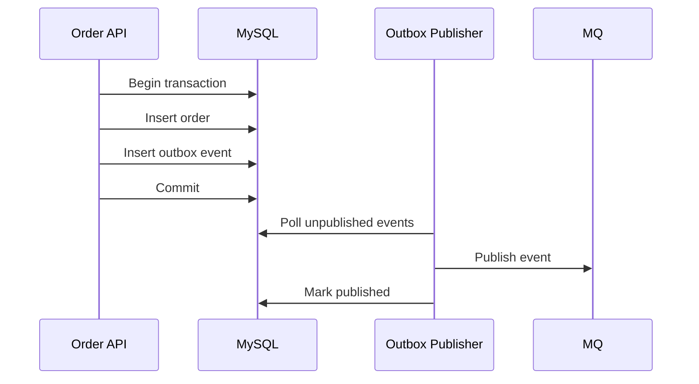

# Outbox Pattern

Outbox Pattern 用来解决“数据库写入成功，但消息发送失败”的一致性问题。服务在同一个本地事务里写业务表和 outbox 表，再由后台发布器把 outbox 事件投递到 MQ。

## 后续扩写

- polling publisher。
- CDC + binlog。
- 发布幂等和消息去重。

## 延伸阅读

- [Microservices.io: Transactional Outbox](https://microservices.io/patterns/data/transactional-outbox.html)
- [Debezium: Outbox Event Router](https://debezium.io/documentation/reference/stable/transformations/outbox-event-router.html)
