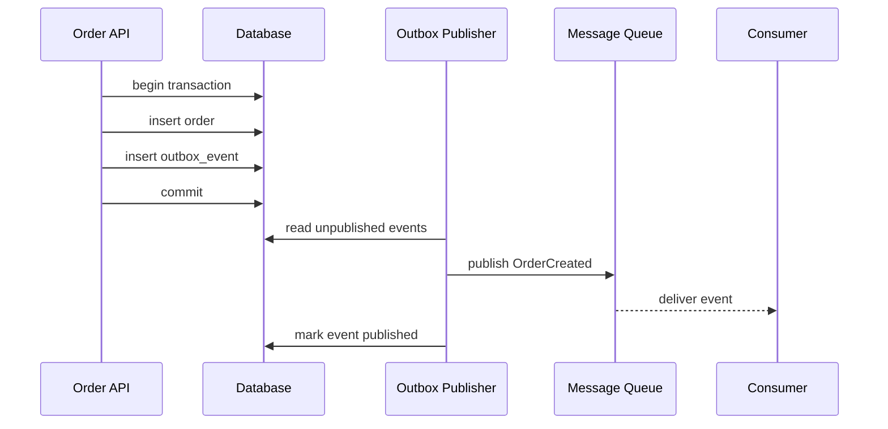
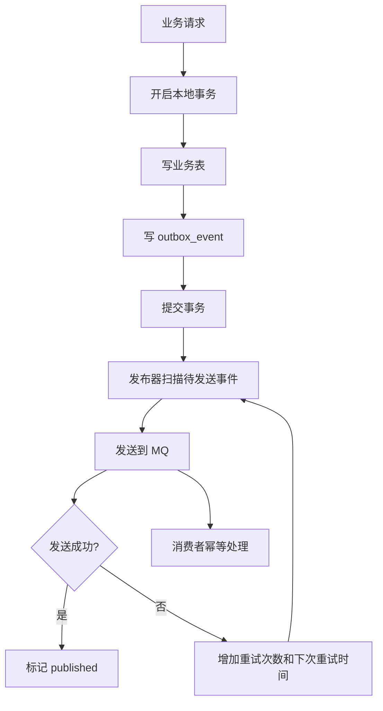
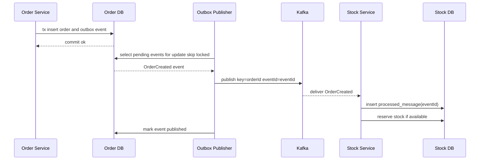

import Tabs from '@theme/Tabs';
import TabItem from '@theme/TabItem';

# Outbox Pattern

Outbox Pattern 用来解决“业务数据库写入成功，但消息发送失败”的一致性问题。它把业务数据和待发送消息写入同一个本地事务，再由后台发布器把 outbox 表里的事件投递到消息队列。

## 先理解这些概念

- **本地事务**：同一个数据库里的多次写入一起提交或一起回滚。
- **业务表**：真正保存业务状态的表，比如订单表。
- **Outbox 表**：和业务表在同一个数据库里，保存“待发送消息”。
- **发布器 Publisher**：后台任务，读取 outbox 表并发送到 MQ。
- **至少一次发布**：消息可能重复发，但不能轻易丢。
- **消费者幂等**：下游收到重复消息时，业务结果只生效一次。

读这篇时先记住：Outbox 不追求数据库和 MQ 同时强一致提交，而是先把“要发的消息”可靠写进数据库，再慢慢发出去。



## 它是什么

Outbox 是业务库里的一个事件表。服务在一个数据库事务里同时写业务表和 outbox 表，确保“业务状态变化”和“事件记录生成”同时成功或同时失败。后续由独立发布器读取 outbox 表，把事件发送到 Kafka、RabbitMQ、Pulsar、SQS 等消息系统。

它不追求一次性完成“数据库事务 + MQ 事务”的强一致提交，而是把问题拆成两个阶段：先用本地事务可靠记录要发送的消息，再用后台任务至少一次发布。

## 为什么需要它

很多业务动作都需要同时修改数据库并通知其他系统。例如订单创建后要通知库存、积分、风控、搜索索引。如果代码先写数据库再发消息，发消息失败会导致下游永远不知道这次变更；如果先发消息再写数据库，下游可能消费到一个最终没有落库的订单。

分布式事务通常成本高、耦合重，很多互联网后端会选择 Outbox，用最终一致性换取更好的可靠性和可运维性。

## 它解决什么问题

Outbox 解决的是跨资源写入的一致性缺口：数据库和消息队列无法天然共享同一个本地事务。

它能提供：

- 业务数据提交后，事件不会因为进程崩溃而丢失。
- 消息发布失败可以重试，不需要重新执行业务操作。
- 发布器可以水平扩展，通过锁定或分片处理待发布事件。
- 事件发布至少一次，消费者通过幂等保证最终正确。

它不能提供：

- 消息严格只发送一次。
- 所有消费者立即看到最新状态。
- 没有幂等设计时的端到端一致性。

## 核心原理

Outbox 的关键是不把 MQ 发送放进用户请求的关键一致性路径，而是把“要发送什么”持久化下来。



常见 outbox 表字段：

| 字段 | 说明 |
| --- | --- |
| `id` | 事件唯一 ID，也可作为消息 key 或幂等键 |
| `aggregate_type` | 业务聚合类型，例如 `order` |
| `aggregate_id` | 业务对象 ID，例如订单 ID |
| `event_type` | 事件类型，例如 `OrderCreated` |
| `payload` | JSON 事件内容 |
| `status` | `pending`、`publishing`、`published`、`failed` |
| `retry_count` | 已重试次数 |
| `next_retry_at` | 下次可发布时间 |
| `created_at` | 创建时间 |

发布方式通常有两类：

- **轮询发布器**：应用定时扫描 outbox 表，适合实现简单、流量中等的系统。
- **CDC 发布器**：Debezium 等组件订阅数据库 binlog，把 outbox insert 转换成 MQ 消息，适合事件量大、希望降低轮询压力的系统。

## 最小示例

下面示例只展示在同一个本地事务里写订单和 outbox 事件。

<Tabs groupId="language">
<TabItem value="java" label="Java">

```java
import java.util.UUID;

class OrderService {
    private final TransactionTemplate tx;
    private final OrderRepository orders;
    private final OutboxRepository outbox;

    OrderService(TransactionTemplate tx, OrderRepository orders, OutboxRepository outbox) {
        this.tx = tx;
        this.orders = orders;
        this.outbox = outbox;
    }

    String createOrder(CreateOrderCommand cmd) {
        return tx.execute(() -> {
            String orderId = UUID.randomUUID().toString();
            orders.insert(orderId, cmd.userId(), cmd.amount());
            outbox.insert(new OutboxEvent(
                UUID.randomUUID().toString(),
                "order",
                orderId,
                "OrderCreated",
                Json.stringify(cmd)
            ));
            return orderId;
        });
    }
}
```

</TabItem>
<TabItem value="go" label="Go">

```go
package order

import (
    "context"
    "encoding/json"

    "github.com/google/uuid"
)

func CreateOrder(ctx context.Context, db DB, cmd CreateOrderCommand) (string, error) {
    orderID := uuid.NewString()
    payload, _ := json.Marshal(cmd)

    err := db.WithTx(ctx, func(tx Tx) error {
        if err := tx.Exec("insert into orders(id, user_id, amount) values(?, ?, ?)", orderID, cmd.UserID, cmd.Amount); err != nil {
            return err
        }
        return tx.Exec(`insert into outbox_events(id, aggregate_type, aggregate_id, event_type, payload, status)
            values(?, ?, ?, ?, ?, 'pending')`, uuid.NewString(), "order", orderID, "OrderCreated", payload)
    })
    return orderID, err
}
```

</TabItem>
<TabItem value="typescript" label="TypeScript">

```ts
import { randomUUID } from "node:crypto";

async function createOrder(db: Database, cmd: CreateOrderCommand) {
  const orderId = randomUUID();

  await db.transaction(async (tx) => {
    await tx.orders.insert({ id: orderId, userId: cmd.userId, amount: cmd.amount });
    await tx.outboxEvents.insert({
      id: randomUUID(),
      aggregateType: "order",
      aggregateId: orderId,
      eventType: "OrderCreated",
      payload: JSON.stringify(cmd),
      status: "pending",
    });
  });

  return orderId;
}
```

</TabItem>
<TabItem value="python" label="Python">

```python
import json
import uuid


async def create_order(db, cmd: dict) -> str:
    order_id = str(uuid.uuid4())

    async with db.transaction() as tx:
        await tx.execute(
            "insert into orders(id, user_id, amount) values($1, $2, $3)",
            order_id,
            cmd["user_id"],
            cmd["amount"],
        )
        await tx.execute(
            """insert into outbox_events
               (id, aggregate_type, aggregate_id, event_type, payload, status)
               values($1, $2, $3, $4, $5, 'pending')""",
            str(uuid.uuid4()),
            "order",
            order_id,
            "OrderCreated",
            json.dumps(cmd),
        )

    return order_id
```

</TabItem>
</Tabs>

## 工程实践

- outbox 写入必须和业务写入在同一个数据库事务里完成。
- 事件 ID 要全局唯一，并传递给消费者作为幂等键。
- 发布器要支持至少一次发布，发送 MQ 成功但标记 published 失败时会重复发送。
- 消费者必须幂等，例如维护 `processed_message` 表、使用唯一索引或业务状态机。
- 发布器读取事件时要避免多实例重复抢同一批数据，可使用 `SELECT ... FOR UPDATE SKIP LOCKED` 或按分片扫描。
- 失败事件要有重试退避、最大重试次数和死信处理。
- payload 要有版本字段，避免事件结构演进破坏旧消费者。
- 监控 outbox 堆积量、最老 pending 事件年龄、发布成功率、重试次数和死信数量。

## 常见坑

- 在事务提交前发送 MQ，消费者可能读不到对应业务数据。
- 只在内存队列里暂存待发送消息，进程崩溃后事件丢失。
- 认为 outbox 能保证 exactly once，消费者没有做幂等。
- 发布器先标记 published 再发送 MQ，发送失败后事件被错误跳过。
- outbox 表无限增长，没有归档和清理策略。
- 所有事件共用一个大表且没有索引，发布器扫描越来越慢。
- payload 直接塞完整数据库行，导致事件兼容性和隐私边界失控。

## 完整案例

订单服务创建订单后，需要让库存服务预占库存。最初实现是在订单事务提交后直接调用 MQ。一次发布过程中网络抖动，订单已经创建成功，但 `OrderCreated` 消息没有发出去，库存服务没有预占库存，用户后续支付时才发现库存不足。

改造后，订单服务在同一个事务里写入 `orders` 和 `outbox_events`。发布器每秒读取 pending 事件，发到 Kafka 后标记 published。库存服务消费 `OrderCreated` 时用事件 ID 写入 `processed_message` 表，重复消息会被唯一索引拦住。



发布器伪代码：

```text
loop:
  events = select pending events where next_retry_at <= now limit 100 for update skip locked
  for event in events:
    try publish(event.id, event.aggregate_id, event.payload)
    if success: mark published
    else: retry_count += 1, next_retry_at = now + backoff(retry_count)
```

这个设计的最终一致性边界很清楚：订单提交后事件一定留在数据库里；事件可能重复发布；库存消费必须幂等；如果 MQ 长时间不可用，outbox 会堆积并触发告警。

## 检查清单

- 业务表和 outbox 表是否在同一个本地事务中写入？
- 事件是否有全局唯一 ID 和明确的 schema 版本？
- 发布器是否按至少一次语义设计，而不是假设只会发送一次？
- 消费者是否用事件 ID 或业务唯一键实现幂等？
- 发布器多实例运行时是否避免重复抢占同一批事件？
- outbox 表是否有适合 `status`、`next_retry_at`、`created_at` 的索引？
- 是否有重试退避、死信、归档和告警？
- 是否定义了事件顺序要求，例如同一 `aggregate_id` 使用同一个 MQ key？

## 这篇文章在系统里怎么用

Outbox 常用于订单创建、支付成功、退款成功、库存变化这类“数据库状态变了，必须通知其他系统”的场景。它解决的是数据库提交成功但 MQ 发送失败的问题。

系统设计时，提到 Outbox 要继续说明：业务表和 outbox 表在同一个事务写入，发布器如何重试，消息可能重复，下游如何幂等，outbox 堆积如何告警和清理。

## 术语回看

- [Outbox](../system-design/glossary.md#outbox)
- [最终一致性](../system-design/glossary.md#最终一致性)
- [幂等](../system-design/glossary.md#幂等)
- [DLQ](../system-design/glossary.md#dlq)

## 延伸阅读

- [Microservices.io: Transactional Outbox](https://microservices.io/patterns/data/transactional-outbox.html)
- [Debezium: Outbox Event Router](https://debezium.io/documentation/reference/stable/transformations/outbox-event-router.html)
- [Confluent: Change Data Capture](https://www.confluent.io/learn/change-data-capture/)
- [AWS Prescriptive Guidance: Transactional outbox pattern](https://docs.aws.amazon.com/prescriptive-guidance/latest/cloud-design-patterns/transactional-outbox.html)
