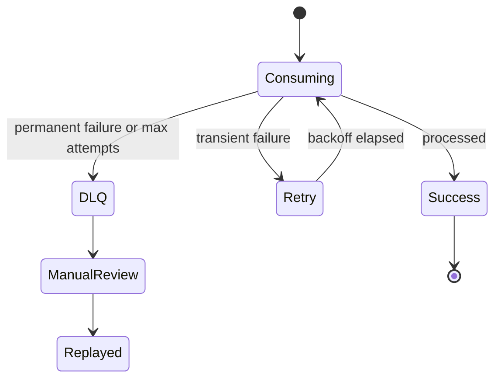
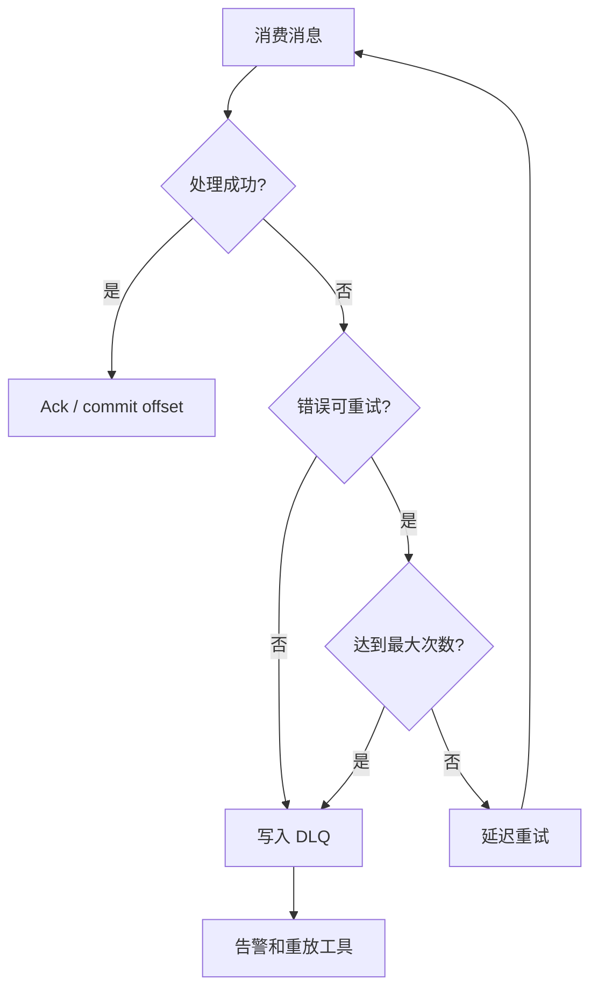
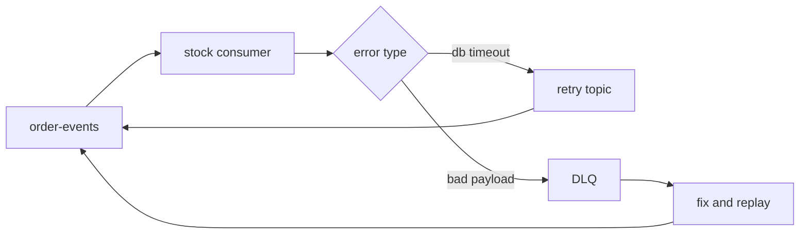

import Tabs from '@theme/Tabs';
import TabItem from '@theme/TabItem';

# 重试与死信队列

消费失败不能简单无限重试。合理的 MQ 失败处理需要错误分类、退避、最大次数、死信队列、告警和安全重放，避免单条坏消息阻塞整条消费链路。



## 它是什么

重试是消费失败后再次处理消息；死信队列是保存无法继续正常消费消息的隔离队列。它们一起构成 MQ 消费失败的恢复机制。

失败可以分为两类：

- **临时失败**：数据库短暂不可用、RPC 超时、限流、锁冲突，适合延迟重试。
- **永久失败**：消息格式错误、必需字段缺失、业务状态不允许、schema 不兼容，应进入 DLQ。

## 为什么需要它

MQ 通常按至少一次投递工作，消费者失败后消息会再次出现。如果没有边界，坏消息会无限重试，占满消费者线程，甚至阻塞同一分区的后续消息。

重试和 DLQ 的价值是把“可恢复错误”和“需要人工或补丁处理的错误”分开，让系统能继续处理健康消息。

## 它解决什么问题

- 临时故障自动恢复，不需要人工介入。
- 单条毒消息不会无限阻塞消费。
- 保留失败现场，便于排查和补偿。
- 支持修复代码或数据后安全重放。

## 核心原理

消费失败后，系统根据错误类型和尝试次数决定下一步。



常见实现方式：

- RabbitMQ：DLX、TTL 延迟队列、重新投递。
- Kafka：应用维护 retry topic，例如 `orders.retry.1m`、`orders.retry.10m`、`orders.dlq`。
- SQS：visibility timeout、redrive policy、DLQ。

## 最小示例

<Tabs groupId="language">
<TabItem value="java" label="Java">

```java
class Consumer {
    void handle(Message msg) {
        try {
            process(msg);
            msg.ack();
        } catch (PermanentException e) {
            dlq.publish(msg, e);
            msg.ack();
        } catch (TransientException e) {
            if (msg.attempts() >= 5) {
                dlq.publish(msg, e);
            } else {
                retry.publish(msg, backoff(msg.attempts()));
            }
            msg.ack();
        }
    }
}
```

</TabItem>
<TabItem value="go" label="Go">

```go
package retrydlq

func Handle(msg Message, retry Publisher, dlq Publisher) error {
    err := Process(msg)
    if err == nil {
        return msg.Ack()
    }
    if !IsRetryable(err) || msg.Attempts >= 5 {
        _ = dlq.Publish(msg.WithError(err))
        return msg.Ack()
    }
    _ = retry.Publish(msg.WithDelay(Backoff(msg.Attempts)))
    return msg.Ack()
}
```

</TabItem>
<TabItem value="typescript" label="TypeScript">

```ts
async function handle(msg: Message, retry: Publisher, dlq: Publisher) {
  try {
    await processMessage(msg);
    await msg.ack();
  } catch (err) {
    if (!isRetryable(err) || msg.attempts >= 5) {
      await dlq.publish({ ...msg, error: String(err) });
    } else {
      await retry.publish(msg, { delayMs: backoff(msg.attempts) });
    }
    await msg.ack();
  }
}
```

</TabItem>
<TabItem value="python" label="Python">

```python
async def handle(message, retry_publisher, dlq_publisher):
    try:
        await process_message(message)
        await message.ack()
    except Exception as exc:
        if not is_retryable(exc) or message.attempts >= 5:
            await dlq_publisher.publish(message, error=str(exc))
        else:
            await retry_publisher.publish(message, delay=backoff(message.attempts))
        await message.ack()
```

</TabItem>
</Tabs>

## 工程实践

- 明确错误分类：解析错误、参数错误通常不重试；超时、限流、锁冲突可以重试。
- 重试使用指数退避和 jitter，避免故障恢复时集中冲击下游。
- 最大重试次数后进入 DLQ，并保留 topic、partition、offset、key、payload、错误信息和堆栈。
- DLQ 必须有告警，不能只写进去没人看。
- 重放前要确认消费者幂等，避免重复副作用。
- 对顺序敏感的 topic，要评估跳过坏消息进入 DLQ 是否破坏业务顺序。

## 常见坑

- 消费失败后不 ack，也不转移，导致同一消息被立即无限投递。
- 所有错误都重试，消息格式错误也打满消费者。
- DLQ 没有监控，问题沉默堆积。
- 重放 DLQ 时不限制速率，把下游再次打挂。
- 重放前没有修复根因，消息又回到 DLQ。
- 失败消息没有记录错误上下文，排查只能猜。

## 完整案例

库存服务消费 `OrderCreated` 事件预占库存。一次发布后，部分消息缺少 `sku_id` 字段，消费者反序列化成功但业务校验失败。如果继续无限重试，Kafka 同一分区后面的订单事件都会被卡住。

改造方案：

1. 字段缺失属于永久错误，直接进入 `order-events.dlq`。
2. 数据库超时属于临时错误，进入 1m、5m、30m retry topic。
3. 重试 5 次仍失败进入 DLQ。
4. DLQ 告警包含事件 ID、订单 ID、错误类型和最早失败时间。
5. 修复生产者字段后，通过重放工具按 100 msg/s 限速重放。



## 检查清单

- 是否区分临时错误和永久错误？
- 是否设置最大重试次数和退避策略？
- 是否有 DLQ topic/queue 和告警？
- DLQ 消息是否保留足够排查上下文？
- 是否有安全重放工具和限速机制？
- 消费者是否幂等，能承受重复投递和重放？
- 对顺序敏感消息是否评估跳过和重放的影响？

## 延伸阅读

- [RabbitMQ: Dead Letter Exchanges](https://www.rabbitmq.com/docs/dlx)
- [Kafka Connect: Dead Letter Queue](https://docs.confluent.io/platform/current/connect/errors.html#dead-letter-queue)
- [Amazon SQS: Dead-letter queues](https://docs.aws.amazon.com/AWSSimpleQueueService/latest/SQSDeveloperGuide/sqs-dead-letter-queues.html)
- [Google Cloud Pub/Sub: Handling failures](https://cloud.google.com/pubsub/docs/handling-failures)
