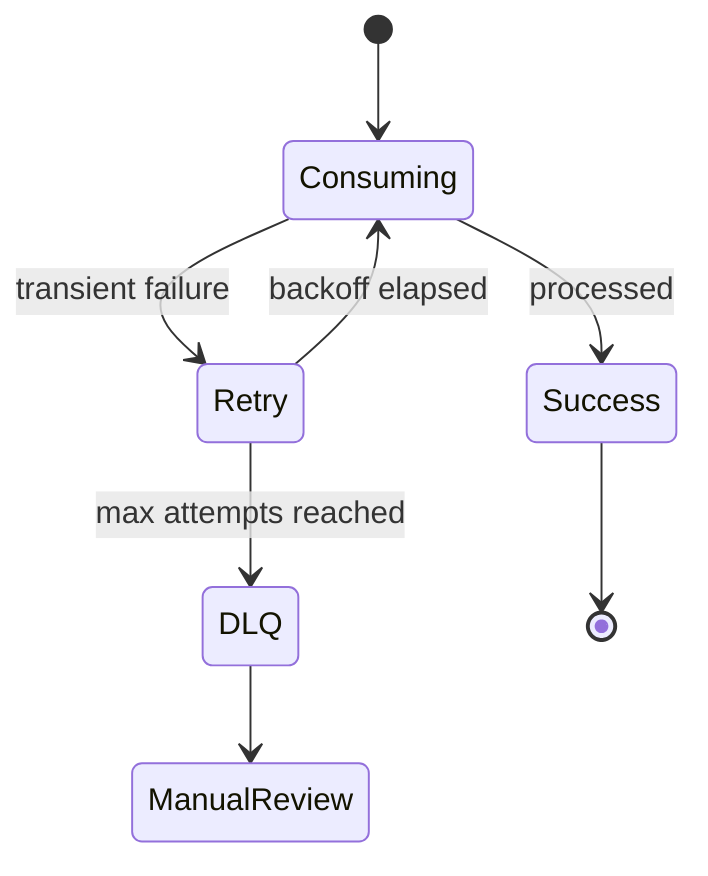

# 重试与死信队列

消费失败不能简单无限重试。合理的重试策略需要退避、最大次数、错误分类和死信队列，避免单条坏消息阻塞整条消费链路。

## 后续扩写

- 可重试错误与不可重试错误。
- 延迟重试队列。
- DLQ 监控、重放和人工处理。

## 延伸阅读

- [RabbitMQ: Dead Letter Exchanges](https://www.rabbitmq.com/docs/dlx)
- [Kafka Connect: Dead Letter Queue](https://docs.confluent.io/platform/current/connect/errors.html#dead-letter-queue)
