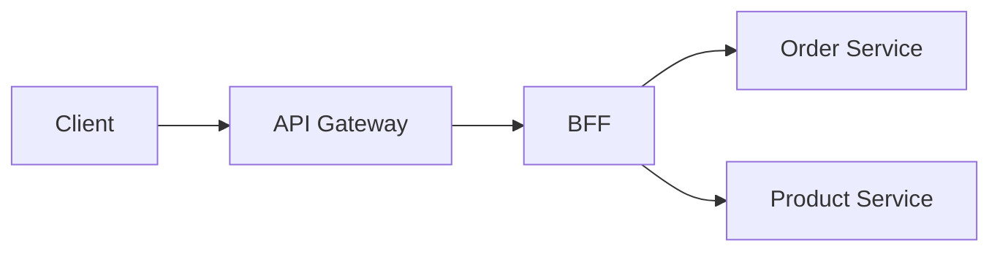

# API Gateway 与 BFF

API Gateway 是后端流量入口，BFF 是面向特定前端体验的后端聚合层。两者都在客户端和服务之间，但职责不同，不能把所有业务逻辑都塞进网关。



## 场景

Gateway 常做：

- TLS 终止、路由、鉴权入口。
- 限流、防刷、黑白名单。
- 统一日志、traceId、指标。
- 灰度路由、版本路由。

BFF 常做：

- 为 Web、App、管理后台分别聚合接口。
- 把多个后端服务的数据组合成页面 DTO。
- 处理展示层字段裁剪和兼容。

## 推荐边界

| 层 | 应该做 | 不应该做 |
| --- | --- | --- |
| Gateway | 通用入口治理 | 复杂业务状态机 |
| BFF | 面向端的聚合和适配 | 直接写多个服务数据库 |
| Domain Service | 业务规则和数据 owner | 处理页面展示细节 |

## 反例：网关里写业务逻辑

```pseudo
function gatewayHandleCreateOrder(request):
    checkAuth(request)
    reserveInventory(request)
    createOrder(request)
    callPayment(request)
```

问题：

- 网关变成业务服务，职责膨胀。
- 业务变更需要发布网关，风险扩大。
- 多团队共享网关时互相影响。

推荐：网关只做通用治理，把业务交给服务。

```pseudo
function gateway(request):
    traceId = ensureTraceId(request)
    user = authenticate(request)
    rateLimit(user, request.path)
    routeToBackend(request, user, traceId)
```

## BFF 聚合伪代码

```pseudo
function getOrderDetailPage(orderId, userId):
    order = orderService.getOrder(orderId, userId)
    product = productService.getProduct(order.skuId)
    payment = paymentService.getPaymentStatus(order.paymentId)

    return {
        orderId: order.id,
        status: order.status,
        productName: product.name,
        payStatus: payment.status
    }
```

BFF 聚合要设置超时和降级。商品推荐、评论摘要这类弱依赖失败时，可以隐藏；订单状态这类强依赖失败时，应该返回错误。

## 失败补偿

| 问题 | 后果 | 处理 |
| --- | --- | --- |
| 网关限流配置错误 | 大量误伤用户 | 灰度配置、白名单、快速回滚 |
| BFF 串行调用太多服务 | 页面变慢 | 并行调用、超时、降级、缓存 |
| Gateway 和 BFF 都做鉴权 | 规则不一致 | 网关做入口认证，服务做资源授权 |
| BFF 直接写多服务数据 | 一致性混乱 | 写操作回到 domain service |

## 面试怎么讲

可以这样回答：

> API Gateway 是统一入口，主要做路由、鉴权入口、限流、日志、trace 和灰度。BFF 是面向某类客户端的聚合层，比如 App 订单详情页需要订单、商品、支付状态，BFF 可以组合这些服务的数据。复杂业务规则不应该放网关，数据写入也不应该由 BFF 直接跨服务改表。服务自身仍要做资源级授权，因为不能只信任网关。

## 检查清单

- Gateway 是否只放通用治理逻辑？
- BFF 是否只做聚合和端适配？
- 服务是否仍做资源级授权？
- BFF 调下游是否有超时、并行和降级？
- 网关限流和灰度配置是否可回滚？

## 延伸阅读

- [一个请求的完整生命周期](../fundamentals/request-lifecycle.md)
- [限流算法深挖](../algorithms/rate-limit-algorithms.md)
- [熔断与降级](../reliability/circuit-breaker.md)
