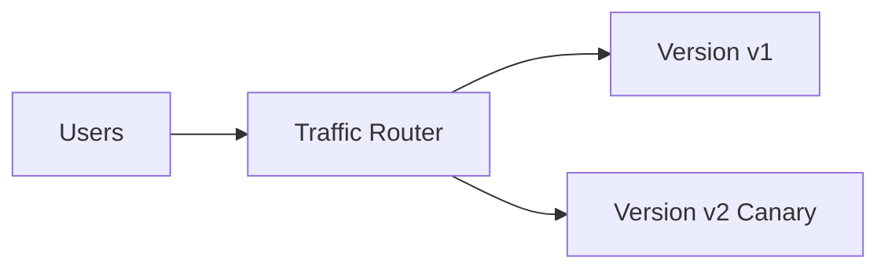

# 灰度发布与回滚

后端服务发布不是“把新版本全量上线”。可靠发布需要控制影响面，先让少量流量进入新版本，观察指标，再逐步放量。如果出问题，要能快速回滚。



## 场景

常见发布方式：

- 蓝绿发布：两套环境切流量。
- 金丝雀发布：先 1%、5%、20%、100% 放量。
- 按用户灰度：内部用户、白名单用户、新用户。
- 按地域灰度：先某个机房或城市。

## 推荐发布流程

```text
1. 部署新版本但不接流量
2. 健康检查通过
3. 内部流量灰度
4. 1% 真实流量
5. 观察错误率、P99、业务指标
6. 逐步放量
7. 异常时回滚或停止放量
```

伪代码：

```pseudo
function routeRequest(userId):
    if userId in canaryWhitelist:
        return "v2"

    if hash(userId) % 100 < canaryPercent:
        return "v2"

    return "v1"
```

## 数据库变更要兼容

数据库发布最容易破坏回滚。推荐 expand-contract：

```text
1. 先加新字段，新旧代码都兼容
2. 发布新代码，开始写新字段
3. 后台回填历史数据
4. 确认无旧代码依赖后，再删除旧字段
```

反例：先删字段再发代码。

```text
旧版本仍在运行 -> 查询旧字段失败 -> 大量 500
```

## 回滚策略

回滚不只是部署旧代码，还要考虑：

- 新版本是否写了旧版本不认识的数据。
- MQ 消息 schema 是否兼容。
- 缓存 key 是否变更。
- 数据库迁移是否可逆。

推荐事件 schema 向后兼容：

```json
{
  "eventType": "OrderCreated",
  "version": 2,
  "orderId": "ord_1",
  "newOptionalField": "value"
}
```

旧消费者忽略未知字段，新消费者兼容缺失字段。

## 观测指标

灰度至少观察：

```text
http_error_rate{version}
http_duration_p99{version}
business_success_rate{version}
dependency_error_rate{version,dependency}
mq_consumer_lag{version}
```

不要只看 CPU。很多发布问题首先体现在业务成功率和错误率。

## 失败补偿

| 问题 | 后果 | 处理 |
| --- | --- | --- |
| 灰度规则错误 | 错误用户进入新版本 | 白名单和百分比规则可回滚 |
| 新版本错误率升高 | 用户受影响 | 停止放量，切回 v1 |
| DB 变更不兼容 | 旧版本无法运行 | expand-contract，禁止破坏性变更先行 |
| MQ schema 不兼容 | 消费失败 | 事件版本化，消费者兼容旧新格式 |

## 面试怎么讲

可以这样回答：

> 灰度发布是控制新版本影响面的发布方式。我会先部署新版本但不接流量，健康检查通过后让内部用户或 1% 流量进入，观察错误率、P99 和业务成功率，再逐步放量。回滚要考虑代码、数据库、MQ schema 和缓存 key 是否兼容。数据库变更采用 expand-contract：先加字段并兼容旧代码，再发布新代码，回填数据，最后删除旧字段。

## 检查清单

- 是否支持按用户、百分比或地域灰度？
- 灰度版本和稳定版本指标是否分开？
- 回滚是否只需要切流量，而不是手工修数据？
- DB 变更是否向前向后兼容？
- MQ 事件 schema 是否版本化？

## 延伸阅读

- [日志、指标与链路追踪](../observability/logging-metrics-tracing.md)
- [SLO 与告警](../observability/slo-alerting.md)
- [线上排障案例](../interview/production-troubleshooting.md)
