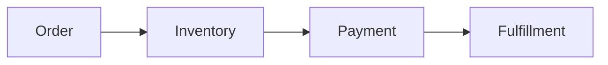
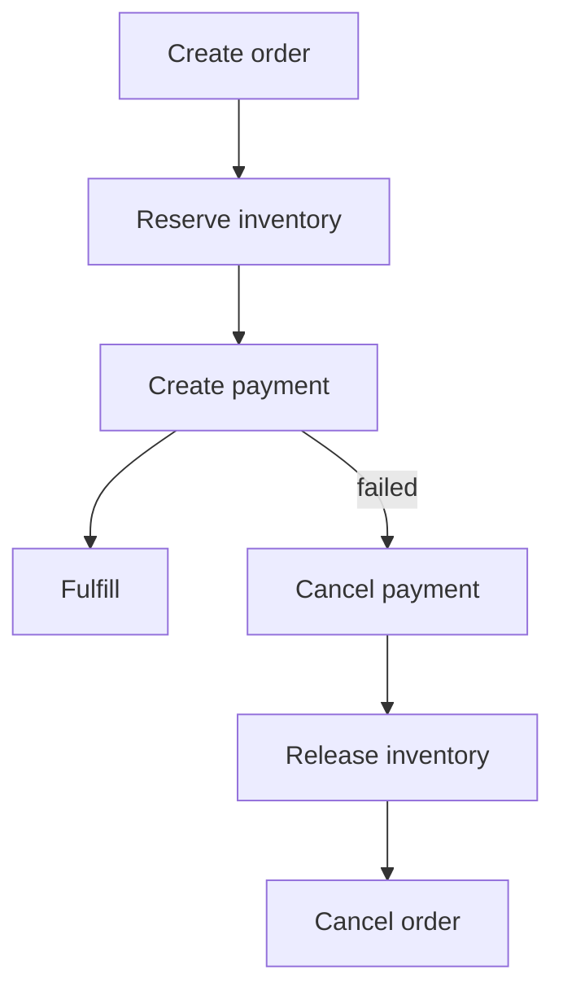

# Saga 与 TCC

微服务拆分后，一个业务流程可能跨订单、库存、支付、履约多个服务。它们不能像单库事务一样一起提交。Saga 和 TCC 是两种常见的分布式一致性模式。



## 为什么不用大事务

跨服务强事务会带来：

- 长时间锁资源。
- 服务之间强耦合。
- 任一服务慢都会拖住整个事务。
- 可用性和扩展性差。

互联网业务通常更常用最终一致：每一步本地提交，失败时执行补偿。

## Saga 是什么

Saga 把一个大事务拆成多个本地事务，每个本地事务都有补偿动作。



伪代码：

```pseudo
function createOrderSaga(request):
    try:
        order = orderService.create(request)
        inventoryService.reserve(order.id, request.items)
        paymentService.createPayment(order.id, request.amount)
        return SUCCESS
    catch error:
        paymentService.cancelIfExists(order.id)
        inventoryService.releaseIfReserved(order.id)
        orderService.cancel(order.id)
        return FAILED
```

补偿动作必须幂等。`releaseIfReserved` 可以执行多次，结果都一样。

## TCC 是什么

TCC 分成 Try、Confirm、Cancel：

- Try：预留资源。
- Confirm：确认使用资源。
- Cancel：释放预留资源。

库存 TCC：

```pseudo
function tryReserve(orderId, skuId, quantity):
    deduct available
    add reserved(orderId, skuId, quantity)

function confirmReserve(orderId):
    move reserved to sold

function cancelReserve(orderId):
    release reserved back to available
```

TCC 比 Saga 更强，但要求每个参与服务都实现 Try/Confirm/Cancel，业务侵入更大。

## Saga vs TCC

| 模式 | 优点 | 代价 | 适合场景 |
| --- | --- | --- | --- |
| Saga | 实现相对简单，基于事件补偿 | 中间状态可见 | 订单、通知、履约 |
| TCC | 资源预留明确，一致性更强 | 业务侵入大 | 库存、账户余额、票务占座 |

## 反例：没有补偿

```pseudo
function badCreateOrder(request):
    orderService.create(request)
    inventoryService.reserve(request)
    paymentService.createPayment(request)  # failed
```

问题：订单已创建，库存已预占，但支付创建失败。如果没有补偿，库存会一直占住，订单状态也会卡住。

## 状态表设计

```sql
create table saga_instances (
  saga_id varchar(64) primary key,
  business_id varchar(64) not null,
  status varchar(32) not null,
  current_step varchar(64) not null,
  error_message text,
  created_at timestamp not null,
  updated_at timestamp not null
);
```

## 失败补偿

| 问题 | 后果 | 处理 |
| --- | --- | --- |
| 补偿动作失败 | 状态卡住 | 重试、告警、人工介入 |
| 补偿重复执行 | 释放多次资源 | 补偿动作幂等 |
| Confirm 丢失 | 资源长期预留 | 超时扫描 Cancel |
| 服务回调乱序 | 状态回退 | 状态机条件更新 |

## 面试怎么讲

可以这样回答：

> 微服务里跨服务大事务成本高，所以常用最终一致。Saga 是把流程拆成多个本地事务，每一步失败时执行相反的补偿动作，比如创建订单后库存预占失败，就取消订单；支付失败就释放库存。TCC 更明确，Try 阶段预留资源，Confirm 确认，Cancel 释放，适合库存和账户这类资源预留场景。无论 Saga 还是 TCC，补偿和 Confirm/Cancel 都必须幂等，并且要有状态表和超时扫描。

## 检查清单

- 每个步骤是否有补偿动作？
- 补偿动作是否幂等？
- 是否有 Saga/TCC 状态表？
- 中间状态用户是否能理解？
- 超时未完成的流程是否会被扫描补偿？

## 延伸阅读

- [订单系统设计](../system-design/order-system.md)
- [下单链路组件协作完整案例](../collaboration/order-flow-collaboration.md)
- [Microservices.io: Saga](https://microservices.io/patterns/data/saga.html)
