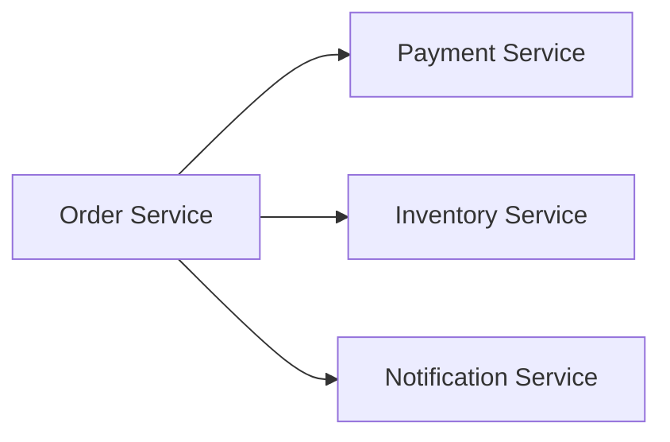
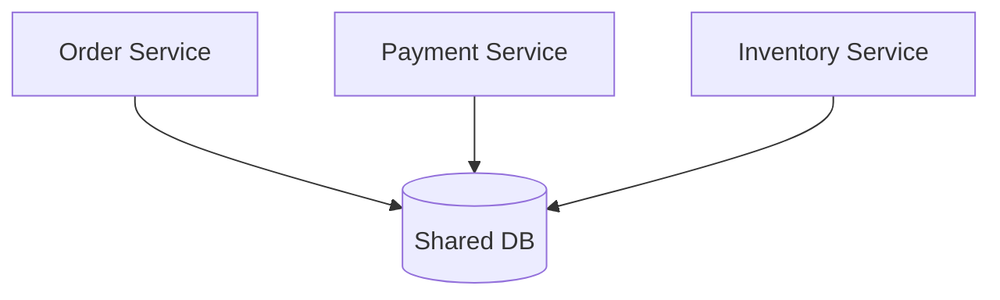
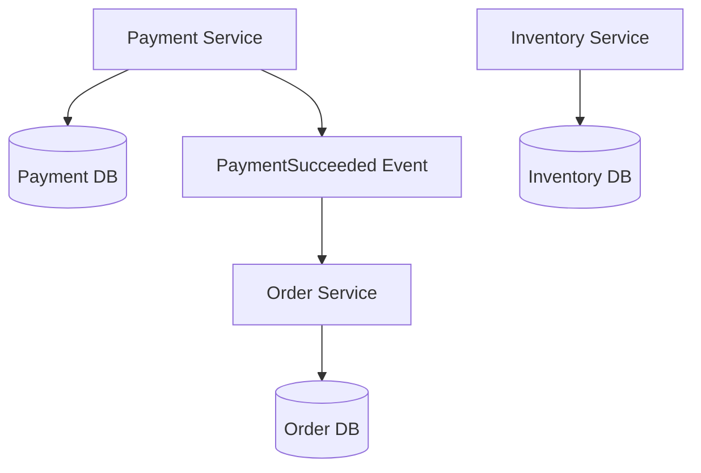

# 微服务拆分与边界

微服务不是“把代码拆成很多服务”。真正难的是边界：哪些能力应该独立，哪些数据归谁管理，服务之间如何协作，拆分后故障和一致性怎么处理。



## 场景

适合拆服务的信号：

- 团队规模变大，不同业务模块需要独立发布。
- 某些模块负载差异明显，例如订单写多、商品读多。
- 某些能力需要独立治理，例如支付、风控、通知。
- 数据边界清晰，有明确负责人。

不适合拆服务的信号：

- 业务还不稳定，边界经常变化。
- 只是为了“架构先进”。
- 团队没有服务治理、监控、部署、排障能力。
- 拆完以后仍共享同一个数据库大量表。

## 推荐拆分原则

按业务能力拆，而不是按技术层拆。

```text
推荐：订单服务、支付服务、库存服务、通知服务
不推荐：UserController 服务、OrderDAO 服务、CommonUtil 服务
```

服务边界要满足：

- 有明确业务职责。
- 有自己的数据所有权。
- 对外暴露稳定 API 或事件。
- 能独立发布和扩容。

## 反例：共享数据库



问题：

- 一个服务直接改另一个服务的表，绕过业务规则。
- 数据库表结构变更会影响多个服务。
- 很难判断谁是数据权威。
- 看起来是微服务，本质还是分布式单体。

推荐：每个服务拥有自己的数据，跨服务通过 API 或事件协作。



## 边界怎么判断

可以问这些问题：

| 问题 | 判断 |
| --- | --- |
| 这个模块能否独立定义状态机？ | 能，可能适合独立服务 |
| 数据是否有明确 owner？ | 有，适合独立管理 |
| 是否需要独立扩容？ | 需要，拆分收益更大 |
| 是否频繁和其他模块强事务更新？ | 是，先别急着拆 |
| 失败是否可以通过补偿恢复？ | 可以，适合事件协作 |

## 伪代码：不要跨服务改表

反例：订单服务直接改库存表。

```pseudo
function createOrder(request):
    insert order_db.orders(...)
    update inventory_db.stock set available = available - 1
```

推荐：调用库存服务或发布事件。

```pseudo
function createOrder(request):
    begin transaction
        order = insert orders(...)
        insert outbox_events("OrderCreated", order)
    commit

function inventoryConsumer(event):
    reserveInventory(event.orderId, event.skuId)
```

## 失败补偿

| 问题 | 后果 | 处理 |
| --- | --- | --- |
| 服务拆太细 | 调用链长，排障困难 | 合并边界，按业务能力拆 |
| 共享数据库 | 数据 owner 混乱 | 数据归属单一服务 |
| 跨服务同步调用太多 | 延迟和故障传播 | 异步事件、缓存读模型 |
| 拆分后缺监控 | 故障无法定位 | trace、指标、日志先行 |

## 面试怎么讲

可以这样回答：

> 微服务拆分应该按业务能力拆，而不是按技术层拆。一个服务应该有清晰职责、自己的数据所有权、稳定 API 或事件，并能独立发布和扩容。订单、支付、库存适合拆，因为它们状态机和数据边界不同。但拆分会带来网络调用、最终一致性、监控和运维复杂度，所以业务不稳定或团队治理能力不足时，不应该过早拆。数据库也不应该多个服务共享写表，否则会变成分布式单体。

## 检查清单

- 服务是否按业务能力拆分？
- 每个服务是否有明确数据 owner？
- 是否避免跨服务直接改表？
- 跨服务一致性是否有补偿机制？
- 是否具备 trace、指标、日志和独立发布能力？

## 延伸阅读

- [数据库与 MQ 一致性：Outbox](../collaboration/database-mq-outbox.md)
- [订单系统设计](../system-design/order-system.md)
- [Martin Fowler: Microservices](https://martinfowler.com/articles/microservices.html)
