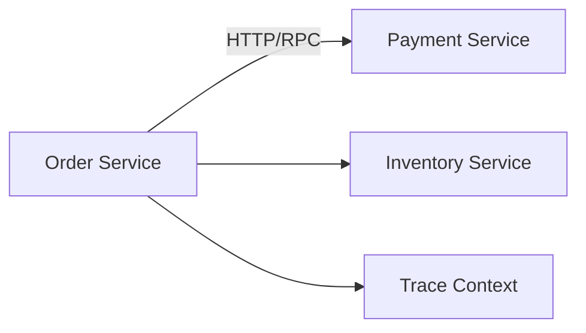
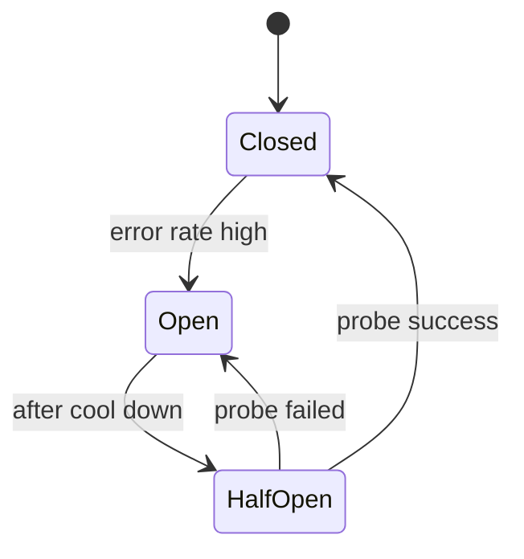

# 服务间调用治理

微服务拆分后，原来的本地函数调用变成网络调用。网络调用会超时、失败、重试、排队，还可能造成级联故障。服务间调用治理就是给这些调用设置边界。



## 场景

订单服务创建订单时可能调用：

- 库存服务预占库存。
- 支付服务创建支付单。
- 优惠券服务锁定优惠。
- 风控服务判断风险。

任何一个下游变慢，都可能拖慢订单服务。

## 推荐做法

每个下游调用都要配置：

```text
timeout + retry + circuit breaker + rate limit + fallback + trace
```

伪代码：

```pseudo
function callInventory(request):
    return circuitBreaker.execute("inventory", fallback = failFast, function():
        return retry(maxAttempts = 2, backoff = jitter, function():
            return http.post(
                url = inventoryUrl,
                timeout = 200 ms,
                headers = { "trace-id": currentTraceId() },
                body = request
            )
        )
    )
```

## 超时预算

不要给每个下游都设置 3 秒超时。如果入口 SLO 是 800ms，要把预算拆开：

```text
Gateway: 50ms
Order Service logic: 100ms
Inventory: 200ms
Payment: 300ms
Buffer: 150ms
```

## 重试风暴

反例：多层都重试。

```text
客户端重试 3 次
网关重试 3 次
订单服务重试库存 3 次
实际放大 27 倍
```

后果：下游本来已经过载，重试让它更过载。

推荐：

- 写操作必须幂等才允许重试。
- 只在一层重试，控制总重试预算。
- 使用退避和 jitter。
- 下游持续异常时熔断。

## 熔断和降级



强依赖和弱依赖处理不同：

| 依赖 | 失败时 |
| --- | --- |
| 库存预占 | 下单失败或进入排队，不可忽略 |
| 支付创建 | 返回支付不可用 |
| 推荐商品 | 降级隐藏 |
| 评论摘要 | 返回空列表 |

## Trace 传递

跨服务调用必须透传 traceId：

```pseudo
function handleRequest(request):
    traceId = request.headers["trace-id"] or generateTraceId()
    callDownstream(headers = { "trace-id": traceId })
    log.info("create order", traceId)
```

没有 traceId，排查一次请求会在多个服务日志里断开。

## 失败补偿

| 问题 | 后果 | 处理 |
| --- | --- | --- |
| 超时过长 | 线程和连接池被占满 | 设置调用预算 |
| 无幂等重试 | 重复下单/扣款 | 幂等键和唯一约束 |
| 多层重试 | 流量放大 | 重试预算和单层重试 |
| 无熔断 | 下游拖垮调用方 | 熔断和 fallback |
| 无 trace | 排障困难 | 统一 traceId 透传 |

## 面试怎么讲

可以这样回答：

> 微服务之间的调用不是普通函数调用，必须设置超时、重试、熔断、限流和 trace。超时要从入口 SLO 倒推，每个下游有预算。重试只能用于幂等操作，并且要有退避和总预算，避免重试风暴。下游持续异常时用熔断快速失败，弱依赖可以降级。traceId 要跨服务透传，否则线上排障无法串联调用链。

## 检查清单

- 每个下游调用是否有 timeout？
- 写操作重试是否有幂等保护？
- 是否避免客户端、网关、服务多层同时重试？
- 是否有熔断和降级策略？
- traceId 是否跨服务透传？
- 是否监控下游 P99、错误率、重试次数、熔断状态？

## 延伸阅读

- [HTTP 超时与重试](../fundamentals/http-timeout-retry.md)
- [超时控制](../reliability/timeout.md)
- [重试策略](../reliability/retry.md)
- [熔断与降级](../reliability/circuit-breaker.md)
