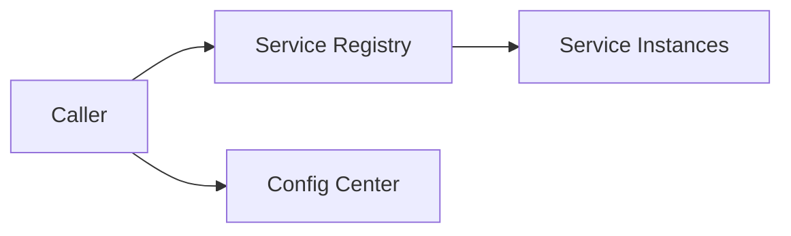

# 服务发现与配置中心

微服务运行时，服务实例会扩容、缩容、重启和迁移。调用方不能把下游地址写死在代码里。服务发现解决“服务在哪里”，配置中心解决“运行参数是什么”。



## 服务发现是什么

服务启动时注册自己：

```pseudo
function onStart():
    registry.register(
        serviceName = "payment-service",
        instanceId = hostname,
        address = "10.0.1.12:8080",
        ttl = 30 seconds
    )
    keepAliveLoop()
```

调用方发现实例：

```pseudo
function callPayment(request):
    instances = registry.list("payment-service")
    instance = loadBalancer.pick(instances)
    return http.post(instance.address + "/payments", request)
```

实例持续心跳，心跳过期后从注册表摘除。

## 配置中心是什么

配置中心保存动态参数：

- 超时和重试配置。
- 限流阈值。
- 开关和灰度规则。
- 下游地址或 topic 名称。

读取配置：

```pseudo
function loadConfig():
    config = configCenter.get("order-service")
    timeoutMs = config.get("payment.timeout.ms")
    rateLimit = config.get("order.create.qps")
```

动态更新要有版本号：

```text
config version 102 -> canary 5% instances
config version 103 -> rollback if error rate rises
```

## 推荐做法

- 服务注册使用 TTL，实例异常后自动摘除。
- 调用方本地缓存服务列表，注册中心短暂不可用时仍能调用旧列表。
- 配置变更先灰度，再全量。
- 关键配置变更要审计和可回滚。
- 配置中心不可用时，服务使用最后一份可用配置。

## 反例：地址写死

```pseudo
paymentUrl = "http://10.0.1.12:8080"
```

问题：

- 实例重启或迁移后调用失败。
- 扩容新实例不会被使用。
- 故障实例不能自动摘除。

## 反例：配置直接全量生效

```pseudo
configCenter.update("order.create.qps", 100)
publishToAllInstancesImmediately()
```

问题：

- 配错一个限流值可能瞬间影响所有用户。
- 没有灰度和回滚窗口。
- 排查时不知道哪个实例用哪个配置版本。

## 失败补偿

| 问题 | 后果 | 处理 |
| --- | --- | --- |
| 注册中心短暂不可用 | 无法获取服务列表 | 使用本地缓存，告警 |
| 实例心跳丢失 | 健康实例被摘除 | TTL 设置合理，允许短暂抖动 |
| 配置错误 | 全站异常 | 灰度发布、版本回滚、审计 |
| 调用方缓存过旧 | 继续打到坏实例 | 服务列表 watch + 主动刷新 |

## 面试怎么讲

可以这样回答：

> 服务发现解决服务实例地址动态变化的问题。服务启动时注册地址和健康状态，调用方从注册中心拿实例列表，再做负载均衡。配置中心保存超时、限流、开关等动态配置，变更要有版本、灰度、审计和回滚。注册中心或配置中心短暂不可用时，服务应使用本地缓存和最后一份可用配置，而不是立刻不可用。

## 检查清单

- 服务实例是否有 TTL 心跳？
- 调用方是否缓存实例列表？
- 配置是否支持版本、灰度、回滚？
- 关键配置变更是否审计？
- 配置中心不可用时是否能用旧配置运行？

## 延伸阅读

- [熔断与降级](../reliability/circuit-breaker.md)
- [超时控制](../reliability/timeout.md)
- [一个请求的完整生命周期](../fundamentals/request-lifecycle.md)
