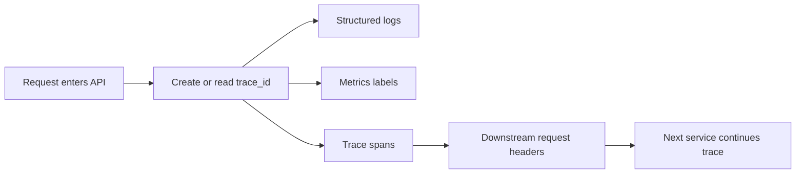
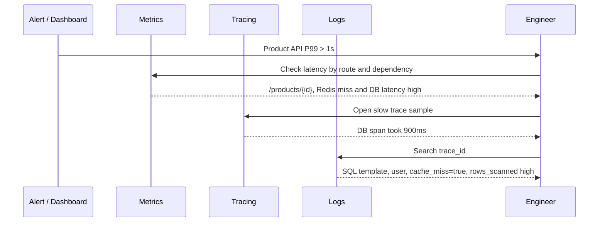
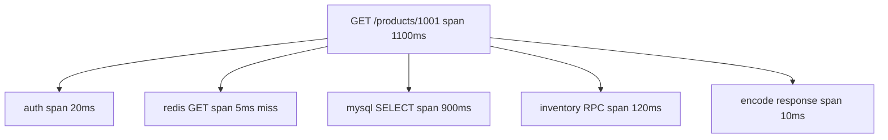

import Tabs from '@theme/Tabs';
import TabItem from '@theme/TabItem';

# 日志、指标与链路追踪

日志回答“发生了什么”，指标回答“整体是否异常”，链路追踪回答“慢在哪里”。三者不是互相替代的工具，而是一套互相跳转的排查系统：先用指标发现异常，再用追踪定位慢在哪一段，最后用日志查看具体上下文。

## 它是什么

**日志**是离散事件记录，适合描述一次请求、一次错误、一次状态变化。生产日志应该结构化，包含 `trace_id`、`user_id`、`route`、`status`、`duration_ms`、`error_type` 等字段。

**指标**是可聚合的数值时间序列，适合看系统整体状态，例如 QPS、错误率、P95/P99、连接池等待、缓存命中率、MQ lag。

**链路追踪**把一次请求拆成多个 span，展示请求经过哪些服务、每段耗时多少、哪里报错。常见标准是 OpenTelemetry。

## 为什么需要它

没有可观测性，高并发系统排查问题只能靠猜。接口慢了，不知道是网关排队、应用 CPU、Redis miss、数据库慢查询、下游超时，还是重试放大。错误率升高时，不知道影响了哪些用户、哪些接口、哪些依赖。

可观测性的目标不是“多打日志”，而是让线上问题可以被快速发现、定位、解释和验证修复。它直接影响故障恢复时间，也影响你能否安全发布和扩容。

## 它解决什么问题

| 信号 | 解决的问题 | 不适合做什么 |
| --- | --- | --- |
| Logs | 单次请求发生了什么，错误上下文是什么 | 直接计算高基数全局趋势 |
| Metrics | 系统整体是否异常，异常从什么时候开始 | 解释某一次请求的完整路径 |
| Traces | 一次请求慢在哪里，跨服务如何传播 | 长期保存所有业务细节 |
| Events | 发布、扩容、配置变更等离散事件 | 代替请求级日志 |
| Profiles | CPU、内存、锁、GC 等运行时瓶颈 | 代替业务可观测信号 |

三者组合后，排查路径更清晰：告警从指标触发，trace 定位慢 span，日志还原错误上下文。

## 核心原理

一次请求进入系统后，应该创建或继承一个 trace id。这个 id 要贯穿日志、指标标签和下游请求头。



三个信号在排查中各司其职。



一次完整 trace 通常长这样：



## 最小示例

下面示例展示同一个核心动作：处理请求时读取或生成 `trace_id`，输出结构化日志，记录请求耗时指标，并把 `trace_id` 传给下游。

<Tabs groupId="language">
  <TabItem value="java" label="Java">

```java
import java.net.URI;
import java.net.http.HttpClient;
import java.net.http.HttpRequest;
import java.time.Duration;
import java.util.Map;
import java.util.UUID;

public class ProductHandler {
    private final HttpClient client = HttpClient.newHttpClient();
    private final Metrics metrics;
    private final Logger logger;

    public ProductHandler(Metrics metrics, Logger logger) {
        this.metrics = metrics;
        this.logger = logger;
    }

    public void handle(Map<String, String> headers, String productId) throws Exception {
        String traceId = headers.getOrDefault("X-Trace-Id", UUID.randomUUID().toString());
        long start = System.nanoTime();
        int status = 200;

        try {
            HttpRequest request = HttpRequest.newBuilder()
                .uri(URI.create("https://inventory.internal/products/" + productId))
                .timeout(Duration.ofMillis(120))
                .header("X-Trace-Id", traceId)
                .GET()
                .build();
            client.send(request, java.net.http.HttpResponse.BodyHandlers.discarding());
        } catch (Exception e) {
            status = 503;
            logger.error("inventory call failed", Map.of("trace_id", traceId, "error", e.getClass().getSimpleName()));
            throw e;
        } finally {
            long durationMs = (System.nanoTime() - start) / 1_000_000;
            metrics.recordHttpRequest("GET /products/{id}", status, durationMs);
            logger.info("request completed", Map.of(
                "trace_id", traceId,
                "route", "GET /products/{id}",
                "status", status,
                "duration_ms", durationMs
            ));
        }
    }
}

interface Metrics { void recordHttpRequest(String route, int status, long durationMs); }
interface Logger { void info(String message, Map<String, Object> fields); void error(String message, Map<String, Object> fields); }
```

  </TabItem>
  <TabItem value="go" label="Go">

```go
package product

import (
    "context"
    "log/slog"
    "net/http"
    "time"

    "github.com/google/uuid"
)

type Metrics interface {
    RecordHTTPRequest(route string, status int, duration time.Duration)
}

func HandleProduct(w http.ResponseWriter, r *http.Request, metrics Metrics) {
    traceID := r.Header.Get("X-Trace-Id")
    if traceID == "" {
        traceID = uuid.NewString()
    }

    start := time.Now()
    status := http.StatusOK
    defer func() {
        duration := time.Since(start)
        metrics.RecordHTTPRequest("GET /products/{id}", status, duration)
        slog.Info("request completed",
            "trace_id", traceID,
            "route", "GET /products/{id}",
            "status", status,
            "duration_ms", duration.Milliseconds(),
        )
    }()

    ctx, cancel := context.WithTimeout(r.Context(), 120*time.Millisecond)
    defer cancel()

    req, err := http.NewRequestWithContext(ctx, http.MethodGet, "https://inventory.internal/products/1001", nil)
    if err != nil {
        status = http.StatusInternalServerError
        http.Error(w, "request build failed", status)
        return
    }
    req.Header.Set("X-Trace-Id", traceID)

    resp, err := http.DefaultClient.Do(req)
    if err != nil {
        status = http.StatusServiceUnavailable
        slog.Error("inventory call failed", "trace_id", traceID, "error", err)
        http.Error(w, "inventory unavailable", status)
        return
    }
    defer resp.Body.Close()
    w.WriteHeader(status)
}
```

  </TabItem>
  <TabItem value="typescript" label="TypeScript">

```typescript
import crypto from 'node:crypto';

type Metrics = {
  recordHttpRequest(route: string, status: number, durationMs: number): void;
};

type Logger = {
  info(message: string, fields: Record<string, unknown>): void;
  error(message: string, fields: Record<string, unknown>): void;
};

export async function handleProduct(
  headers: Record<string, string | undefined>,
  metrics: Metrics,
  logger: Logger,
): Promise<Response> {
  const traceId = headers['x-trace-id'] ?? crypto.randomUUID();
  const start = performance.now();
  let status = 200;

  try {
    const controller = new AbortController();
    const timeout = setTimeout(() => controller.abort(), 120);
    try {
      await fetch('https://inventory.internal/products/1001', {
        headers: { 'X-Trace-Id': traceId },
        signal: controller.signal,
      });
    } finally {
      clearTimeout(timeout);
    }
    return new Response('ok', { status });
  } catch (error) {
    status = 503;
    logger.error('inventory call failed', { trace_id: traceId, error: String(error) });
    return new Response('inventory unavailable', { status });
  } finally {
    const durationMs = Math.round(performance.now() - start);
    metrics.recordHttpRequest('GET /products/{id}', status, durationMs);
    logger.info('request completed', {
      trace_id: traceId,
      route: 'GET /products/{id}',
      status,
      duration_ms: durationMs,
    });
  }
}
```

  </TabItem>
  <TabItem value="python" label="Python">

```python
import json
import time
import urllib.request
import uuid
from typing import Mapping, Protocol


class Metrics(Protocol):
    def record_http_request(self, route: str, status: int, duration_ms: int) -> None: ...


def log(level: str, message: str, **fields: object) -> None:
    print(json.dumps({"level": level, "message": message, **fields}, ensure_ascii=False))


def handle_product(headers: Mapping[str, str], metrics: Metrics) -> tuple[int, str]:
    trace_id = headers.get("X-Trace-Id", str(uuid.uuid4()))
    start = time.monotonic()
    status = 200

    try:
        req = urllib.request.Request(
            "https://inventory.internal/products/1001",
            headers={"X-Trace-Id": trace_id},
        )
        urllib.request.urlopen(req, timeout=0.12).close()
        return status, "ok"
    except Exception as exc:
        status = 503
        log("error", "inventory call failed", trace_id=trace_id, error=type(exc).__name__)
        return status, "inventory unavailable"
    finally:
        duration_ms = int((time.monotonic() - start) * 1000)
        metrics.record_http_request("GET /products/{id}", status, duration_ms)
        log(
            "info",
            "request completed",
            trace_id=trace_id,
            route="GET /products/{id}",
            status=status,
            duration_ms=duration_ms,
        )
```

  </TabItem>
</Tabs>

## 工程实践

### 1. 日志必须结构化

不要只写自然语言日志，例如 `query failed`。生产日志应该是可检索字段：`trace_id`、`service`、`route`、`status`、`duration_ms`、`dependency`、`error_type`、`user_id`。字段名要稳定，否则查询和告警会失效。

### 2. 指标要控制标签基数

指标标签不能直接放 `user_id`、`order_id`、完整 URL、错误堆栈这类高基数字段。高基数会拖垮指标系统。常见安全标签是：`service`、`route_template`、`method`、`status_class`、`dependency`、`region`。

### 3. trace id 要跨服务传播

入口服务要读取或生成 trace id，并通过 HTTP header、gRPC metadata、MQ message headers 传给下游。日志和 trace span 都要包含同一个 trace id，这样才能从慢 trace 跳到对应日志。

### 4. 采样策略要分层

高流量服务通常不会保存 100% trace。可以对正常请求低比例采样，对错误请求、慢请求、关键交易请求提高采样率。采样策略要避免“越出问题越看不到数据”。

### 5. 告警围绕用户影响

不要为每一个底层指标都直接 page。优先围绕 SLO 指标告警：错误率、P99、可用性、成功率、队列积压。底层指标用于诊断，而不是全部作为紧急告警。

## 常见坑

- 日志没有 trace id，跨服务排查只能靠时间窗口猜。
- 日志只写字符串，不写结构化字段，无法可靠聚合。
- 指标标签包含用户 id、商品 id，导致指标系统高基数爆炸。
- 只看平均延迟，不看 P95/P99 和错误率。
- trace 采样率太低，故障时找不到慢请求样本。
- 错误被 catch 后吞掉，指标仍然记录成功。
- 只监控 API，不监控 Redis、DB、MQ 和下游 RPC。
- 告警太多且无优先级，真正故障时被噪声淹没。

## 完整案例：商品详情 P99 升高

### 场景

商品详情接口平均延迟正常，但 P99 从 120 ms 升到 1.8 s。用户反馈偶发页面加载慢。错误率只有轻微上升，单看日志没有明显异常。

### 排查路径

```mermaid
flowchart TD
    A[Alert: Product API P99 high] --> B[Metrics by route]
    B --> C[/products/{id} P99 high]
    C --> D[Metrics by dependency]
    D --> E[DB latency and Redis miss increased]
    E --> F[Open slow trace sample]
    F --> G[DB span 900ms]
    G --> H[Search logs by trace_id]
    H --> I[cache_miss=true rows_scanned=500000]
    I --> J[Fix index / cache policy]
```

### 需要的关键字段

| 信号 | 关键字段 |
| --- | --- |
| API latency metric | `route`, `method`, `status_class`, `region` |
| DB metric | `query_template`, `operation`, `rows_scanned_bucket` |
| Trace span | `trace_id`, `span_id`, `parent_span_id`, `duration_ms`, `dependency` |
| Log | `trace_id`, `product_id`, `cache_hit`, `sql_template`, `error_type` |

### 修复验证

修复后不能只看“没有用户反馈”。要看：`/products/{id}` P99 是否回落，Redis hit ratio 是否恢复，DB rows scanned 是否下降，慢 trace 中 DB span 是否消失，错误率和限流率是否正常。

## 检查清单

学完这一节后，你应该能回答：

- 日志、指标、链路追踪分别回答什么问题？
- 为什么 trace id 必须贯穿日志、trace 和下游调用？
- 结构化日志应该包含哪些字段？
- 指标标签为什么要控制基数？
- P99 升高时如何从指标跳到 trace，再跳到日志？
- 采样率应该如何处理错误请求和慢请求？
- 告警应该围绕底层资源还是用户影响？
- 修复线上问题后，如何用可观测数据验证修复有效？

## 延伸阅读

- [OpenTelemetry Documentation](https://opentelemetry.io/docs/)
- [OpenTelemetry: Logs, Metrics, and Traces](https://opentelemetry.io/docs/concepts/signals/)
- [Google SRE Book: Monitoring Distributed Systems](https://sre.google/sre-book/monitoring-distributed-systems/)
- [Google SRE Book: Service Level Objectives](https://sre.google/sre-book/service-level-objectives/)
- [Grafana: RED Method](https://grafana.com/blog/2018/08/02/the-red-method-how-to-instrument-your-services/)
- [Prometheus: Instrumentation](https://prometheus.io/docs/practices/instrumentation/)
