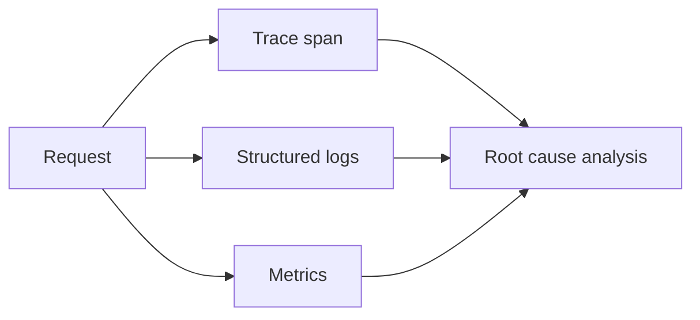

# 日志、指标与链路追踪

日志回答“发生了什么”，指标回答“整体是否异常”，链路追踪回答“慢在哪里”。三者需要通过 trace id、service name 和 operation name 串起来。

## 延伸阅读

- [OpenTelemetry Documentation](https://opentelemetry.io/docs/)
- [Google SRE Book: Monitoring Distributed Systems](https://sre.google/sre-book/monitoring-distributed-systems/)
