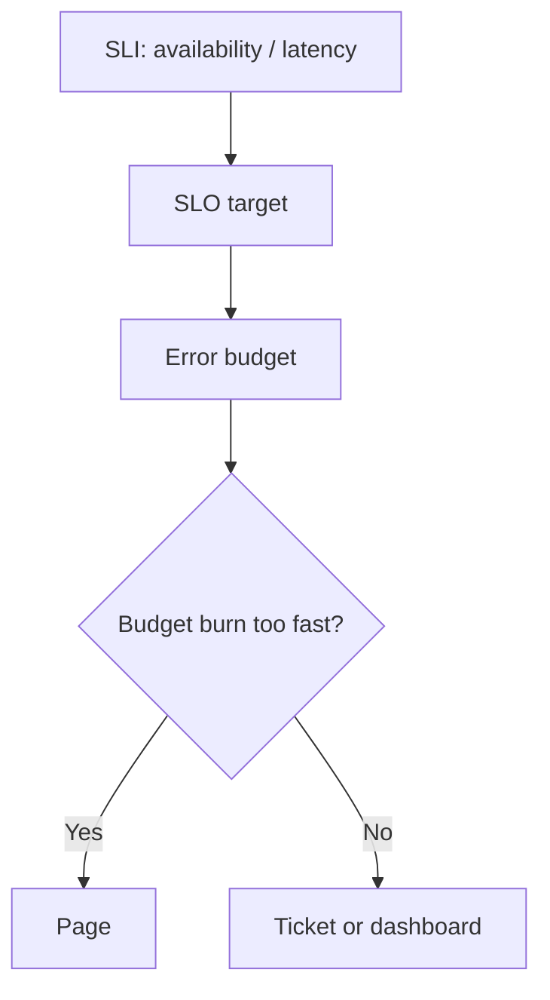

# SLO 与告警

SLO 用用户体验定义可靠性目标，告警应该围绕用户影响触发，而不是围绕每一个低层指标噪声触发。

## 延伸阅读

- [Google SRE Book: Service Level Objectives](https://sre.google/sre-book/service-level-objectives/)
- [Google SRE Workbook: Alerting on SLOs](https://sre.google/workbook/alerting-on-slos/)
