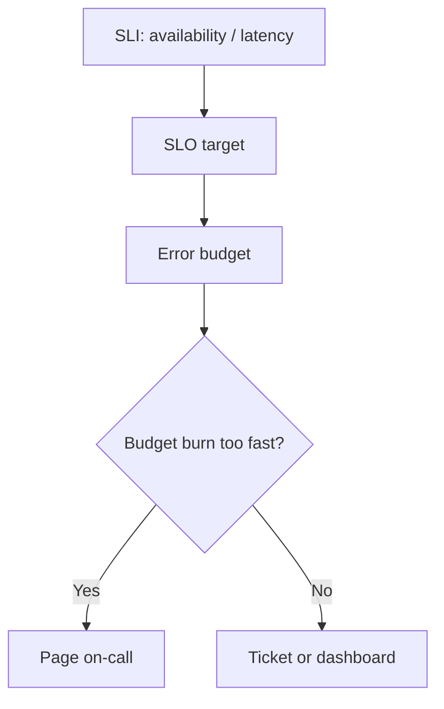
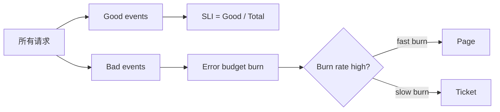
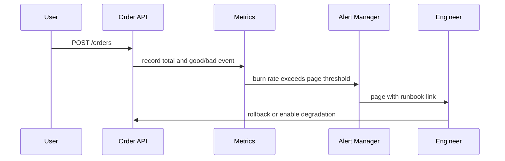

import Tabs from '@theme/Tabs';
import TabItem from '@theme/TabItem';

# SLO 与告警

SLO 用用户体验定义可靠性目标，告警应该围绕用户影响触发，而不是围绕每一个低层指标噪声触发。好的告警能让工程师在用户明显受影响前介入，差的告警只会制造疲劳。



## 它是什么

SLO 是 Service Level Objective，表示服务对用户承诺的可靠性目标，例如“订单创建接口 99.9% 请求在 500ms 内成功”。SLI 是 Service Level Indicator，是衡量目标的指标，例如成功率、延迟、正确性、可用性。

告警是围绕 SLO 的行动机制：当错误预算消耗过快，说明用户体验正在恶化，需要通知值班工程师处理。

## 为什么需要它

只用 CPU、内存、磁盘、连接数这些低层指标做告警，很容易产生噪声。CPU 90% 不一定影响用户；但订单创建成功率跌到 98% 一定值得关注。

SLO 把告警从“机器是不是异常”转成“用户是不是受影响”。这能减少无意义告警，也能让团队用错误预算决定是否继续发版、扩容或优先修复可靠性问题。

## 它解决什么问题

- 告警太多，值班人员分不清优先级。
- 低层指标异常但用户无感，频繁误报。
- 用户已经受影响，但没有面向体验的告警。
- 团队无法量化可靠性和迭代速度之间的取舍。
- 发布后错误率轻微升高但持续消耗预算，没有及时发现。

## 核心原理

SLO 的核心是错误预算：如果 SLO 是 99.9%，一个 30 天窗口内允许 0.1% 请求失败。告警不应只看某一分钟是否失败，而要看错误预算燃烧速度。



常见 SLI：

| SLI | Good event 示例 |
| --- | --- |
| 可用性 | HTTP 2xx/3xx 或业务成功码 |
| 延迟 | 请求在 500ms 内完成 |
| 正确性 | 返回数据通过业务校验 |
| 新鲜度 | 数据延迟低于 1 分钟 |
| 消费延迟 | MQ 最老未消费消息小于 5 分钟 |

Burn rate 告警通常分层：

- 快速燃烧：5 分钟和 1 小时窗口都很高，立即 page。
- 慢速燃烧：6 小时或 1 天窗口偏高，创建 ticket 或工作时间处理。
- 低层指标：作为诊断面板，不默认 page。

## 最小示例

下面示例展示如何记录订单创建接口的 good/total 事件。真实系统通常会用 Prometheus、OpenTelemetry、Datadog 或云监控统一计算 SLI。

<Tabs groupId="language">
<TabItem value="java" label="Java">

```java
class OrderMetrics {
    private final Counter total;
    private final Counter good;

    void recordCreateOrder(int statusCode, long latencyMs) {
        total.increment();
        if (statusCode >= 200 && statusCode < 500 && latencyMs <= 500) {
            good.increment();
        }
    }
}
```

</TabItem>
<TabItem value="go" label="Go">

```go
package slo

func RecordCreateOrder(metrics Metrics, status int, latencyMs int64) {
    metrics.Inc("order_create_total")
    if status >= 200 && status < 500 && latencyMs <= 500 {
        metrics.Inc("order_create_good")
    }
}
```

</TabItem>
<TabItem value="typescript" label="TypeScript">

```ts
function recordCreateOrder(metrics: Metrics, status: number, latencyMs: number) {
  metrics.increment("order_create_total");
  if (status >= 200 && status < 500 && latencyMs <= 500) {
    metrics.increment("order_create_good");
  }
}
```

</TabItem>
<TabItem value="python" label="Python">

```python
def record_create_order(metrics, status: int, latency_ms: int) -> None:
    metrics.increment("order_create_total")
    if 200 <= status < 500 and latency_ms <= 500:
        metrics.increment("order_create_good")
```

</TabItem>
</Tabs>

Prometheus 形式的 SLI 可以类似这样计算：

```promql
sum(rate(order_create_good[5m]))
/
sum(rate(order_create_total[5m]))
```

## 工程实践

- SLO 先从核心用户路径开始，例如登录、下单、支付、查询订单。
- SLI 必须能反映用户体验，避免只用机器指标替代。
- 延迟 SLO 要结合成功率，例如“成功且 500ms 内完成”才算 good event。
- 告警分级：快速错误预算燃烧 page，慢速燃烧 ticket，低层指标进 dashboard。
- 每个 page 告警都要有 runbook，说明影响范围、排查入口和回滚条件。
- 发布系统可以参考错误预算，预算消耗过快时冻结非紧急发布。

## 常见坑

- 用 CPU、内存、磁盘直接 page，导致大量无用户影响告警。
- SLO 定得过高，例如所有服务都 99.99%，团队长期无法达成。
- 只定义可用性，不定义延迟，慢请求被算作成功。
- 告警窗口太短，瞬时毛刺频繁 page。
- 告警没有 runbook，值班人员收到通知后仍要从零开始查。
- SLO 定义不区分核心链路和非核心链路，优先级混乱。

## 完整案例

订单创建接口是核心链路。团队最初用服务 CPU、数据库连接数和 5xx 错误做告警。一次促销期间，接口没有大量 5xx，但 P99 延迟超过 3 秒，用户重复点击导致重复请求增加，直到客服反馈才发现。

改造方案：

1. 定义 SLI：`status < 500` 且 `latency <= 800ms` 的订单创建请求为 good event。
2. 定义 SLO：30 天窗口内 99.9% good events。
3. 快速告警：5 分钟和 1 小时 burn rate 同时超过阈值时 page。
4. 慢速告警：6 小时窗口预算消耗过快时创建 ticket。
5. Dashboard 展示成功率、P95/P99、下游库存延迟、数据库连接池等待和错误预算剩余。



## 检查清单

- 是否为核心用户路径定义了 SLI 和 SLO？
- SLI 是否同时考虑成功率和延迟？
- SLO 是否有明确时间窗口，例如 7 天或 30 天？
- 是否使用错误预算和 burn rate 告警？
- Page 告警是否只针对需要立即行动的问题？
- 每个告警是否有 runbook 和 dashboard 链接？
- 是否定期复盘告警噪声和漏报？

## 延伸阅读

- [Google SRE Book: Service Level Objectives](https://sre.google/sre-book/service-level-objectives/)
- [Google SRE Workbook: Alerting on SLOs](https://sre.google/workbook/alerting-on-slos/)
- [The Site Reliability Workbook: Implementing SLOs](https://sre.google/workbook/implementing-slos/)
- [Prometheus: Alerting rules](https://prometheus.io/docs/prometheus/latest/configuration/alerting_rules/)
