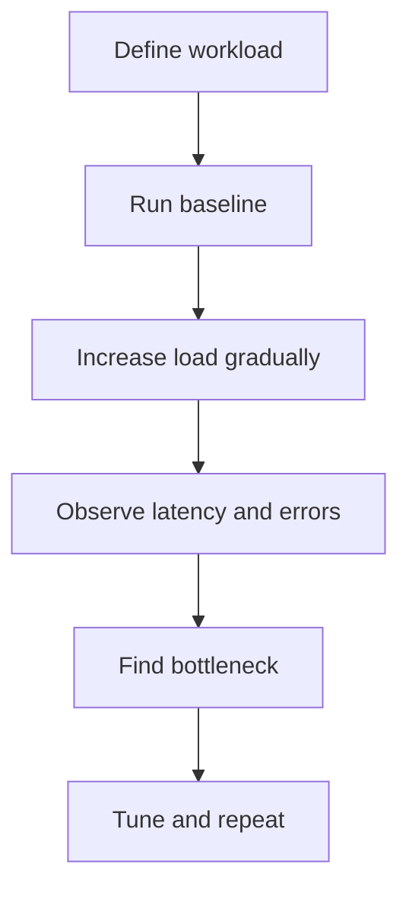

# 压测方法

压测要回答的是“系统在目标流量下是否稳定，瓶颈在哪里”。只看最大 QPS 不够，还要看错误率、P95/P99、资源利用率和队列积压。

```mermaid
flowchart TD
    A[Define workload] --> B[Run baseline]
    B --> C[Increase load gradually]
    C --> D[Observe latency and errors]
    D --> E[Find bottleneck]
    E --> F[Tune and repeat]
```

## 延伸阅读

- [k6 Documentation](https://grafana.com/docs/k6/latest/)
- [wrk GitHub](https://github.com/wg/wrk)
