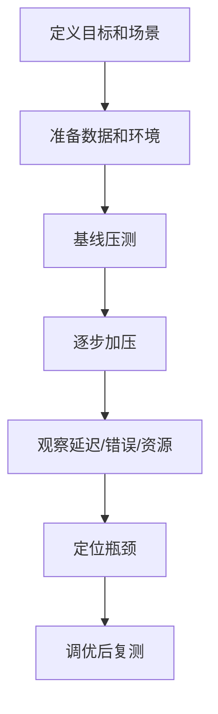
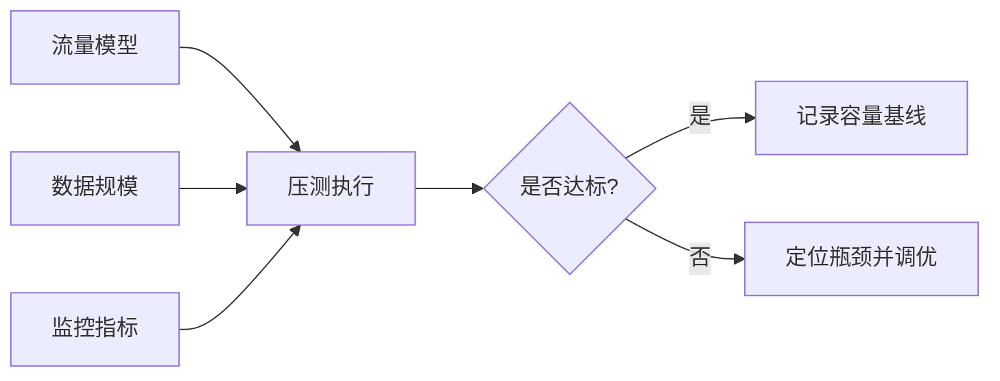
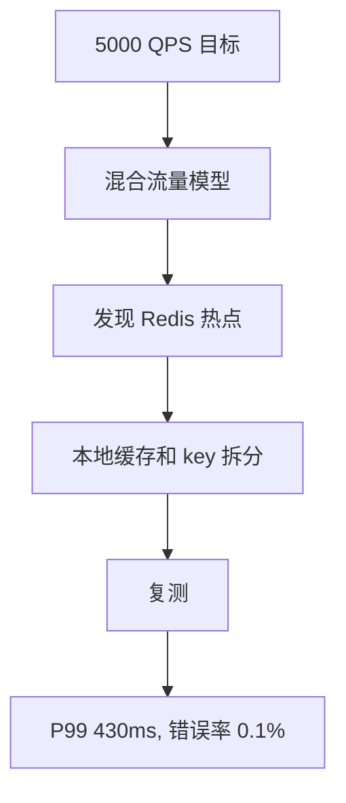

import Tabs from '@theme/Tabs';
import TabItem from '@theme/TabItem';

# 压测方法

压测要回答的不是“最大 QPS 能到多少”，而是系统在目标负载下是否稳定、瓶颈在哪里、扩容是否有效、失败模式是否可控。

## 先理解这些概念

- **压测**：用模拟流量验证系统在目标负载下的表现。
- **基线**：当前系统在稳定条件下的性能参考值。
- **阶梯加压**：逐步提高流量，观察系统从稳定到瓶颈的过程。
- **QPS**：每秒请求数。
- **错误率**：失败请求占比，比如 5xx、超时、业务失败。
- **瓶颈**：最先限制系统继续提升的资源或组件。
- **压测模型**：请求比例、数据分布、热点和用户行为的模拟方式。

读这篇时先记住：压测不是跑出一个最大 QPS 数字，而是用数据回答系统能不能稳定承接目标流量。



## 它是什么

压测是在可控环境中模拟真实流量，观察系统在不同负载下的吞吐、延迟、错误率和资源利用率。常见形式包括基准测试、阶梯加压、稳定性测试、峰值测试、故障压测。

一个有效压测必须包含真实请求模型、足够的数据规模、完整监控和明确停止条件。

## 为什么需要它

很多性能问题只在并发和数据规模上来后出现：连接池耗尽、慢 SQL、锁竞争、缓存热点、GC、消息积压、下游限流。没有压测，系统容量只能靠猜。

压测可以在上线前暴露瓶颈，也能帮助团队建立容量基线，例如“当前配置稳定承接 3000 QPS，P99 小于 500ms”。

## 它解决什么问题

- 验证目标流量下的 P95/P99、错误率和资源利用率。
- 找出数据库、缓存、RPC、线程池、连接池等瓶颈。
- 验证限流、熔断、降级和扩容是否按预期工作。
- 评估发布变更、索引优化、缓存策略对性能的影响。

## 核心原理

压测要用闭环或开环模型明确“请求如何产生”。开环模型按固定到达率发请求，更接近真实流量；闭环模型由虚拟用户等待响应后再发下一次请求，容易在系统变慢时自动降压。



关键指标：

- 吞吐：QPS、TPS、消息消费速率。
- 延迟：P50、P95、P99、超时比例。
- 错误：HTTP 5xx、业务错误、限流、连接失败。
- 资源：CPU、内存、GC、磁盘 IO、网络、连接数、队列长度。
- 下游：数据库慢查询、Redis 延迟、RPC 耗时、MQ 积压。

## 最小示例

下面示例展示一个最小压测脚本，真实压测建议使用 k6、wrk、JMeter、Locust 或 Gatling。

<Tabs groupId="language">
<TabItem value="java" label="Java">

```java
class LoadTestWorker implements Runnable {
    private final HttpClient client;
    private final Metrics metrics;

    public void run() {
        while (!Thread.currentThread().isInterrupted()) {
            long start = System.nanoTime();
            try {
                int status = client.get("https://api.local/products/42");
                metrics.recordStatus(status);
            } finally {
                metrics.recordLatency((System.nanoTime() - start) / 1_000_000);
            }
        }
    }
}
```

</TabItem>
<TabItem value="go" label="Go">

```go
package loadtest

import (
    "net/http"
    "time"
)

func Worker(client *http.Client, metrics Metrics, stop <-chan struct{}) {
    for {
        select {
        case <-stop:
            return
        default:
            start := time.Now()
            resp, err := client.Get("https://api.local/products/42")
            metrics.Record(err, resp, time.Since(start))
        }
    }
}
```

</TabItem>
<TabItem value="typescript" label="TypeScript">

```ts
async function worker(metrics: Metrics, signal: AbortSignal) {
  while (!signal.aborted) {
    const start = performance.now();
    try {
      const res = await fetch("https://api.local/products/42", { signal });
      metrics.recordStatus(res.status);
    } finally {
      metrics.recordLatency(performance.now() - start);
    }
  }
}
```

</TabItem>
<TabItem value="python" label="Python">

```python
import time
import httpx


async def worker(metrics, stop_event):
    async with httpx.AsyncClient(timeout=1.0) as client:
        while not stop_event.is_set():
            start = time.perf_counter()
            try:
                response = await client.get("https://api.local/products/42")
                metrics.record_status(response.status_code)
            finally:
                metrics.record_latency((time.perf_counter() - start) * 1000)
```

</TabItem>
</Tabs>

## 工程实践

- 压测前定义目标：目标 QPS、P99、错误率、持续时间、资源水位。
- 使用接近生产的数据量和数据分布，特别是热点 key、深分页、大用户订单数。
- 阶梯加压：例如 500、1000、2000、3000 QPS，每档持续观察。
- 设置停止条件：错误率超过阈值、P99 超过 SLA、数据库 CPU 过高、队列持续积压。
- 压测时打开链路追踪和数据库慢查询，避免事后没有证据。
- 区分容量压测和破坏性压测，生产压测必须有隔离、限流和回滚预案。

## 常见坑

- 只压一个接口，忽略真实用户路径和混合流量比例。
- 测试数据太少，全部命中缓存，数据库压力不真实。
- 只看 QPS，不看 P99、错误率和队列积压。
- 压测机先成为瓶颈，误判服务端容量。
- 没有预热 JVM、连接池和缓存，基线结果波动大。
- 在共享环境压测，影响其他服务却没有隔离和通知。

## 完整案例

团队要验证商品详情页能否承接大促 5000 QPS。第一次压测只用了 100 个商品 ID，缓存命中率接近 100%，P99 只有 80ms。上线前重新设计压测数据：80% 流量访问 Top 1000 商品，20% 访问长尾商品，并模拟缓存过期。

结果发现 3500 QPS 后 Redis 单分片 CPU 到 90%，商品服务连接池等待上升，P99 到 1.2s。修复方案包括热 key 本地缓存、Redis key 拆分、数据库连接池调整和限流降级。复测后 5000 QPS 下 P99 稳定在 430ms，错误率低于 0.1%。



## 检查清单

- 是否定义了压测目标和达标标准？
- 请求模型是否接近真实流量比例？
- 数据规模和热点分布是否接近生产？
- 是否同时观察 P99、错误率、资源和下游指标？
- 压测工具本身是否有足够容量？
- 是否记录瓶颈、调优动作和复测结果？

## 这篇文章在系统里怎么用

压测常用于大促前、架构改造后、数据库索引变更后、缓存策略上线前。系统设计时，可以用压测说明容量边界：目标 QPS、P99、错误率、资源水位和降级条件。

压测结果要和观测指标一起看。只看 QPS 没意义，还要看 P99、连接池等待、慢 SQL、Redis 热点、MQ 积压和下游错误。

## 术语回看

- [P99](../system-design/glossary.md#p99)
- [热点 / 热 Key](../system-design/glossary.md#热点--热-key)
- [削峰](../system-design/glossary.md#削峰)

## 延伸阅读

- [k6 Documentation](https://grafana.com/docs/k6/latest/)
- [wrk GitHub](https://github.com/wg/wrk)
- [Google SRE Book: Load Balancing at the Frontend](https://sre.google/sre-book/load-balancing-frontend/)
- [Grafana: Load testing](https://grafana.com/load-testing/)
