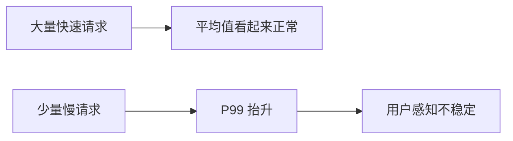
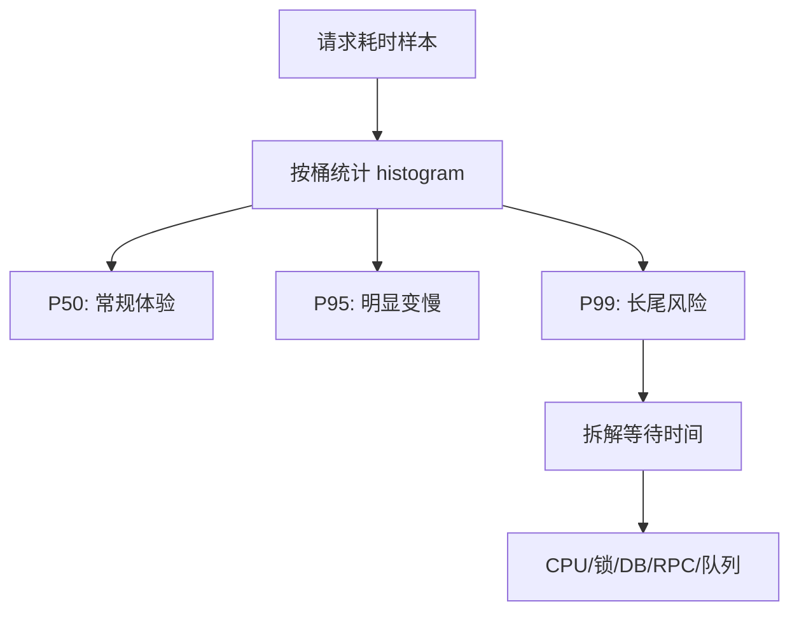
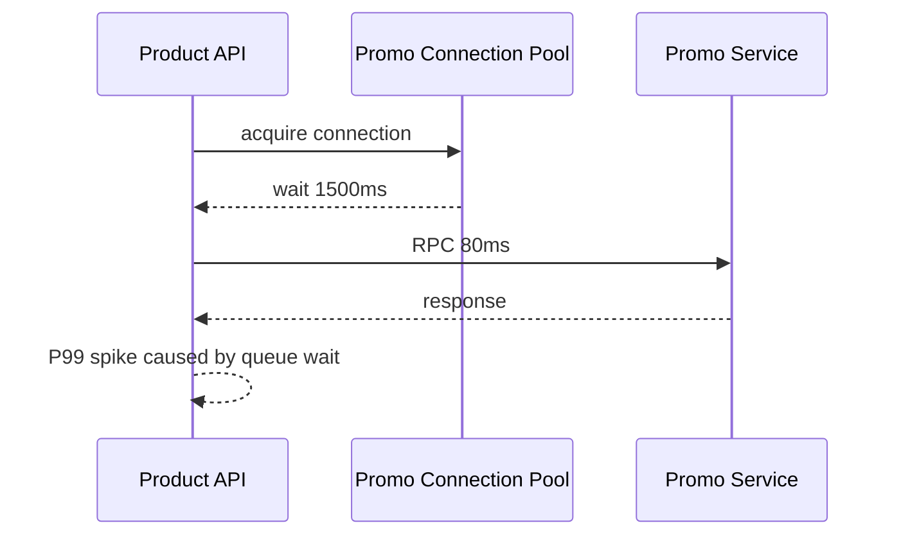

import Tabs from '@theme/Tabs';
import TabItem from '@theme/TabItem';

# P99 延迟

平均延迟会掩盖长尾问题。P99 表示最慢的 1% 请求，它经常暴露排队、GC、锁等待、慢 SQL、下游抖动、连接池耗尽和重试放大。

## 先理解这些概念

- **平均延迟**：所有请求耗时的平均值，容易掩盖少量慢请求。
- **P50**：一半请求比它快，也叫中位数。
- **P95 / P99**：最慢 5% 或 1% 请求的边界，用来看长尾。
- **长尾延迟**：少量请求特别慢，但对真实用户很明显。
- **排队时间**：请求还没真正执行，只是在等线程、连接或下游容量。
- **Histogram**：把延迟按桶统计，适合计算分位数。

读这篇时先记住：用户感受到的是某一次请求，不是平均值。P99 能帮你看到“少数用户非常慢”的问题。



## 它是什么

P99 是延迟分布的第 99 百分位。如果某接口 P99 是 900ms，含义是 99% 请求在 900ms 内完成，最慢 1% 请求超过 900ms。

分位数比平均值更适合描述用户体验，因为用户遇到的是单次请求，而不是平均请求。

## 为什么需要它

高并发系统的性能问题通常先出现在尾部。平均延迟稳定并不代表系统稳定：少量慢 SQL、偶发锁等待、队列积压、下游抖动都会让 P99 抬升，并可能进一步占住线程和连接，形成更大范围的延迟扩散。

P99 是服务稳定性的早期信号，也是 SLO 和容量评估的重要指标。

## 它解决什么问题

- 发现平均值掩盖的长尾慢请求。
- 判断系统是否存在排队、锁竞争或资源池耗尽。
- 评估发布、扩容、索引优化是否改善真实用户体验。
- 为超时、熔断、限流和容量规划提供数据依据。

## 核心原理

延迟不是单个数字，而是分布。需要用直方图或高动态范围 histogram 统计。



常见长尾来源：

- 队列等待：线程池、连接池、消息队列、任务队列。
- 资源竞争：锁、热点 key、数据库行锁、CPU 抢占。
- 下游抖动：RPC 慢、DNS 慢、TLS 握手慢、第三方服务慢。
- 运行时停顿：GC、JIT、事件循环阻塞。
- 协调遗漏：压测工具未统计排队时间或 timeout 后的真实耗时。

## 最小示例

下面示例展示如何记录请求耗时到 histogram。真实系统建议接入 Prometheus、OpenTelemetry 或语言生态的 metrics 库。

<Tabs groupId="language">
<TabItem value="java" label="Java">

```java
class LatencyMiddleware {
    private final Histogram histogram;

    Response handle(Request request, Handler next) {
        long start = System.nanoTime();
        try {
            return next.handle(request);
        } finally {
            long elapsedMs = (System.nanoTime() - start) / 1_000_000;
            histogram.record("http.server.duration", elapsedMs, request.path());
        }
    }
}
```

</TabItem>
<TabItem value="go" label="Go">

```go
package latency

import (
    "net/http"
    "time"
)

func Middleware(next http.Handler, h Histogram) http.Handler {
    return http.HandlerFunc(func(w http.ResponseWriter, r *http.Request) {
        start := time.Now()
        defer func() {
            h.Record("http.server.duration", time.Since(start), r.URL.Path)
        }()
        next.ServeHTTP(w, r)
    })
}
```

</TabItem>
<TabItem value="typescript" label="TypeScript">

```ts
function latencyMiddleware(histogram: Histogram) {
  return async (req: Request, next: () => Promise<Response>) => {
    const start = performance.now();
    try {
      return await next();
    } finally {
      histogram.record("http.server.duration", performance.now() - start, {
        route: req.route,
      });
    }
  };
}
```

</TabItem>
<TabItem value="python" label="Python">

```python
import time


async def latency_middleware(request, call_next, histogram):
    start = time.perf_counter()
    try:
        return await call_next(request)
    finally:
        elapsed_ms = (time.perf_counter() - start) * 1000
        histogram.record("http.server.duration", elapsed_ms, {"route": request.url.path})
```

</TabItem>
</Tabs>

## 工程实践

- 同时看 P50、P95、P99、错误率、QPS 和资源利用率，不要孤立看一个数。
- 按接口、状态码、调用下游、数据库语句模板分组，避免所有请求混在一起。
- 使用 histogram，不要只上报平均值或客户端本地日志。
- 压测时统计端到端延迟，包括排队、连接等待和超时。
- 对关键接口设置 latency SLO，例如 99% 请求低于 500ms。
- P99 抬升时优先查队列长度、连接池等待、慢 SQL、下游耗时和 GC 暂停。

## 常见坑

- 只看平均延迟，发布后才发现少量用户非常慢。
- 使用客户端 coordinated omission 的压测结果，低估真实延迟。
- 在 Prometheus 里用错误的 bucket 或 label，导致分位数失真。
- 把所有接口混在一个指标里，慢接口被快接口稀释。
- 只优化 CPU，却忽略连接池排队和下游慢调用。

## 完整案例

商品详情接口平均延迟 80ms，看起来健康，但 P99 偶尔到 2s。链路追踪显示慢请求集中在促销信息查询。进一步排查发现促销服务连接池只有 20 个连接，高峰期请求在连接池等待 1.5s。

修复方案：

1. 指标拆分连接池等待时间和实际 RPC 时间。
2. 增加促销服务连接池容量，并设置 50ms 池等待超时。
3. 促销信息超时后返回无促销，不阻塞商品主信息。
4. 对促销结果加本地短缓存，降低高峰读压力。
5. 压测验证 P99 从 2s 降到 420ms。



## 检查清单

- 是否对核心接口记录 histogram？
- 是否同时看 P50/P95/P99/错误率/QPS？
- 是否把排队时间纳入端到端延迟？
- 是否按路由、状态码、下游和错误类型拆分？
- 是否有 P99 SLO 和告警？
- 压测工具是否避免 coordinated omission？

## 这篇文章在系统里怎么用

P99 是接口体验和容量评估的核心指标。排查慢接口时，如果平均延迟正常但用户仍觉得慢，优先看 P95/P99，再拆连接池等待、锁等待、慢 SQL、Redis 延迟和下游 RPC。

系统设计时，可以用 P99 表达非功能目标，例如“订单创建 P99 小于 800ms”。压测和 SLO 告警也应该围绕 P99 或延迟分布，而不是只看平均值。

## 术语回看

- [P99](../system-design/glossary.md#p99)
- [SLI / SLO](../system-design/glossary.md#sli--slo)
- [削峰](../system-design/glossary.md#削峰)

## 延伸阅读

- [Google SRE Book: Service Level Objectives](https://sre.google/sre-book/service-level-objectives/)
- [Gil Tene: How NOT to Measure Latency](https://www.youtube.com/watch?v=lJ8ydIuPFeU)
- [Prometheus: Histograms and summaries](https://prometheus.io/docs/practices/histograms/)
- [HdrHistogram](https://hdrhistogram.github.io/HdrHistogram/)
