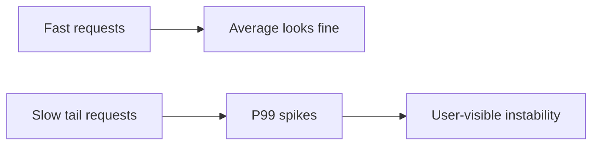

# P99 延迟

平均延迟会掩盖长尾问题。P99 代表最慢的 1% 请求，通常暴露排队、GC、锁等待、慢 SQL、下游抖动和重试放大。

## 延伸阅读

- [Google SRE Book: Service Level Objectives](https://sre.google/sre-book/service-level-objectives/)
- [Gil Tene: How NOT to Measure Latency](https://www.youtube.com/watch?v=lJ8ydIuPFeU)
