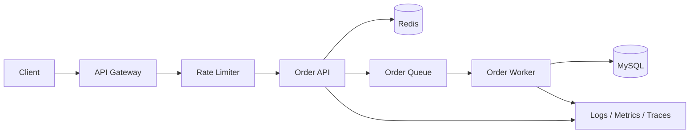
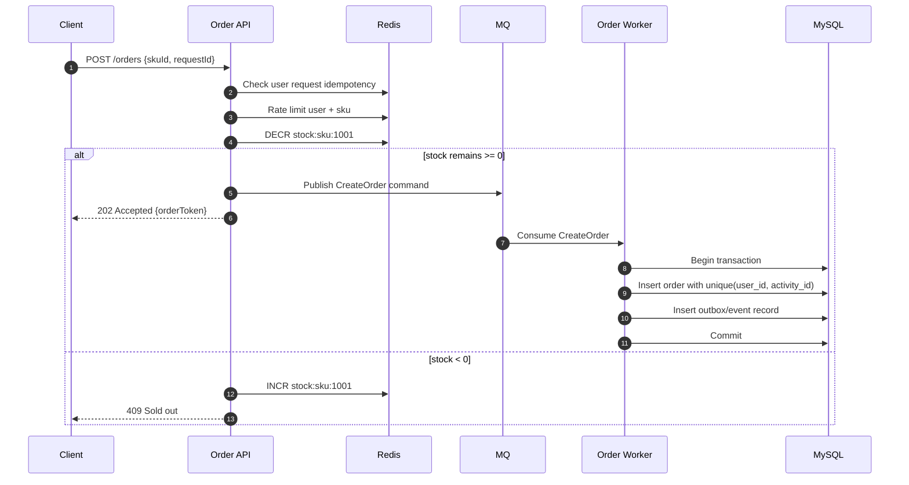
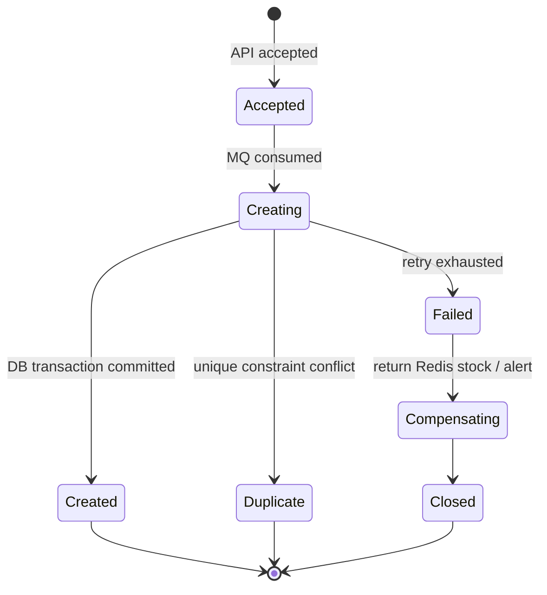

# 高并发下单系统设计

下单系统能把缓存、数据库事务、MQ、幂等、限流、观测和降级串起来。这里以“限量商品下单”为例，目标不是做完整电商，而是用一个小系统覆盖高并发后端的关键问题。

## 业务目标

- 用户可以查看商品详情和库存状态。
- 用户可以提交下单请求。
- 同一个用户对同一个活动只能成功下单一次。
- 库存不能超卖。
- 高峰流量下优先保护数据库。
- 订单创建可以异步化，但用户要拿到可查询的结果。

## 总体架构



## 下单时序



## 数据模型

```sql
CREATE TABLE orders (
  id BIGINT PRIMARY KEY,
  user_id BIGINT NOT NULL,
  sku_id BIGINT NOT NULL,
  activity_id BIGINT NOT NULL,
  status VARCHAR(32) NOT NULL,
  request_id VARCHAR(64) NOT NULL,
  created_at TIMESTAMP NOT NULL DEFAULT CURRENT_TIMESTAMP,
  UNIQUE KEY uk_user_activity (user_id, activity_id),
  UNIQUE KEY uk_request (request_id)
);

CREATE TABLE inventory_deductions (
  id BIGINT PRIMARY KEY,
  sku_id BIGINT NOT NULL,
  order_id BIGINT NOT NULL,
  quantity INT NOT NULL,
  created_at TIMESTAMP NOT NULL DEFAULT CURRENT_TIMESTAMP,
  UNIQUE KEY uk_order (order_id)
);
```

## 关键设计点

| 目标 | 设计 |
| --- | --- |
| 防重复提交 | 客户端传 `requestId`，服务端用唯一索引兜底 |
| 防超卖 | Redis 预扣减挡流量，数据库唯一约束和事务兜底 |
| 保护数据库 | 网关限流、用户限流、Redis 原子扣减、MQ 削峰 |
| 可靠创建订单 | MQ 至少一次投递，worker 幂等消费 |
| 可恢复 | Redis 与 DB 不一致时用补偿任务对账 |
| 可观测 | 每个下单请求带 trace id，记录库存扣减、入队、消费、写库耗时 |

## 状态机



## 常见错误

- 只依赖 Redis 扣库存，没有数据库层兜底和对账。
- 下单接口同步写库，流量高峰时数据库连接池被打满。
- MQ 消费者没有幂等，重试后创建重复订单。
- 失败补偿没有状态机，靠人工查日志恢复。
- 只压测单接口，不压测完整链路和消费者积压。

## 压测观察指标

- 入口 QPS、成功率、限流率、P95/P99。
- Redis `DECR` 延迟、连接池等待、热 key 情况。
- MQ 入队速率、消费速率、lag、重试和死信数量。
- MySQL TPS、锁等待、慢 SQL、连接池使用率。
- worker 消费耗时、失败率、重复消息比例。

## 下一步实践拆分

1. 先实现同步版本：API 直接用数据库事务创建订单。
2. 加 Redis 缓存商品详情和库存预扣减。
3. 引入 MQ，把订单创建异步化。
4. 加幂等表、唯一索引和失败重试。
5. 用 k6 压测，并接入 Prometheus / Grafana。
6. 做故障演练：Redis 慢、MQ 积压、DB 慢查询、worker 崩溃。

## 延伸阅读

- [AWS Builders Library: Avoiding insurmountable queue backlogs](https://aws.amazon.com/builders-library/avoiding-insurmountable-queue-backlogs/)
- [AWS Builders Library: Making retries safe with idempotent APIs](https://aws.amazon.com/builders-library/making-retries-safe-with-idempotent-APIs/)
- [Google SRE Book: Handling Overload](https://sre.google/sre-book/handling-overload/)
- [Redis Documentation: INCR command](https://redis.io/docs/latest/commands/incr/)
