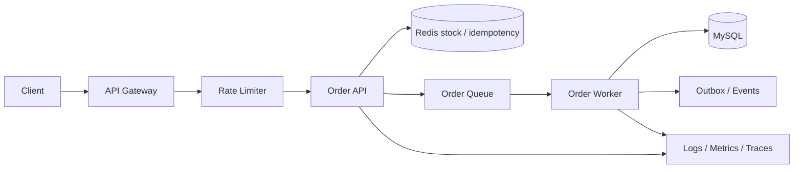
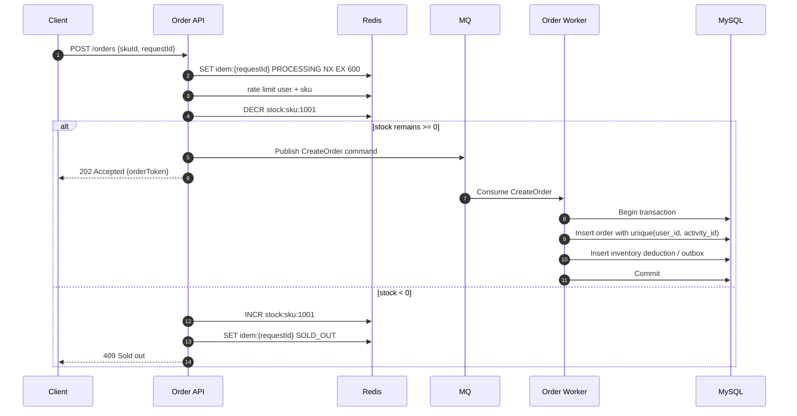
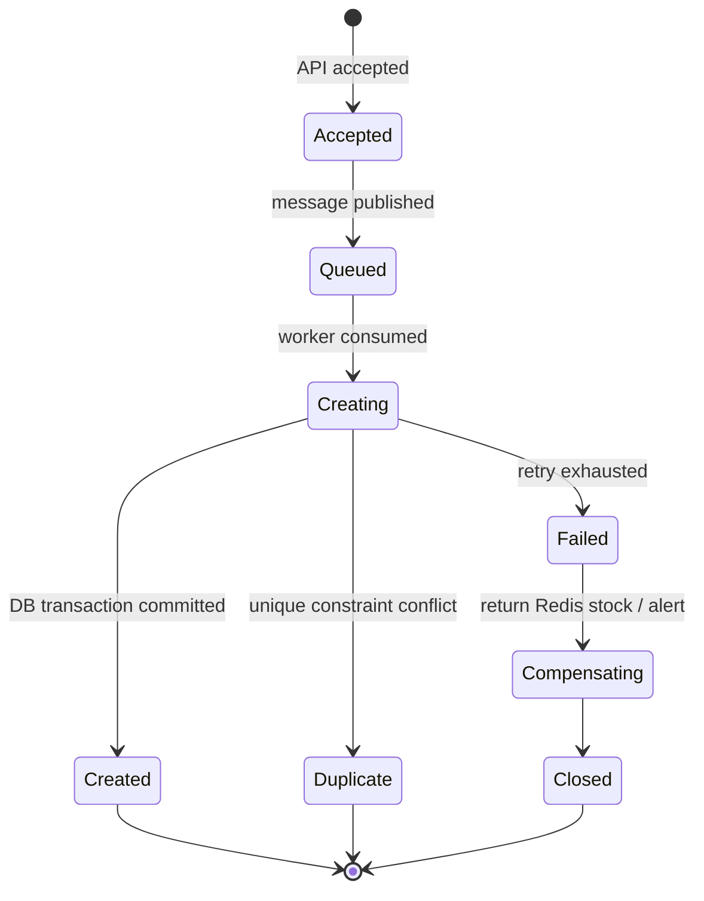
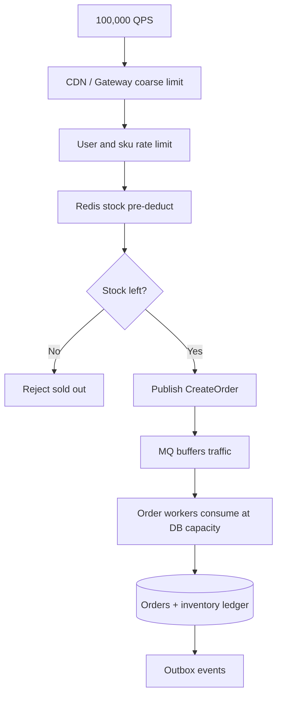
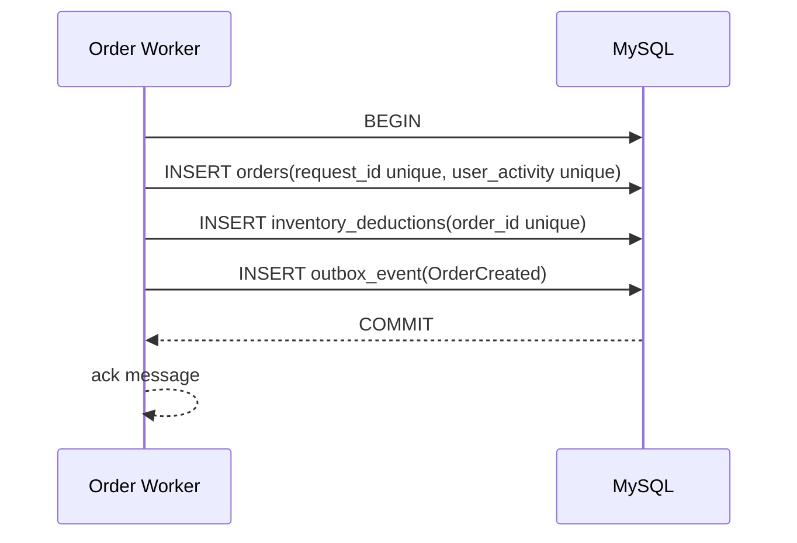

import Tabs from '@theme/Tabs';
import TabItem from '@theme/TabItem';

# 高并发下单系统设计

下单系统能把缓存、数据库事务、MQ、幂等、限流、可观测性和降级串起来。这里以“限量商品下单”为例，目标不是做完整电商，而是用一个小系统覆盖高并发后端的关键设计问题。

## 它是什么

高并发下单系统是在短时间大量用户同时请求有限库存商品时，仍然能保持库存不超卖、订单不重复、核心依赖不被打垮、失败可恢复的一类系统。

典型场景包括秒杀、抢票、限量发售、活动报名、优惠券领取。它不是单个接口优化问题，而是入口流量控制、库存扣减、订单创建、异步削峰、幂等处理、失败补偿和可观测性的组合设计。

## 为什么需要它

普通下单接口通常是同步流程：校验用户、查库存、扣库存、写订单、返回结果。低流量时没问题，但高峰时会出现几个风险：

- 大量请求直接打到数据库，连接池被占满。
- 多个请求同时读到库存充足，导致超卖。
- 用户重复点击或客户端重试，导致重复订单。
- 同步写库路径过长，P99 延迟升高。
- MQ、Redis、数据库任意一层失败后状态不一致。
- 没有 trace、指标和对账，故障后无法判断影响范围。

高并发下单系统的核心目标是：**把不可控的瞬时流量变成可控的状态流转**。

## 它解决什么问题

| 问题 | 设计手段 | 边界 |
| --- | --- | --- |
| 流量突刺 | 网关限流、用户限流、商品限流 | 会拒绝一部分请求 |
| 数据库保护 | Redis 预扣减、MQ 削峰 | Redis/DB 需要对账 |
| 库存不超卖 | 原子扣减、数据库事务兜底 | 需要处理失败补偿 |
| 重复提交 | request id、唯一索引、幂等表 | 客户端和服务端都要配合 |
| 异步创建 | API 接受请求，worker 写订单 | 用户需要查询最终状态 |
| 失败恢复 | 状态机、重试、死信、补偿任务 | 需要可观测和运营工具 |

它不能凭空提升库存数量，也不能让所有用户都成功。高并发下单的正确目标是：在容量内公平处理请求，在容量外明确拒绝或排队，并保证数据正确。

## 核心原理

总体架构分成入口层、缓存/限流层、异步队列、订单 worker、数据库和观测系统。



下单入口尽量短：校验、限流、幂等、Redis 预扣减、入队，然后返回 `202 Accepted`。订单真正落库由 worker 异步完成。



订单状态必须显式建模。异步系统里，不能只靠“有没有订单记录”判断状态。



## 最小示例

下面示例只展示下单入口的核心逻辑：幂等占位、限流、Redis 预扣减、MQ 入队、失败时补偿库存。完整工程还需要 worker、数据库事务、对账任务、状态查询接口和监控。

<Tabs groupId="language">
  <TabItem value="java" label="Java">

```java
import java.time.Duration;

record OrderRequest(long userId, long skuId, String requestId) {}
record OrderAccepted(String orderToken) {}
record CreateOrderCommand(long userId, long skuId, String requestId, String orderToken) {}

interface RedisClient {
    boolean setNx(String key, String value, Duration ttl);
    long decrement(String key);
    void increment(String key);
    void set(String key, String value, Duration ttl);
}

interface RateLimiter { boolean allow(String key); }
interface MessageQueue { void publish(CreateOrderCommand command); }

public class OrderApi {
    private final RedisClient redis;
    private final RateLimiter limiter;
    private final MessageQueue queue;

    public OrderApi(RedisClient redis, RateLimiter limiter, MessageQueue queue) {
        this.redis = redis;
        this.limiter = limiter;
        this.queue = queue;
    }

    public OrderAccepted submit(OrderRequest request) {
        String idemKey = "idem:order:" + request.requestId();
        if (!redis.setNx(idemKey, "PROCESSING", Duration.ofMinutes(10))) {
            throw new IllegalStateException("duplicate request");
        }

        if (!limiter.allow("sku:" + request.skuId())) {
            redis.set(idemKey, "RATE_LIMITED", Duration.ofMinutes(10));
            throw new IllegalStateException("too many requests");
        }

        String stockKey = "stock:sku:" + request.skuId();
        long left = redis.decrement(stockKey);
        if (left < 0) {
            redis.increment(stockKey);
            redis.set(idemKey, "SOLD_OUT", Duration.ofMinutes(10));
            throw new IllegalStateException("sold out");
        }

        String orderToken = "ord_" + request.requestId();
        try {
            queue.publish(new CreateOrderCommand(request.userId(), request.skuId(), request.requestId(), orderToken));
            redis.set(idemKey, "QUEUED:" + orderToken, Duration.ofMinutes(10));
            return new OrderAccepted(orderToken);
        } catch (RuntimeException e) {
            redis.increment(stockKey);
            redis.set(idemKey, "FAILED", Duration.ofMinutes(10));
            throw e;
        }
    }
}
```

  </TabItem>
  <TabItem value="go" label="Go">

```go
package order

import (
    "context"
    "fmt"
    "time"
)

type OrderRequest struct {
    UserID    int64
    SkuID     int64
    RequestID string
}

type CreateOrderCommand struct {
    UserID     int64
    SkuID      int64
    RequestID  string
    OrderToken string
}

type RedisClient interface {
    SetNX(ctx context.Context, key, value string, ttl time.Duration) (bool, error)
    Decrement(ctx context.Context, key string) (int64, error)
    Increment(ctx context.Context, key string) error
    Set(ctx context.Context, key, value string, ttl time.Duration) error
}

type RateLimiter interface { Allow(ctx context.Context, key string) bool }
type Queue interface { Publish(ctx context.Context, command CreateOrderCommand) error }

type API struct {
    redis   RedisClient
    limiter RateLimiter
    queue   Queue
}

func (a API) Submit(ctx context.Context, req OrderRequest) (string, error) {
    idemKey := "idem:order:" + req.RequestID
    ok, err := a.redis.SetNX(ctx, idemKey, "PROCESSING", 10*time.Minute)
    if err != nil || !ok {
        return "", fmt.Errorf("duplicate or unavailable: %w", err)
    }

    if !a.limiter.Allow(ctx, fmt.Sprintf("sku:%d", req.SkuID)) {
        _ = a.redis.Set(ctx, idemKey, "RATE_LIMITED", 10*time.Minute)
        return "", fmt.Errorf("too many requests")
    }

    stockKey := fmt.Sprintf("stock:sku:%d", req.SkuID)
    left, err := a.redis.Decrement(ctx, stockKey)
    if err != nil {
        return "", err
    }
    if left < 0 {
        _ = a.redis.Increment(ctx, stockKey)
        _ = a.redis.Set(ctx, idemKey, "SOLD_OUT", 10*time.Minute)
        return "", fmt.Errorf("sold out")
    }

    token := "ord_" + req.RequestID
    command := CreateOrderCommand{UserID: req.UserID, SkuID: req.SkuID, RequestID: req.RequestID, OrderToken: token}
    if err := a.queue.Publish(ctx, command); err != nil {
        _ = a.redis.Increment(ctx, stockKey)
        _ = a.redis.Set(ctx, idemKey, "FAILED", 10*time.Minute)
        return "", err
    }
    _ = a.redis.Set(ctx, idemKey, "QUEUED:"+token, 10*time.Minute)
    return token, nil
}
```

  </TabItem>
  <TabItem value="typescript" label="TypeScript">

```typescript
type OrderRequest = {
  userId: string;
  skuId: string;
  requestId: string;
};

type CreateOrderCommand = OrderRequest & { orderToken: string };

type RedisClient = {
  setNX(key: string, value: string, ttlSeconds: number): Promise<boolean>;
  decrement(key: string): Promise<number>;
  increment(key: string): Promise<void>;
  set(key: string, value: string, ttlSeconds: number): Promise<void>;
};

type RateLimiter = { allow(key: string): Promise<boolean> };
type Queue = { publish(command: CreateOrderCommand): Promise<void> };

export class OrderApi {
  constructor(
    private readonly redis: RedisClient,
    private readonly limiter: RateLimiter,
    private readonly queue: Queue,
  ) {}

  async submit(request: OrderRequest): Promise<{ orderToken: string }> {
    const idemKey = `idem:order:${request.requestId}`;
    const created = await this.redis.setNX(idemKey, 'PROCESSING', 600);
    if (!created) {
      throw new Error('duplicate request');
    }

    if (!(await this.limiter.allow(`sku:${request.skuId}`))) {
      await this.redis.set(idemKey, 'RATE_LIMITED', 600);
      throw new Error('too many requests');
    }

    const stockKey = `stock:sku:${request.skuId}`;
    const left = await this.redis.decrement(stockKey);
    if (left < 0) {
      await this.redis.increment(stockKey);
      await this.redis.set(idemKey, 'SOLD_OUT', 600);
      throw new Error('sold out');
    }

    const orderToken = `ord_${request.requestId}`;
    try {
      await this.queue.publish({ ...request, orderToken });
      await this.redis.set(idemKey, `QUEUED:${orderToken}`, 600);
      return { orderToken };
    } catch (error) {
      await this.redis.increment(stockKey);
      await this.redis.set(idemKey, 'FAILED', 600);
      throw error;
    }
  }
}
```

  </TabItem>
  <TabItem value="python" label="Python">

```python
from dataclasses import dataclass
from typing import Protocol


@dataclass(frozen=True)
class OrderRequest:
    user_id: int
    sku_id: int
    request_id: str


@dataclass(frozen=True)
class CreateOrderCommand:
    user_id: int
    sku_id: int
    request_id: str
    order_token: str


class RedisClient(Protocol):
    def set_nx(self, key: str, value: str, ttl_seconds: int) -> bool: ...
    def decrement(self, key: str) -> int: ...
    def increment(self, key: str) -> None: ...
    def set(self, key: str, value: str, ttl_seconds: int) -> None: ...


class RateLimiter(Protocol):
    def allow(self, key: str) -> bool: ...


class Queue(Protocol):
    def publish(self, command: CreateOrderCommand) -> None: ...


class OrderApi:
    def __init__(self, redis: RedisClient, limiter: RateLimiter, queue: Queue):
        self.redis = redis
        self.limiter = limiter
        self.queue = queue

    def submit(self, request: OrderRequest) -> str:
        idem_key = f"idem:order:{request.request_id}"
        if not self.redis.set_nx(idem_key, "PROCESSING", ttl_seconds=600):
            raise RuntimeError("duplicate request")

        if not self.limiter.allow(f"sku:{request.sku_id}"):
            self.redis.set(idem_key, "RATE_LIMITED", ttl_seconds=600)
            raise RuntimeError("too many requests")

        stock_key = f"stock:sku:{request.sku_id}"
        left = self.redis.decrement(stock_key)
        if left < 0:
            self.redis.increment(stock_key)
            self.redis.set(idem_key, "SOLD_OUT", ttl_seconds=600)
            raise RuntimeError("sold out")

        order_token = f"ord_{request.request_id}"
        try:
            self.queue.publish(CreateOrderCommand(request.user_id, request.sku_id, request.request_id, order_token))
            self.redis.set(idem_key, f"QUEUED:{order_token}", ttl_seconds=600)
            return order_token
        except Exception:
            self.redis.increment(stock_key)
            self.redis.set(idem_key, "FAILED", ttl_seconds=600)
            raise
```

  </TabItem>
</Tabs>

## 工程实践

### 1. Redis 预扣减不是最终事实

Redis 预扣减用于挡住高峰流量，但最终事实仍然在数据库订单和库存流水里。Redis 扣减成功但 MQ 发布失败、worker 写库失败、消息重试等情况都需要补偿和对账。

### 2. 数据库必须兜底

不要只依赖 Redis 防超卖。数据库层至少要有唯一索引和事务约束，例如 `UNIQUE(user_id, activity_id)` 防重复下单，库存流水唯一索引防重复扣减。关键库存扣减可以用 `UPDATE inventory SET stock = stock - 1 WHERE sku_id = ? AND stock > 0` 兜底。

### 3. 异步化需要状态查询

API 返回 `202 Accepted` 后，用户需要能查询 `orderToken` 的最终状态：排队中、成功、售罄、失败、已重复提交。没有状态查询，用户会重复点击或刷新，进一步放大流量。

### 4. MQ 消费必须幂等

下单命令至少一次投递时，worker 可能重复消费。同一个 `requestId` 或 `orderToken` 必须只创建一个订单。重复消息应 no-op 并 ack，真正失败才重试或进入 DLQ。

### 5. 对账和补偿要产品化

高并发系统不能靠临时 SQL 修数据。需要定时对账：Redis 预扣减数量、MQ 成功消息、订单表、库存流水表是否一致。发现不一致后进入补偿状态机，并输出告警和可审计记录。

## 常见坑

- 只用 Redis `DECR` 防超卖，没有数据库事务兜底。
- 下单请求同步写库，高峰时数据库连接池被打满。
- API 入队成功前就返回成功，消息丢失后用户没有订单。
- MQ 消费者没有幂等，重试后创建重复订单。
- 失败补偿没有状态机，靠人工查日志恢复。
- 没有状态查询接口，用户重复点击导致请求放大。
- 只压测单个 API，不压测 Redis、MQ、worker 和数据库完整链路。
- 没有观测 MQ lag，活动结束后才发现订单积压。

## 完整案例：限量商品秒杀

### 业务目标

- 商品库存 10,000 件。
- 峰值入口流量 100,000 QPS。
- 每个用户最多成功下单一次。
- 成功请求最终必须生成订单。
- 系统过载时优先保护数据库。

### 分层设计



### Worker 写库事务



### 压测观察指标

- 入口 QPS、成功率、限流率、售罄率、P95/P99。
- Redis `DECR` 延迟、连接池等待、热点 key QPS。
- MQ 入队速率、消费速率、lag、重试和死信数量。
- MySQL TPS、锁等待、慢 SQL、连接池使用率。
- worker 消费耗时、失败率、重复消息比例。
- 对账差异：Redis 预扣减、订单数、库存流水数。

## 检查清单

学完这一节后，你应该能回答：

- 为什么高并发下单不能直接同步写数据库？
- Redis 预扣减解决什么问题，为什么不能作为最终事实？
- 如何防止重复提交和重复消费？
- 为什么数据库唯一索引和事务仍然必需？
- API 返回 `202 Accepted` 后，用户如何知道最终结果？
- MQ 积压、Redis 扣减成功但入队失败、worker 写库失败分别怎么恢复？
- 需要监控哪些指标判断系统是否处于可控状态？
- 压测时为什么必须覆盖入口、Redis、MQ、worker、DB 的完整链路？

## 下一步实践拆分

1. 先实现同步版本：API 直接用数据库事务创建订单。
2. 加 Redis 缓存商品详情和库存预扣减。
3. 引入 MQ，把订单创建异步化。
4. 加幂等表、唯一索引和失败重试。
5. 用 k6 压测，并接入 Prometheus / Grafana。
6. 做故障演练：Redis 慢、MQ 积压、DB 慢查询、worker 崩溃。

## 延伸阅读

- [AWS Builders Library: Avoiding insurmountable queue backlogs](https://aws.amazon.com/builders-library/avoiding-insurmountable-queue-backlogs/)
- [AWS Builders Library: Making retries safe with idempotent APIs](https://aws.amazon.com/builders-library/making-retries-safe-with-idempotent-APIs/)
- [Google SRE Book: Handling Overload](https://sre.google/sre-book/handling-overload/)
- [Google SRE Book: Addressing Cascading Failures](https://sre.google/sre-book/addressing-cascading-failures/)
- [Redis Documentation: DECR command](https://redis.io/docs/latest/commands/decr/)
- [Microservices.io: Transactional Outbox](https://microservices.io/patterns/data/transactional-outbox.html)
