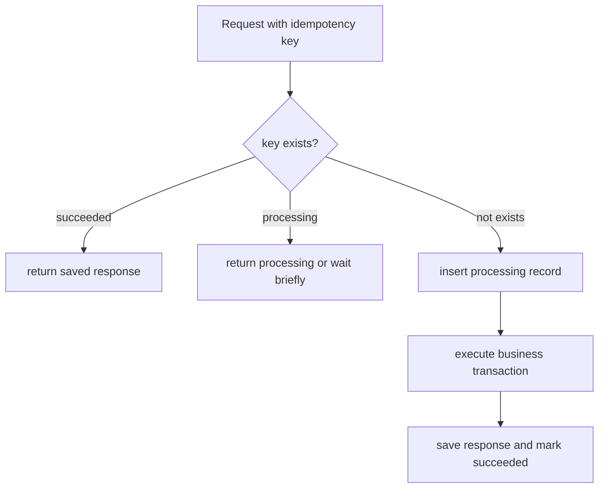

# 幂等 Key 设计实战

幂等 Key 是“同一次业务意图”的稳定标识。它的目标不是阻止请求重复到达，而是让重复请求、重复消息、重复回调只产生一次业务效果。

## 使用场景

必须设计幂等 Key 的场景：

- 创建订单：用户重复点击或客户端超时重试。
- 创建支付：订单服务重试创建支付单。
- 支付回调：渠道重复通知同一笔支付结果。
- MQ 消费：消息至少一次投递，消费者可能重复消费。
- 发券/加积分：重复处理会造成资损。
- 退款：同一退款请求不能重复退款。

## 命名规范

幂等 Key 要满足三个条件：

- **稳定**：同一次业务意图重试时 key 不变。
- **唯一**：不同业务意图不能共用同一个 key。
- **可追踪**：能从 key 或关联字段找到业务对象。

推荐格式：

```text
idem:{domain}:{action}:{business_id}:{request_id}
```

如果 `business_id` 已经唯一，也可以不用额外 `request_id`。

## 推荐模板

下单：

```text
idem:order:create:{user_id}:{client_request_id}
```

支付创建：

```text
idem:payment:create:{merchant_order_id}:{payment_request_id}
```

支付回调去重：

```text
callback:payment:{channel}:{channel_event_id}
```

MQ 消费去重：

```text
processed:event:{event_id}
```

发券：

```text
idem:coupon:grant:{campaign_id}:{user_id}
```

退款：

```text
idem:refund:create:{payment_id}:{refund_request_id}
```

短信验证码发送：

```text
idem:sms:send:{phone_hash}:{scene}:{minute_window}
```

## 数据库表模板

通用幂等表：

```sql
create table idempotency_keys (
  idempotency_key varchar(200) primary key,
  request_hash varchar(64) not null,
  status varchar(32) not null,
  response_body json,
  business_id varchar(64),
  created_at timestamp not null,
  updated_at timestamp not null,
  expires_at timestamp not null
);
```

状态建议：

```text
processing -> succeeded
processing -> failed
processing -> expired
```

## 处理流程



关键点：幂等记录和业务结果最好在同一个事务里提交，避免业务成功但幂等记录丢失。

## 反例

反例 1：服务端每次生成随机 key。

```text
idem:order:create:{uuid}
```

问题：客户端重试时拿不到同一个 key，无法去重。

修正：

```text
idem:order:create:{user_id}:{client_request_id}
```

反例 2：只用用户 ID。

```text
idem:order:create:{user_id}
```

问题：同一个用户只能下一单，误伤正常请求。

修正：

```text
idem:order:create:{user_id}:{client_request_id}
```

反例 3：同一个 key 不校验请求参数。

问题：客户端 bug 用同一个 key 发了不同金额的支付请求。

修正：保存 `request_hash`，重复请求 hash 不一致时返回 409。

## 常见坑与修复

| 坑 | 现象 | 修复 |
| --- | --- | --- |
| 幂等 key 不稳定 | 重试仍创建多条记录 | key 由客户端或业务 ID 生成 |
| 没有唯一约束 | 并发插入多条幂等记录 | key 建 primary key / unique index |
| 不校验参数 hash | 同 key 不同请求被错误复用 | 保存并校验 `request_hash` |
| processing 永久卡住 | 用户一直看到处理中 | 设置过期时间和恢复任务 |
| 成功响应没保存 | 重复请求无法返回同一结果 | 保存 response 或 business_id |

## 监控指标

- `idempotency_request_total{domain,action,result}`
- `idempotency_conflict_total{domain,action}`
- `idempotency_processing_timeout_total{domain,action}`
- `duplicate_message_total{event_type}`
- `callback_duplicate_total{channel,event_type}`

## 完整业务例子

支付创建接口：

1. 订单服务生成 `payment_request_id`。
2. 支付服务收到请求，构造 key：

```text
idem:payment:create:{merchant_order_id}:{payment_request_id}
```

3. 计算请求摘要：`hash(amount, currency, merchant_order_id)`。
4. 插入幂等记录，状态为 `processing`。
5. 创建支付单并调用渠道。
6. 保存渠道支付链接和支付单 ID。
7. 幂等记录标记 `succeeded`，保存响应。
8. 客户端重试时，直接返回第一次的支付链接。

## 检查清单

- key 是否代表同一次业务意图？
- 客户端重试时 key 是否保持不变？
- 数据库是否有唯一约束？
- 是否保存并校验请求摘要？
- 重复请求是否返回第一次结果？
- `processing` 状态是否有超时恢复？
- MQ 和回调是否也有业务幂等 key？
