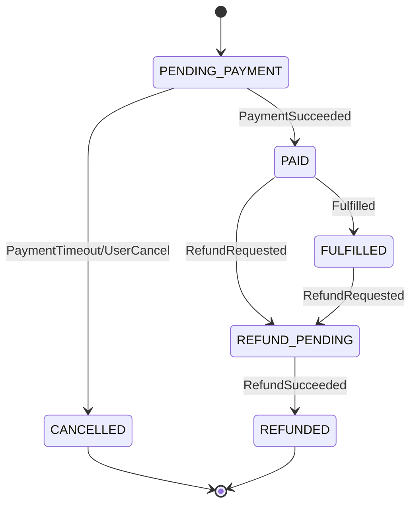

# 订单状态机设计实战

订单状态机的目标是让订单只能沿着合法路径变化。它不是画一张状态图就结束，而是要落到数据库字段、条件更新、状态流水、幂等和补偿任务里。

## 使用场景

需要状态机的对象：

- 订单：待支付、已支付、已取消、已退款。
- 支付单：创建、支付中、成功、失败、关闭。
- 退款单：申请中、处理中、成功、失败。
- 库存预占：已占用、已确认、已释放。
- 工单/审核：待处理、通过、拒绝、撤销。

## 状态命名规范

推荐使用稳定英文枚举，数据库和代码保持一致：

```text
PENDING_PAYMENT
PAID
CANCELLED
FULFILLED
REFUND_PENDING
REFUNDED
```

规则：

- 状态名描述当前结果，不描述动作。
- 动作用事件表示，例如 `PaymentSucceeded`。
- 终态要明确，例如 `CANCELLED`、`REFUNDED`。
- 不要用模糊状态，例如 `PROCESSING` 到处复用。

## 推荐状态图



## 表结构模板

订单表：

```sql
create table orders (
  id varchar(64) primary key,
  user_id varchar(64) not null,
  status varchar(32) not null,
  amount bigint not null,
  version bigint not null default 0,
  paid_at timestamp,
  cancelled_at timestamp,
  created_at timestamp not null,
  updated_at timestamp not null
);
```

状态流水表：

```sql
create table order_status_logs (
  id varchar(64) primary key,
  order_id varchar(64) not null,
  from_status varchar(32),
  to_status varchar(32) not null,
  event_type varchar(64) not null,
  event_id varchar(64) not null,
  reason varchar(255),
  created_at timestamp not null,
  unique(event_id)
);
```

## 条件更新模板

支付成功：

```sql
update orders
set status = 'PAID',
    paid_at = now(),
    version = version + 1,
    updated_at = now()
where id = ?
  and status = 'PENDING_PAYMENT';
```

超时取消：

```sql
update orders
set status = 'CANCELLED',
    cancelled_at = now(),
    version = version + 1,
    updated_at = now()
where id = ?
  and status = 'PENDING_PAYMENT';
```

如果影响行数是 0，不要直接报系统错误。要查询当前状态，判断是重复事件、乱序事件还是非法流转。

## 事件处理模板

```text
handle(event):
  if event_id already processed:
    return success

  begin transaction
    update order where status = expected_status
    if updated = 1:
      insert status log
      insert outbox event
    else:
      load current status and classify duplicate/invalid
  commit
```

## 反例

反例 1：无条件覆盖状态。

```sql
update orders set status = 'PAID' where id = ?;
```

问题：已取消订单可能被迟到支付回调改成已支付。

修正：

```sql
where id = ? and status = 'PENDING_PAYMENT'
```

反例 2：没有状态流水。

问题：事故后不知道订单经历过什么事件。

修正：每次状态变化写 `order_status_logs`。

反例 3：重复回调当错误处理。

问题：支付渠道重复回调导致告警噪声。

修正：用 `event_id` 或渠道流水去重，重复回调返回成功。

## 常见坑与修复

| 坑 | 现象 | 修复 |
| --- | --- | --- |
| 支付和关单并发 | 已支付和已取消互相覆盖 | 条件更新，只允许待支付推进 |
| 没有事件去重 | 重复回调重复写流水 | `event_id` 唯一约束 |
| 状态太细 | 代码到处判断状态 | 区分主状态和子状态 |
| 状态太粗 | 无法定位处理中卡在哪里 | 增加流水和原因字段 |
| 事务里调用外部服务 | 锁持有太久 | 事务只改本地状态，外部调用异步化 |

## 监控指标

- `order_state_transition_total{from,to,event_type,result}`
- `order_invalid_transition_total{from,event_type}`
- `order_pending_payment_age_seconds`
- `order_timeout_cancel_total`
- `order_duplicate_event_total{event_type}`
- `order_state_stuck_total{status}`

## 完整业务例子

支付回调和关单任务同时发生：

1. 关单任务尝试 `PENDING_PAYMENT -> CANCELLED`。
2. 支付回调尝试 `PENDING_PAYMENT -> PAID`。
3. 两个 SQL 都带 `where status = 'PENDING_PAYMENT'`。
4. 谁先提交谁成功。
5. 后提交的一方影响行数为 0。
6. 后提交方读取当前状态，按业务规则处理。

如果当前已经 `PAID`，关单任务跳过；如果当前已经 `CANCELLED`，支付回调进入查单/退款/人工处理流程。

## 检查清单

- 状态枚举是否清晰？
- 合法流转是否画成状态图？
- 每次状态更新是否带 expected status？
- 是否有状态流水表？
- 外部事件是否有 event_id 去重？
- 重复事件和非法事件是否区分处理？
- 是否有卡状态扫描和补偿任务？
