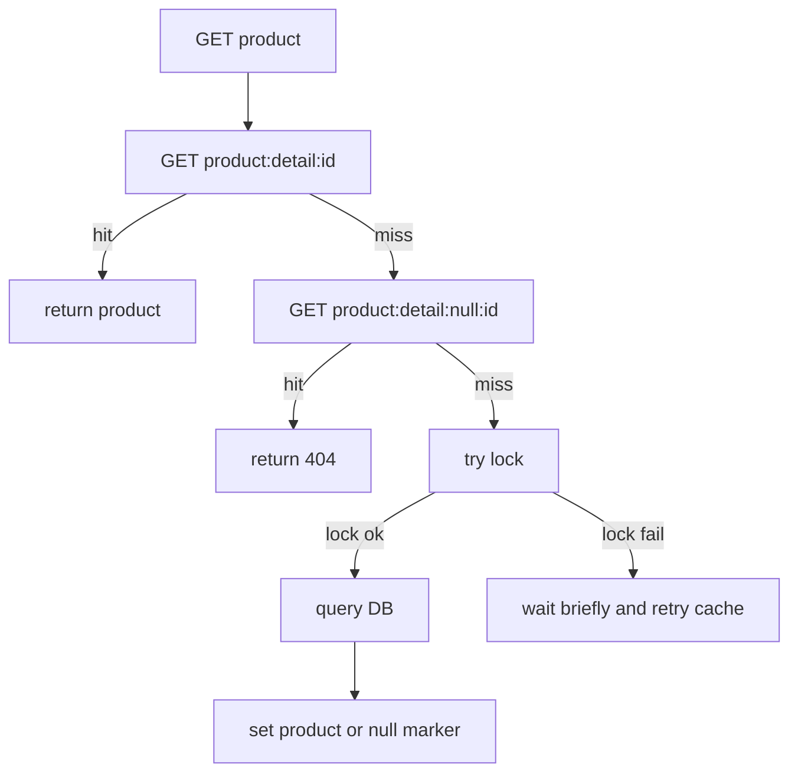

# Redis Key 设计实战

Redis key 设计不是随便拼字符串。好的 key 能让你看懂用途、控制生命周期、定位热点、避免冲突，并在出问题时快速清理或降级。

## 使用场景

常见 Redis key 类型：

- 数据缓存：商品详情、用户资料、配置项。
- 空值缓存：不存在的商品、已删除的短链。
- 计数器：点赞数、库存数、接口访问次数。
- 分布式锁：缓存重建锁、任务抢占锁。
- 幂等结果：下单处理中、支付创建结果。
- 限流状态：用户、IP、接口、资源维度的计数。

## 命名规范

推荐格式：

```text
{domain}:{type}:{id...}
```

规则：

- 从大到小：业务域、对象类型、具体 ID。
- 全部小写，单词用 `-` 或 `_` 统一一种风格。
- ID 用 `{}` 标出变量位，文档里写成模板。
- 不把手机号、邮箱、身份证等敏感信息直接放 key 里。
- 同一类 key 的 TTL、value schema、清理方式要写进文档。

## 推荐模板

商品详情：

```text
product:detail:{product_id}
```

商品不存在的空值缓存：

```text
product:detail:null:{product_id}
```

商品库存快照：

```text
product:stock:{sku_id}
```

缓存重建锁：

```text
lock:cache:product:detail:{product_id}
```

秒杀库存预扣：

```text
seckill:stock:{activity_id}:{sku_id}
```

秒杀用户去重：

```text
seckill:user:{activity_id}:{user_id}
```

下单结果查询：

```text
order:create:result:{request_id}
```

接口限流：

```text
rate-limit:api:{route}:{window_start}
rate-limit:user:{user_id}:{route}:{window_start}
```

## Value 设计

不要只设计 key，也要设计 value。

商品详情缓存：

```json
{
  "schema_version": 1,
  "product_id": "1001",
  "name": "Keyboard",
  "price": 19900,
  "updated_at": "2026-07-12T10:00:00Z"
}
```

逻辑过期缓存：

```json
{
  "expire_at": "2026-07-12T10:05:00Z",
  "data": {
    "product_id": "1001",
    "name": "Keyboard"
  }
}
```

空值缓存：

```json
{
  "exists": false,
  "reason": "not_found"
}
```

## TTL 建议

| Key 类型 | TTL 建议 | 原因 |
| --- | --- | --- |
| 商品详情 | 5 到 30 分钟 + jitter | 读多写少，允许短暂旧值 |
| 空值缓存 | 30 秒到 5 分钟 | 避免挡住后续创建 |
| 热点配置 | 10 秒到 1 分钟，或逻辑过期 | 兼顾稳定和更新速度 |
| 分布式锁 | 大于临界区 P99 | 防止任务没做完锁过期 |
| 限流计数 | 窗口长度略多一点 | 避免窗口边界丢失 |
| 查询结果 | 1 到 5 分钟 | 用户短时间轮询复用 |

TTL 要加随机抖动：

```text
ttl = base_ttl + random(0, jitter)
```

## 反例

反例 1：key 太短，看不出用途。

```text
1001
```

修正：

```text
product:detail:1001
```

反例 2：key 混入敏感信息。

```text
user:profile:phone:13800138000
```

修正：

```text
user:profile:{user_id}
```

反例 3：所有 key 使用相同 TTL。

```text
product:detail:{id} ttl=1800s
```

修正：

```text
product:detail:{id} ttl=1800s + random(0, 300s)
```

## 常见坑与修复

| 坑 | 现象 | 修复 |
| --- | --- | --- |
| key 没有业务前缀 | 清理时不知道删哪些 | 统一 `{domain}:{type}:{id}` |
| 空值缓存 TTL 太长 | 新数据创建后仍返回不存在 | 空值 TTL 短，并在创建时删除 null key |
| 热点 key 直接打 Redis | Redis 单分片 CPU 高 | 本地缓存、key 拆分、读副本 |
| 锁 key 没有随机 token | 可能误删别人锁 | value 使用 UUID，Lua 校验删除 |
| value 没版本 | 结构升级后消费者解析失败 | 加 `schema_version` |

## 监控指标

- `redis_cache_hit_ratio{key_type}`
- `redis_cache_miss_total{key_type}`
- `redis_command_latency_ms{command}`
- `redis_hot_key_qps{key_pattern}`
- `cache_rebuild_total{key_type,result}`
- `cache_null_marker_hit_total{key_type}`
- `redis_lock_acquire_failed_total{lock_type}`

## 完整业务例子

商品详情接口：

1. 读 `product:detail:{product_id}`。
2. 命中直接返回。
3. 命中 `product:detail:null:{product_id}`，返回 404。
4. miss 后抢 `lock:cache:product:detail:{product_id}`。
5. 抢到锁才查数据库并写缓存。
6. 数据库查不到时写 null key，TTL 60 秒。
7. 写商品详情 key 时 TTL 为 `1800s + random(0, 300s)`。



## 检查清单

- key 是否能从名字看出业务含义？
- 是否定义了 value schema 和版本？
- 是否定义 TTL 和 jitter？
- 是否有空值缓存策略？
- 热点 key 是否有本地缓存或拆分方案？
- 删除或更新数据时，相关 key 是否能被定位？
- 是否有 key 级别的命中率和热点监控？
