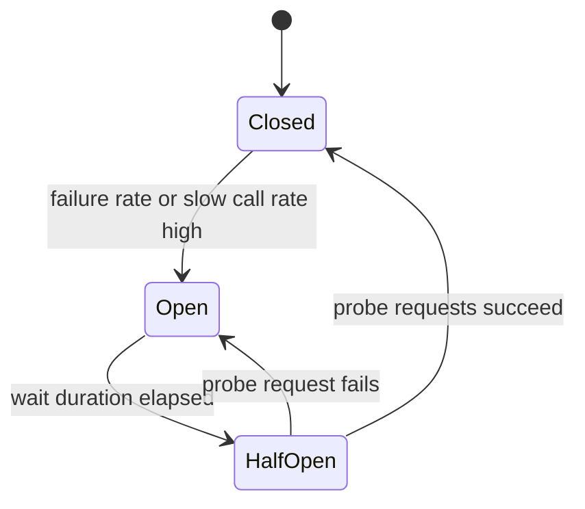
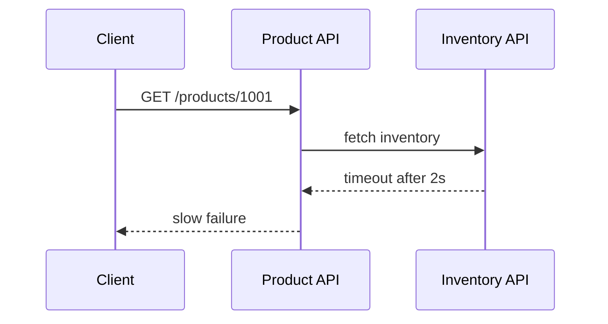
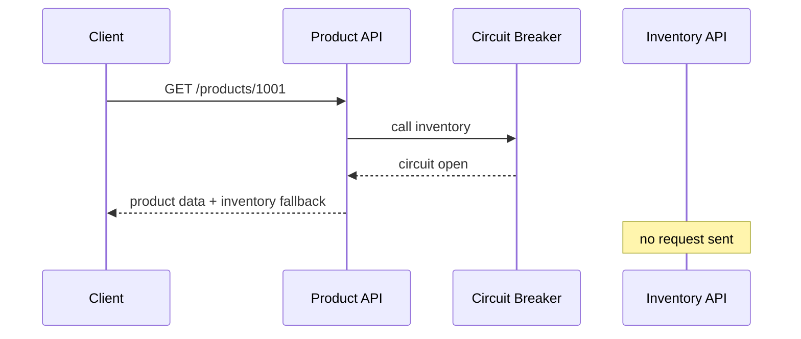
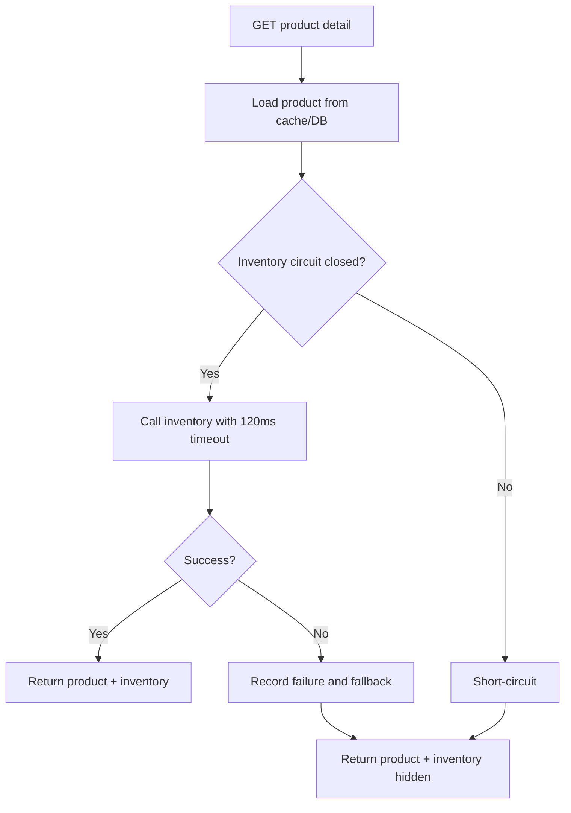
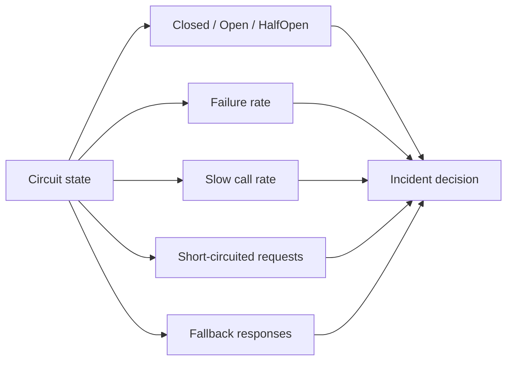

import Tabs from '@theme/Tabs';
import TabItem from '@theme/TabItem';

# 熔断与降级

熔断器在下游持续失败或明显变慢时快速失败，避免调用方线程、连接池和队列被拖垮。降级是在完整结果不可用时返回可接受的备选结果。两者经常一起使用：熔断负责保护系统，降级负责保住用户体验的下限。

## 它是什么

**熔断**借鉴电路保险丝的思想：当下游错误率、慢调用比例或连续失败次数超过阈值时，调用方暂时停止访问下游，直接返回错误或 fallback。经过一段冷却时间后，熔断器允许少量探测请求进入，如果探测成功则恢复正常，否则继续熔断。

**降级**是为失败路径准备的低成本备选方案。例如库存服务不可用时，商品详情页隐藏精确库存；推荐服务不可用时，返回默认推荐；评论服务超时时，先展示商品主体信息。

## 为什么需要它

后端服务通常依赖很多下游：数据库、Redis、MQ、库存服务、支付服务、推荐服务、第三方 API。下游变慢时，如果调用方继续等待、重试和排队，故障会向上游扩散。

典型故障过程是：库存服务 P99 从 50 ms 升到 2 s，商品详情 API 的 worker 被等待占满，入口请求排队，客户端超时重试，网关和数据库也开始受影响。熔断器可以在发现库存服务持续异常后快速失败，让商品详情 API 保持可用，并用降级结果返回。

## 它解决什么问题

| 机制 | 解决的问题 | 边界 |
| --- | --- | --- |
| 熔断 | 防止持续失败下游拖垮调用方 | 不能修复下游故障 |
| HalfOpen 探测 | 在冷却后判断下游是否恢复 | 探测流量要小，避免二次冲击 |
| 降级 | 在依赖不可用时返回备选结果 | 需要业务能接受不完整数据 |
| 慢调用熔断 | 防止长尾延迟耗尽资源 | 阈值需要基于 SLO 设置 |
| 隔离舱 | 限制单个依赖占用的线程/连接 | 会增加资源配置复杂度 |
| 限流配合 | 过载时减少新请求进入 | 不替代熔断的故障隔离 |

熔断不是“把错误藏起来”。它应该减少级联故障，同时通过日志、指标和告警让问题更快暴露。

## 核心原理

熔断器通常有三个状态：

- `Closed`：正常放行请求，统计成功、失败和慢调用。
- `Open`：快速拒绝请求，不访问下游。
- `HalfOpen`：冷却窗口结束后允许少量探测请求，判断是否恢复。



未熔断时，下游慢会占住调用方资源。



熔断打开后，调用方快速返回 fallback，不再把流量打到异常下游。



## 最小示例

下面示例实现同一个最小熔断器：

- 连续失败达到阈值后进入 `Open`。
- `Open` 持续一段时间后进入 `HalfOpen`。
- `HalfOpen` 下一次调用成功则恢复 `Closed`。
- `HalfOpen` 下一次调用失败则回到 `Open`。
- 调用方在熔断打开时走 fallback。

<Tabs groupId="language">
  <TabItem value="java" label="Java">

```java
import java.time.Duration;
import java.time.Instant;
import java.util.function.Supplier;

public class CircuitBreaker {
    enum State { CLOSED, OPEN, HALF_OPEN }

    private final int failureThreshold;
    private final Duration openDuration;
    private State state = State.CLOSED;
    private int failures = 0;
    private Instant openedAt = Instant.EPOCH;

    public CircuitBreaker(int failureThreshold, Duration openDuration) {
        this.failureThreshold = failureThreshold;
        this.openDuration = openDuration;
    }

    public synchronized <T> T call(Supplier<T> action, Supplier<T> fallback) {
        if (state == State.OPEN) {
            if (Instant.now().isBefore(openedAt.plus(openDuration))) {
                return fallback.get();
            }
            state = State.HALF_OPEN;
        }

        try {
            T result = action.get();
            onSuccess();
            return result;
        } catch (RuntimeException e) {
            onFailure();
            return fallback.get();
        }
    }

    private void onSuccess() {
        failures = 0;
        state = State.CLOSED;
    }

    private void onFailure() {
        failures++;
        if (state == State.HALF_OPEN || failures >= failureThreshold) {
            state = State.OPEN;
            openedAt = Instant.now();
        }
    }
}
```

  </TabItem>
  <TabItem value="go" label="Go">

```go
package circuitbreaker

import (
    "sync"
    "time"
)

type State int

const (
    Closed State = iota
    Open
    HalfOpen
)

type CircuitBreaker struct {
    mu               sync.Mutex
    state            State
    failures         int
    failureThreshold int
    openedAt         time.Time
    openDuration     time.Duration
}

func New(failureThreshold int, openDuration time.Duration) *CircuitBreaker {
    return &CircuitBreaker{state: Closed, failureThreshold: failureThreshold, openDuration: openDuration}
}

func (b *CircuitBreaker) Call(action func() (string, error), fallback func() string) string {
    b.mu.Lock()
    if b.state == Open {
        if time.Since(b.openedAt) < b.openDuration {
            b.mu.Unlock()
            return fallback()
        }
        b.state = HalfOpen
    }
    b.mu.Unlock()

    result, err := action()

    b.mu.Lock()
    defer b.mu.Unlock()
    if err == nil {
        b.failures = 0
        b.state = Closed
        return result
    }

    b.failures++
    if b.state == HalfOpen || b.failures >= b.failureThreshold {
        b.state = Open
        b.openedAt = time.Now()
    }
    return fallback()
}
```

  </TabItem>
  <TabItem value="typescript" label="TypeScript">

```typescript
type State = 'closed' | 'open' | 'half-open';

export class CircuitBreaker<T> {
  private state: State = 'closed';
  private failures = 0;
  private openedAt = 0;

  constructor(
    private readonly failureThreshold: number,
    private readonly openDurationMs: number,
  ) {}

  async call(action: () => Promise<T>, fallback: () => T): Promise<T> {
    if (this.state === 'open') {
      if (Date.now() - this.openedAt < this.openDurationMs) {
        return fallback();
      }
      this.state = 'half-open';
    }

    try {
      const result = await action();
      this.onSuccess();
      return result;
    } catch {
      this.onFailure();
      return fallback();
    }
  }

  private onSuccess(): void {
    this.failures = 0;
    this.state = 'closed';
  }

  private onFailure(): void {
    this.failures += 1;
    if (this.state === 'half-open' || this.failures >= this.failureThreshold) {
      this.state = 'open';
      this.openedAt = Date.now();
    }
  }
}
```

  </TabItem>
  <TabItem value="python" label="Python">

```python
import time
from enum import Enum
from threading import Lock
from typing import Callable, TypeVar


T = TypeVar("T")


class State(Enum):
    CLOSED = "closed"
    OPEN = "open"
    HALF_OPEN = "half-open"


class CircuitBreaker:
    def __init__(self, failure_threshold: int, open_duration_seconds: float):
        self.failure_threshold = failure_threshold
        self.open_duration_seconds = open_duration_seconds
        self.state = State.CLOSED
        self.failures = 0
        self.opened_at = 0.0
        self.lock = Lock()

    def call(self, action: Callable[[], T], fallback: Callable[[], T]) -> T:
        with self.lock:
            if self.state == State.OPEN:
                if time.monotonic() - self.opened_at < self.open_duration_seconds:
                    return fallback()
                self.state = State.HALF_OPEN

        try:
            result = action()
        except Exception:
            with self.lock:
                self._on_failure()
            return fallback()

        with self.lock:
            self._on_success()
        return result

    def _on_success(self) -> None:
        self.failures = 0
        self.state = State.CLOSED

    def _on_failure(self) -> None:
        self.failures += 1
        if self.state == State.HALF_OPEN or self.failures >= self.failure_threshold:
            self.state = State.OPEN
            self.opened_at = time.monotonic()
```

  </TabItem>
</Tabs>

## 工程实践

### 1. 熔断统计要基于窗口

真实系统通常不用“连续失败 N 次”作为唯一条件，而是使用滑动窗口统计最近一段时间的请求数、失败率、慢调用比例。样本太少时不要熔断，否则偶发失败会造成误判。

### 2. 熔断阈值要和 SLO 对齐

如果接口 SLO 是 P99 小于 300 ms，那么下游慢调用阈值不能设成 2 s。熔断阈值应围绕用户可感知延迟、调用方线程池容量、下游恢复时间和业务重要性来定。

### 3. fallback 必须低成本

降级结果不能继续依赖同一个故障下游。库存服务挂了，fallback 不能再同步调用库存服务另一个接口。常见 fallback 包括默认值、缓存旧值、本地静态配置、隐藏非核心模块、异步稍后处理。

### 4. HalfOpen 探测要限量

冷却结束后不要一次性放开全部流量。只允许少量探测请求访问下游，成功后逐步恢复，失败则继续 Open。否则下游刚恢复就可能被积压流量再次打挂。

### 5. 熔断必须可观测

至少记录：熔断器名称、状态变化、失败率、慢调用率、被短路请求数、fallback 次数、HalfOpen 探测结果、下游状态码和耗时。

## 常见坑

- 只设置超时和重试，没有熔断，下游持续慢时调用方继续堆积。
- fallback 继续调用故障下游，导致降级路径也变慢。
- 熔断阈值太敏感，偶发失败就 Open，造成可用下游被误伤。
- 熔断阈值太迟钝，下游已经拖垮调用方才 Open。
- HalfOpen 一次放开全部流量，导致下游二次过载。
- 熔断后没有告警，只是用户长期看到降级结果。
- 对核心写操作随意降级，导致业务语义不清，例如支付失败却显示成功。

## 完整案例：库存服务故障时保护商品详情页

### 场景

商品详情页需要展示商品主体信息、价格、库存和推荐。库存服务发布新版本后错误率升到 60%，P99 超过 2 s。商品详情 API 如果继续等待库存服务，会导致整个页面接口超时。

### 保护策略



### 降级结果

- 商品主体信息仍然展示。
- 精确库存隐藏，显示“库存状态暂不可用”。
- 下单按钮可以灰掉，或者下单时再做强校验。
- 熔断状态进入告警，库存服务发布自动回滚。

### 监控面板



## 检查清单

学完这一节后，你应该能回答：

- 熔断、限流、超时、重试分别解决什么问题？
- Closed、Open、HalfOpen 三个状态如何转换？
- 为什么熔断能防止级联故障？
- fallback 应该满足什么条件？
- 慢调用是否应该计入熔断？阈值如何设置？
- HalfOpen 为什么只能放少量探测请求？
- 哪些业务可以降级，哪些业务不能随意降级？
- 熔断器应该暴露哪些指标和告警？

## 延伸阅读

- [Martin Fowler: Circuit Breaker](https://martinfowler.com/bliki/CircuitBreaker.html)
- [Resilience4j CircuitBreaker](https://resilience4j.readme.io/docs/circuitbreaker)
- [Google SRE Book: Addressing Cascading Failures](https://sre.google/sre-book/addressing-cascading-failures/)
- [Google SRE Book: Handling Overload](https://sre.google/sre-book/handling-overload/)
- [Microsoft Azure Architecture Center: Circuit Breaker pattern](https://learn.microsoft.com/en-us/azure/architecture/patterns/circuit-breaker)
