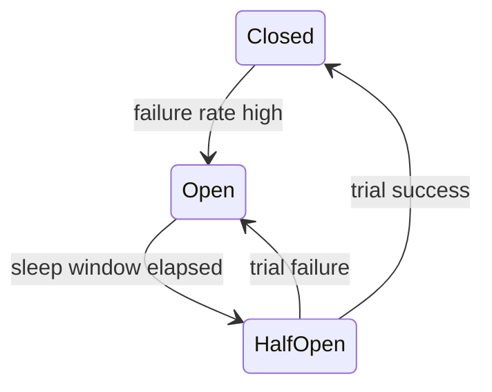

# 熔断与降级

熔断器在下游持续失败时快速失败，避免调用方线程和连接被拖垮。降级则是在完整结果不可用时返回可接受的备选结果。

## 延伸阅读

- [Martin Fowler: Circuit Breaker](https://martinfowler.com/bliki/CircuitBreaker.html)
- [Resilience4j CircuitBreaker](https://resilience4j.readme.io/docs/circuitbreaker)
