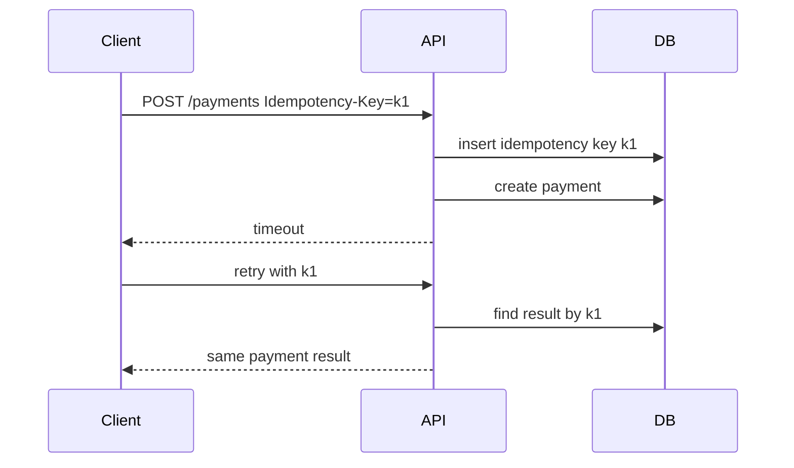
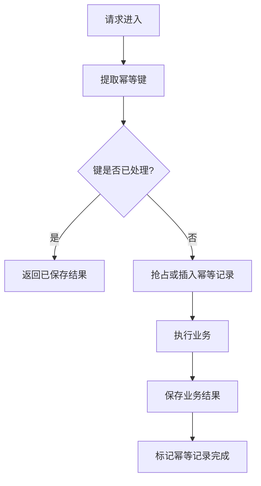
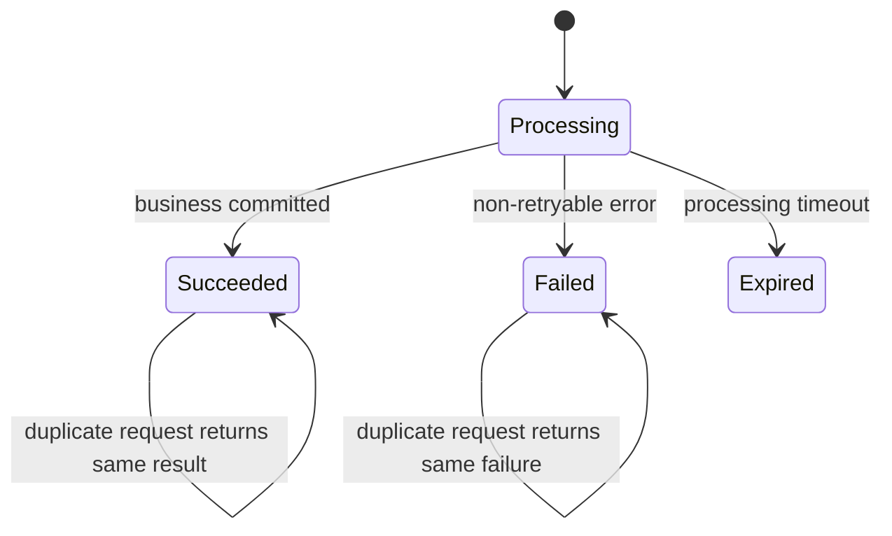

import Tabs from '@theme/Tabs';
import TabItem from '@theme/TabItem';

# 幂等设计

幂等意味着同一个操作执行一次和执行多次的最终效果一致。它是重试、消息消费、支付回调、客户端重复提交和任务补偿的基础。

## 先理解这些概念

- **重复请求**：用户重复点击、客户端超时重试、服务端重试导致同一操作再次到达。
- **幂等键**：标识同一次业务意图的 key，比如支付请求号。
- **请求摘要**：把请求参数算成 hash，防止同一个幂等键被不同参数复用。
- **唯一约束**：数据库层阻止同一业务 key 插入多次。
- **条件更新**：只允许状态从预期状态推进，比如待支付才能变已支付。
- **返回同一结果**：重复请求不重新执行副作用，而是返回第一次处理结果。

读这篇时先记住：幂等不是“请求只会来一次”，而是“来多次也不会造成多次副作用”。



## 它是什么

幂等设计是一组让重复执行安全的工程约束。它不要求代码只运行一次，而是要求重复运行不会造成重复扣款、重复发货、重复发券、重复创建订单等副作用。

常见实现方式包括：幂等键、唯一索引、状态机版本检查、消息消费记录表、业务去重表、条件更新。

## 为什么需要它

高可靠系统一定会重试。客户端会因为超时重试，服务端会因为临时错误重试，MQ 会因为消费失败重新投递，第三方支付会重复回调。如果业务没有幂等保护，可靠性机制会直接变成重复写入和资金风险。

幂等让系统敢于重试、敢于补偿、敢于恢复。

## 它解决什么问题

- 用户重复点击导致的重复创建。
- 客户端超时后不知道服务端是否成功，只能重试确认。
- MQ 至少一次投递导致的重复消费。
- 支付、退款、发券等外部回调重复到达。
- 定时补偿任务重复扫描同一条业务记录。

## 核心原理

幂等的关键是为“同一次业务意图”建立稳定身份，并把处理结果持久化。



典型数据库表：

| 字段 | 说明 |
| --- | --- |
| `idempotency_key` | 客户端或业务生成的唯一键 |
| `request_hash` | 请求参数摘要，防止同 key 不同参数 |
| `status` | `processing`、`succeeded`、`failed` |
| `response_body` | 成功后的可复用响应 |
| `expires_at` | 幂等记录保留期限 |

## 最小示例

<Tabs groupId="language">
<TabItem value="java" label="Java">

```java
class PaymentService {
    PaymentResult create(CreatePayment cmd, String key) {
        String requestHash = hash(cmd);
        IdempotencyRecord existing = repo.find(key);
        if (existing != null) {
            if (!existing.requestHash().equals(requestHash)) {
                throw new IllegalArgumentException("same idempotency key with different request");
            }
            if (existing.isSucceeded()) {
                return existing.result();
            }
            throw new ConflictException("request is still processing");
        }

        return tx.execute(() -> {
            boolean inserted = repo.insertIfAbsent(key, requestHash);
            if (!inserted) {
                throw new ConflictException("request is already processing");
            }
            Payment payment = payments.create(cmd.amount(), cmd.userId());
            PaymentResult result = PaymentResult.from(payment);
            repo.markSucceeded(key, result);
            return result;
        });
    }
}
```

</TabItem>
<TabItem value="go" label="Go">

```go
package idempotency

func CreatePayment(db DB, cmd Command, key string) (Result, error) {
    requestHash := Hash(cmd)
    if record, ok := db.FindIdempotency(key); ok {
        if record.RequestHash != requestHash {
            return Result{}, ErrIdempotencyKeyReused
        }
        if record.Succeeded {
            return record.Result, nil
        }
        return Result{}, ErrStillProcessing
    }

    var result Result
    err := db.WithTx(func(tx Tx) error {
        inserted, err := tx.InsertIdempotencyIfAbsent(key, requestHash)
        if err != nil {
            return err
        }
        if !inserted {
            return ErrStillProcessing
        }
        payment, err := tx.CreatePayment(cmd.UserID, cmd.Amount)
        if err != nil {
            return err
        }
        result = Result{PaymentID: payment.ID}
        return tx.MarkSucceeded(key, result)
    })
    return result, err
}
```

</TabItem>
<TabItem value="typescript" label="TypeScript">

```ts
async function createPayment(db: Database, cmd: Command, key: string) {
  const requestHash = hash(cmd);
  const existing = await db.idempotency.find(key);
  if (existing) {
    if (existing.requestHash !== requestHash) {
      throw new Error('same idempotency key with different request');
    }
    if (existing.status === 'succeeded') return existing.response;
    throw new Error('request is still processing');
  }

  return db.transaction(async (tx) => {
    const inserted = await tx.idempotency.insertIfAbsent({ key, requestHash });
    if (!inserted) throw new Error('request is already processing');
    const payment = await tx.payments.create({ userId: cmd.userId, amount: cmd.amount });
    const response = { paymentId: payment.id };
    await tx.idempotency.markSucceeded(key, response);
    return response;
  });
}
```

</TabItem>
<TabItem value="python" label="Python">

```python
async def create_payment(db, cmd: dict, key: str) -> dict:
    request_hash = hash_request(cmd)
    existing = await db.idempotency.find(key)
    if existing:
        if existing["request_hash"] != request_hash:
            raise ValueError("same idempotency key with different request")
        if existing["status"] == "succeeded":
            return existing["response"]
        raise ConflictError("request is still processing")

    async with db.transaction() as tx:
        inserted = await tx.idempotency.insert_if_absent(key, request_hash)
        if not inserted:
            raise ConflictError("request is already processing")
        payment = await tx.payments.create(cmd["user_id"], cmd["amount"])
        response = {"payment_id": payment["id"]}
        await tx.idempotency.mark_succeeded(key, response)
        return response
```

</TabItem>
</Tabs>

## 工程实践

- 客户端写接口使用 `Idempotency-Key`，服务端校验同 key 的请求参数摘要。
- 数据库层使用唯一索引兜底，例如订单号、支付请求号、消息 ID。
- 对状态流转使用条件更新：`where status = 'pending'`，避免重复推进。
- MQ 消费者保存 `message_id` 处理记录，重复消息直接跳过或返回已处理。
- 幂等记录要有保留期限，过期时间按业务重试窗口设置。
- 对 `processing` 状态设置超时恢复策略，避免进程崩溃后永远占用 key。

## 常见坑

- 只在内存里记录幂等 key，服务重启后失效。
- 同一个 key 对应不同请求参数，服务端没有检查 request hash。
- 先执行业务再写幂等记录，中间崩溃会失去保护。
- 幂等记录没有唯一约束，高并发下插入多条。
- 消费者认为 MQ 不会重复投递，没有去重表。

## 完整案例

支付创建接口经常遇到客户端超时。用户点击支付后，服务端已经创建支付单，但响应在网络中丢失。客户端如果重新提交，没有幂等会创建第二笔支付。

改造方案：

1. 客户端生成 `payment_request_id`，作为幂等键。
2. 服务端在事务中插入幂等记录和支付单。
3. 幂等 key 建唯一索引，请求参数 hash 必须一致。
4. 重复请求返回第一次创建的支付单 ID 和状态。
5. 如果第一次请求还在处理中，返回 409 或短暂等待后查询结果。



## 检查清单

- 写接口是否要求稳定幂等键？
- 幂等键是否有数据库唯一约束？
- 是否校验同 key 的请求参数一致？
- 重复请求是否返回第一次的结果？
- MQ 消费和第三方回调是否有去重记录？
- 状态更新是否使用条件更新或版本号？
- `processing` 记录是否有超时恢复策略？

## 这篇文章在系统里怎么用

幂等设计出现在所有可能重试的地方：创建订单、创建支付、支付回调、退款、MQ 消费、发券、扣库存。只要失败后你想安全重试，就必须先设计幂等。

系统设计时，要说明幂等键来自哪里，唯一约束建在哪里，重复请求返回什么，处理中状态如何恢复。幂等是重试、Outbox、DLQ 重放和补偿任务的基础。

## 术语回看

- [幂等](../system-design/glossary.md#幂等)
- [状态机](../system-design/glossary.md#状态机)
- [补偿](../system-design/glossary.md#补偿)
- [Outbox](../system-design/glossary.md#outbox)

## 延伸阅读

- [Stripe: Idempotent requests](https://docs.stripe.com/api/idempotent_requests)
- [AWS Builders Library: Making retries safe with idempotent APIs](https://aws.amazon.com/builders-library/making-retries-safe-with-idempotent-APIs/)
- [Microservices.io: Idempotent Consumer](https://microservices.io/patterns/communication-style/idempotent-consumer.html)
