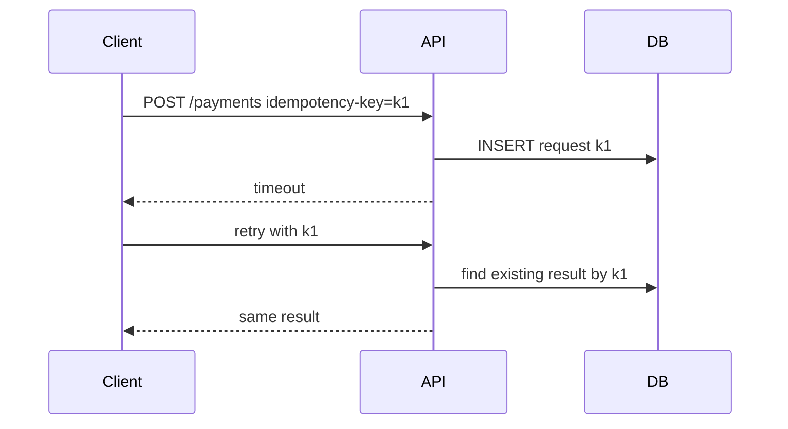

# 幂等设计

幂等意味着同一个操作执行一次和执行多次的最终效果一致。它是重试、消息消费、支付回调和客户端重复提交的基础。

## 延伸阅读

- [Stripe: Idempotent requests](https://docs.stripe.com/api/idempotent_requests)
- [AWS Builders Library: Making retries safe with idempotent APIs](https://aws.amazon.com/builders-library/making-retries-safe-with-idempotent-APIs/)
