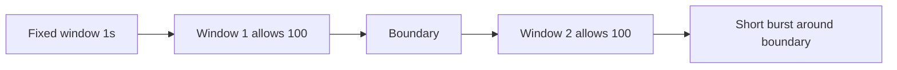
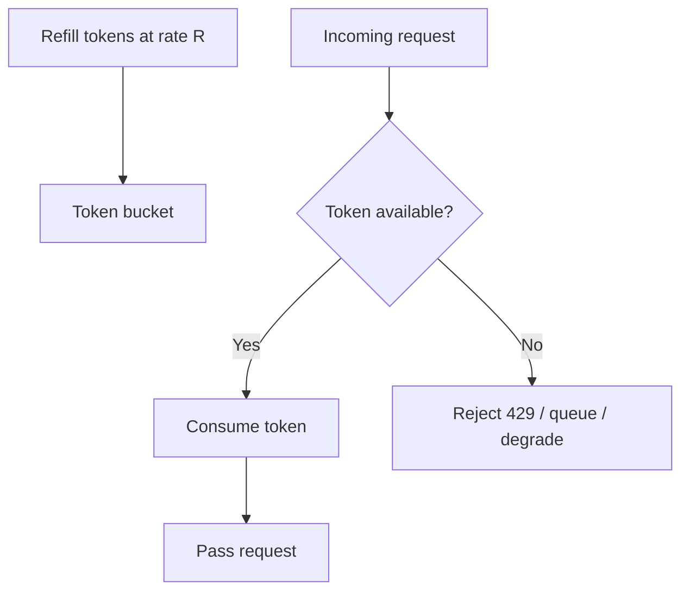
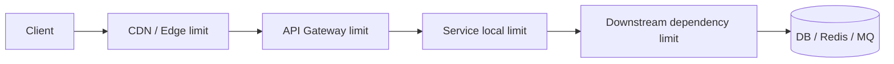
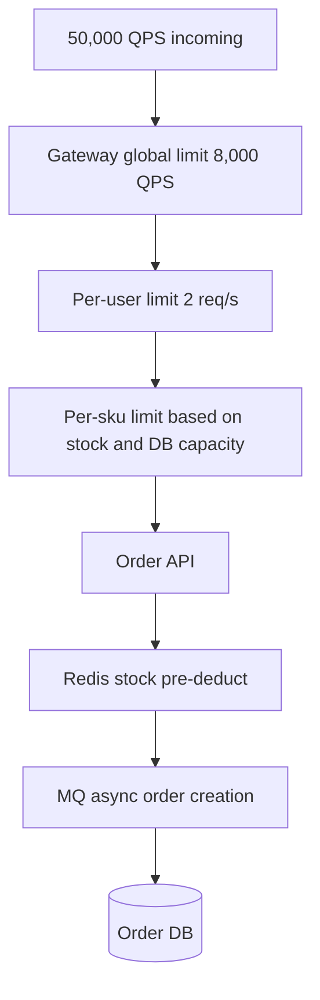
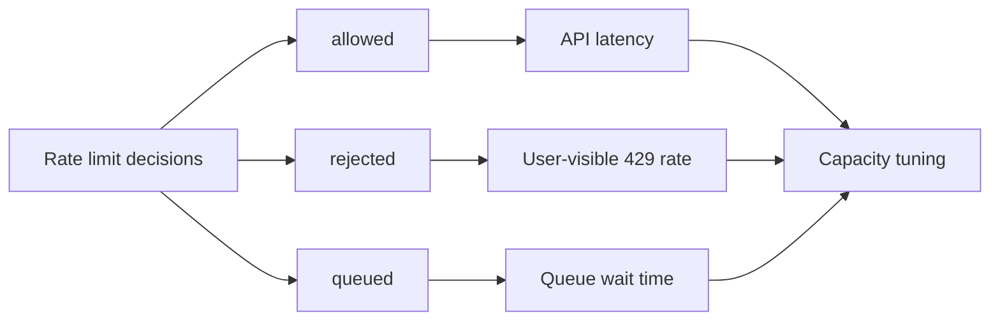

import Tabs from '@theme/Tabs';
import TabItem from '@theme/TabItem';

# 限流

限流的目标不是简单拒绝用户，而是在系统过载前保护核心依赖，让服务以可控方式退化。高并发系统一定要假设入口流量、单用户行为、热点资源和下游依赖都可能超过设计容量。

## 先理解这些概念

- **限流**：超过系统承受能力时，限制请求进入。
- **QPS**：每秒请求数，是常见限流单位。
- **并发数**：同一时间正在处理的请求数量。
- **令牌桶**：桶里有令牌才放行，允许一定突发流量。
- **漏桶**：请求按固定速度流出，更强调平滑处理。
- **局部限流**：单个实例自己限流。
- **全局限流**：多个实例共享同一个限流视图。

读这篇时先记住：限流不是为了拒绝用户，而是为了在过载前保护数据库、缓存、下游服务和核心链路。

## 它是什么

限流是对请求速率或并发量设置上限的机制。超过上限后，系统可以拒绝、排队、降级、延迟处理，或者只允许部分请求通过。

常见限流维度包括：

- 全站级：保护整个服务，例如 API 每秒最多 10,000 请求。
- 用户级：防止单个用户刷接口，例如每用户每秒最多 5 次下单。
- IP / 设备级：防止攻击或异常客户端。
- 资源级：保护热点商品、直播间、帖子等单个 key。
- 下游级：保护数据库、Redis、第三方 API 或内部服务。

## 为什么需要它

没有限流时，系统会在过载后以不可控方式失败：线程池耗尽、连接池排队、数据库 CPU 打满、Redis 热 key 延迟升高、MQ 积压、下游服务被拖垮。用户看到的不是少量 `429`，而是大量超时、白屏、重复提交和数据不一致。

限流的价值是把不可控的慢失败变成可控的快速失败。被拒绝的请求可以重试、排队或显示降级文案；但如果核心依赖被压垮，所有请求都会变慢，恢复时间也更长。

## 它解决什么问题

| 机制 | 解决的问题 | 边界 |
| --- | --- | --- |
| 固定窗口 | 简单统计单位时间请求数 | 窗口边界会出现突刺 |
| 滑动窗口 | 更平滑地限制最近一段时间请求数 | 存储和计算成本更高 |
| 漏桶 | 以固定速率处理请求，削平突发 | 突发流量排队可能增加延迟 |
| 令牌桶 | 允许短暂突发，同时限制长期速率 | 桶容量需要谨慎配置 |
| 并发限制 | 控制同时进行的请求数 | 不直接限制 QPS |
| 分布式限流 | 多实例共享限流状态 | 依赖 Redis/网关等中心组件 |

限流不能增加系统容量，也不能替代性能优化。它解决的是“超过容量时如何保护系统”。

## 核心原理

固定窗口最简单，但窗口边界容易放大流量。比如每秒限制 100 次，用户可以在 `00:00:00.999` 发 100 次，再在 `00:00:01.001` 发 100 次，2 ms 内通过 200 次。



令牌桶是后端接口常用算法：系统按固定速率往桶里放 token；请求来时消耗一个 token；桶空时拒绝或排队。桶容量决定允许多大的短期突发，填充速率决定长期吞吐。



限流位置也很重要。越靠前越能保护后端资源，越靠近业务越能使用精确维度。



## 最小示例

下面示例实现同一个内存令牌桶：每秒补充 `refillRate` 个 token，桶最多保存 `capacity` 个 token。单机限流可以这样实现；多实例生产环境通常要把限流状态放到 Redis、网关或专用限流服务中。

<Tabs groupId="language">
  <TabItem value="java" label="Java">

```java
public class TokenBucket {
    private final double capacity;
    private final double refillPerSecond;
    private double tokens;
    private long lastRefillNanos;

    public TokenBucket(double capacity, double refillPerSecond) {
        this.capacity = capacity;
        this.refillPerSecond = refillPerSecond;
        this.tokens = capacity;
        this.lastRefillNanos = System.nanoTime();
    }

    public synchronized boolean tryAcquire() {
        refill();
        if (tokens < 1.0) {
            return false;
        }
        tokens -= 1.0;
        return true;
    }

    private void refill() {
        long now = System.nanoTime();
        double elapsedSeconds = (now - lastRefillNanos) / 1_000_000_000.0;
        tokens = Math.min(capacity, tokens + elapsedSeconds * refillPerSecond);
        lastRefillNanos = now;
    }
}

// Usage:
// if (!bucket.tryAcquire()) return HTTP 429 Too Many Requests;
```

  </TabItem>
  <TabItem value="go" label="Go">

```go
package ratelimit

import (
    "sync"
    "time"
)

type TokenBucket struct {
    mu              sync.Mutex
    capacity        float64
    refillPerSecond float64
    tokens          float64
    lastRefill      time.Time
}

func NewTokenBucket(capacity, refillPerSecond float64) *TokenBucket {
    return &TokenBucket{
        capacity:        capacity,
        refillPerSecond: refillPerSecond,
        tokens:          capacity,
        lastRefill:      time.Now(),
    }
}

func (b *TokenBucket) TryAcquire() bool {
    b.mu.Lock()
    defer b.mu.Unlock()

    b.refill()
    if b.tokens < 1 {
        return false
    }
    b.tokens--
    return true
}

func (b *TokenBucket) refill() {
    now := time.Now()
    elapsed := now.Sub(b.lastRefill).Seconds()
    b.tokens = b.tokens + elapsed*b.refillPerSecond
    if b.tokens > b.capacity {
        b.tokens = b.capacity
    }
    b.lastRefill = now
}
```

  </TabItem>
  <TabItem value="typescript" label="TypeScript">

```typescript
export class TokenBucket {
  private tokens: number;
  private lastRefillMs: number;

  constructor(
    private readonly capacity: number,
    private readonly refillPerSecond: number,
  ) {
    this.tokens = capacity;
    this.lastRefillMs = Date.now();
  }

  tryAcquire(): boolean {
    this.refill();
    if (this.tokens < 1) {
      return false;
    }
    this.tokens -= 1;
    return true;
  }

  private refill(): void {
    const now = Date.now();
    const elapsedSeconds = (now - this.lastRefillMs) / 1000;
    this.tokens = Math.min(
      this.capacity,
      this.tokens + elapsedSeconds * this.refillPerSecond,
    );
    this.lastRefillMs = now;
  }
}

// Usage:
// if (!bucket.tryAcquire()) return new Response('Too Many Requests', { status: 429 });
```

  </TabItem>
  <TabItem value="python" label="Python">

```python
import threading
import time


class TokenBucket:
    def __init__(self, capacity: float, refill_per_second: float):
        self.capacity = capacity
        self.refill_per_second = refill_per_second
        self.tokens = capacity
        self.last_refill = time.monotonic()
        self.lock = threading.Lock()

    def try_acquire(self) -> bool:
        with self.lock:
            self._refill()
            if self.tokens < 1:
                return False
            self.tokens -= 1
            return True

    def _refill(self) -> None:
        now = time.monotonic()
        elapsed = now - self.last_refill
        self.tokens = min(self.capacity, self.tokens + elapsed * self.refill_per_second)
        self.last_refill = now


# Usage:
# if not bucket.try_acquire(): return 429
```

  </TabItem>
</Tabs>

## 工程实践

### 1. 先定义保护对象

不要先问“限流值配多少”，先问“要保护什么”。保护对象不同，限流维度也不同。

| 保护对象 | 常见限流维度 |
| --- | --- |
| 整个 API 服务 | 全局 QPS、实例级 QPS |
| 单个用户 | user id、account id |
| 防攻击 | IP、设备、账号、UA 组合 |
| 热点商品 | sku id、activity id |
| 数据库 | DB 查询模板、连接池、租户 |
| 第三方 API | provider、endpoint、tenant |

### 2. 返回语义要明确

被限流时通常返回 `429 Too Many Requests`，并尽量带上 `Retry-After` 或业务错误码。对用户关键路径，例如下单、支付，不要让客户端无限自动重试；应该结合幂等 key、退避和用户可理解的提示。

### 3. 多实例要使用共享状态

内存令牌桶只能限制单个进程。如果服务有 20 个实例，每个实例限制 100 QPS，总量可能达到 2,000 QPS。全局限流要放在 API Gateway、Redis、服务网格或专用限流系统中。

### 4. 限流要和排队、降级、熔断配合

限流负责“不要让更多请求进入系统”。排队适合短暂突发，但会增加延迟；降级适合返回低成本结果；熔断适合下游持续失败时快速失败。它们解决的问题不同，应该组合使用。

### 5. 配额要动态可调

限流阈值不能只写死在代码里。活动流量、机器数、数据库容量、下游 SLA 都会变化。生产系统应该支持配置化、灰度调整、快速回滚，并记录每次限流策略变更。

## 常见坑

- 只在业务服务做本地限流，多实例后总流量远超预期。
- 限流值按平均 QPS 配置，忽略 P99 延迟和下游容量。
- 被限流后客户端立即重试，形成重试风暴。
- 对所有用户使用同一限流值，误伤高价值或批量导入场景。
- 限流只保护入口，不保护数据库、Redis、第三方 API 等核心依赖。
- 只记录被限流数量，不记录限流维度、规则名和调用方。
- 使用固定窗口，窗口边界突刺仍然打穿下游。

## 完整案例：秒杀下单接口限流

### 场景

秒杀活动开始后，`POST /orders` 瞬间进入 50,000 QPS，但库存服务和订单数据库稳定容量只有 5,000 QPS。如果没有限流，数据库连接池会被打满，消费者积压，用户看到大量超时和重复提交。

### 分层限流设计



### 策略

- 网关全局限流保护服务入口。
- 用户级限流减少重复点击和脚本刷单。
- 商品级限流保护热点库存 key 和下单链路。
- Redis 预扣减挡住无库存请求。
- MQ 削峰，把订单创建平滑到数据库可承受范围。
- 返回 `429` 时客户端展示“请求过多，请稍后重试”，不要自动立即重试。

### 监控



## 检查清单

学完这一节后，你应该能回答：

- 限流和熔断、降级、排队分别解决什么问题？
- 固定窗口、滑动窗口、漏桶、令牌桶的差异是什么？
- 为什么本地限流不能直接代表全局限流？
- 限流阈值应该根据什么来定？
- 被限流后应该返回什么状态码和语义？
- 为什么客户端立即重试会抵消限流效果？
- 如何对用户、IP、资源、下游依赖分别限流？
- 应该监控哪些指标来判断限流策略是否合理？

## 这篇文章在系统里怎么用

限流常用于秒杀、抢票、登录、发送验证码、支付创建、第三方 API 调用。系统设计时，要说清楚限流维度：按用户、IP、商品、接口、服务实例，还是按下游容量。

被限流后的行为也要设计：直接返回 429、进入排队、返回静态页、降级结果，还是提示稍后重试。限流通常和削峰、熔断、降级一起使用。

## 术语回看

- [削峰](../system-design/glossary.md#削峰)
- [令牌桶 / 漏桶](../system-design/glossary.md#令牌桶--漏桶)
- [热点 / 热 Key](../system-design/glossary.md#热点--热-key)

## 延伸阅读

- [Google SRE Book: Handling Overload](https://sre.google/sre-book/handling-overload/)
- [Google SRE Book: Addressing Cascading Failures](https://sre.google/sre-book/addressing-cascading-failures/)
- [Redis: Rate limiter pattern](https://redis.io/docs/latest/commands/incr/#pattern-rate-limiter)
- [MDN: 429 Too Many Requests](https://developer.mozilla.org/en-US/docs/Web/HTTP/Status/429)
- [Envoy: Global rate limiting](https://www.envoyproxy.io/docs/envoy/latest/intro/arch_overview/other_features/global_rate_limiting)
