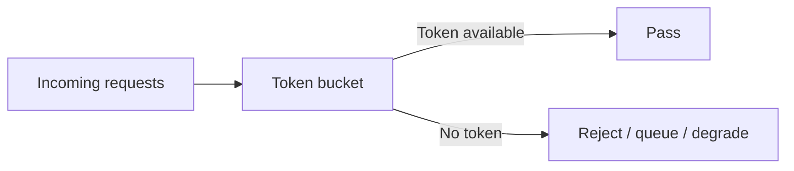

# 限流

限流的目标不是拒绝用户，而是在系统过载前保护核心依赖。常见算法包括固定窗口、滑动窗口、漏桶和令牌桶。

## 延伸阅读

- [Google SRE Book: Handling Overload](https://sre.google/sre-book/handling-overload/)
- [Redis: Rate limiter pattern](https://redis.io/docs/latest/commands/incr/#pattern-rate-limiter)
