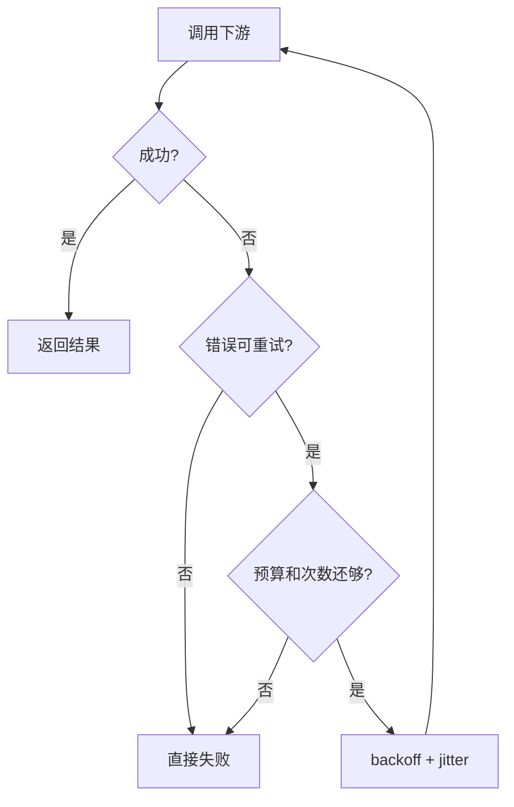
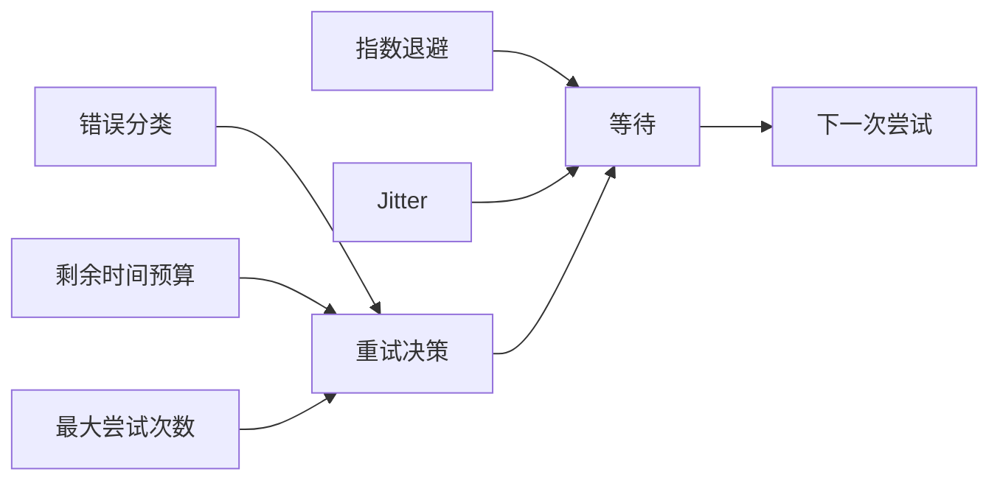
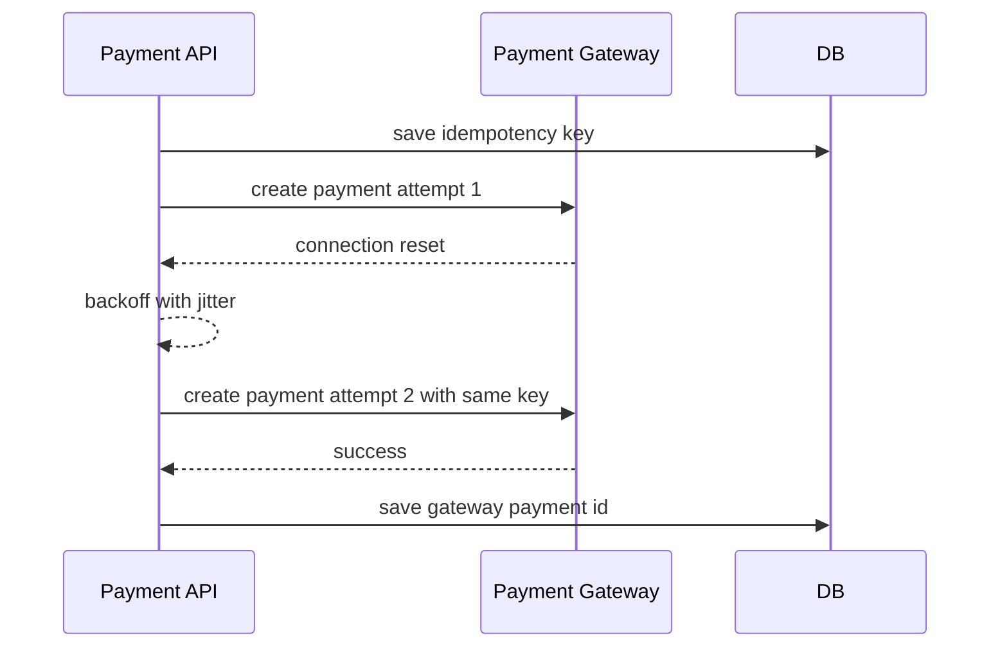

import Tabs from '@theme/Tabs';
import TabItem from '@theme/TabItem';

# 重试策略

重试是处理临时故障的常用手段，但它也是故障放大器。可靠的重试必须有边界：错误可重试、操作可幂等、仍有时间预算、次数有限，并使用退避和 jitter。



## 它是什么

重试是在一次调用失败后再次尝试同一个操作。它适合处理网络抖动、短暂限流、连接重置、主从切换、短时间 5xx 等临时故障。

它不适合掩盖永久错误，例如参数错误、权限错误、余额不足、库存不足、唯一约束冲突。

## 为什么需要它

分布式系统中，失败经常是短暂的。一次请求失败不代表下游整体不可用，合理重试可以显著提升成功率，尤其是在跨网络、跨可用区、调用第三方服务时。

但重试会增加下游压力。如果所有客户端在同一时间立即重试，原本短暂的慢请求会变成流量风暴。

## 它解决什么问题

- 降低瞬时网络抖动导致的用户可见失败。
- 在主从切换、连接重建、短时限流后自动恢复。
- 配合幂等键，让客户端超时后可以安全确认最终结果。
- 用退避和 jitter 平滑重试流量，避免同步冲击。

## 核心原理

重试策略由五个要素组成：错误分类、最大次数、时间预算、退避算法、幂等保障。



常用退避公式：

```text
delay = min(base * 2^attempt, maxDelay)
sleep = random(0, delay)
```

随机 jitter 的作用是把大量客户端的重试时间打散，避免同一秒再次压垮下游。

## 最小示例

<Tabs groupId="language">
<TabItem value="java" label="Java">

```java
import java.time.Duration;
import java.util.concurrent.ThreadLocalRandom;

class Retry {
    static <T> T call(CheckedSupplier<T> fn) throws Exception {
        int maxAttempts = 3;
        for (int attempt = 0; attempt < maxAttempts; attempt++) {
            try {
                return fn.get();
            } catch (TransientException e) {
                if (attempt == maxAttempts - 1) throw e;
                long cap = Math.min(50L * (1L << attempt), 500L);
                Thread.sleep(ThreadLocalRandom.current().nextLong(cap + 1));
            }
        }
        throw new IllegalStateException("unreachable");
    }
}
```

</TabItem>
<TabItem value="go" label="Go">

```go
package retry

import (
    "context"
    "math/rand"
    "time"
)

func Do(ctx context.Context, fn func() error) error {
    var err error
    for attempt := 0; attempt < 3; attempt++ {
        if err = fn(); err == nil {
            return nil
        }
        if !IsTransient(err) || attempt == 2 {
            return err
        }
        capDelay := minDuration(50*time.Millisecond<<attempt, 500*time.Millisecond)
        timer := time.NewTimer(time.Duration(rand.Int63n(int64(capDelay) + 1)))
        select {
        case <-ctx.Done():
            timer.Stop()
            return ctx.Err()
        case <-timer.C:
        }
    }
    return err
}
```

</TabItem>
<TabItem value="typescript" label="TypeScript">

```ts
async function retry<T>(fn: () => Promise<T>, attempts = 3): Promise<T> {
  let lastError: unknown;
  for (let attempt = 0; attempt < attempts; attempt++) {
    try {
      return await fn();
    } catch (err) {
      lastError = err;
      if (!isTransient(err) || attempt === attempts - 1) throw err;
      const cap = Math.min(50 * 2 ** attempt, 500);
      await sleep(Math.floor(Math.random() * (cap + 1)));
    }
  }
  throw lastError;
}
```

</TabItem>
<TabItem value="python" label="Python">

```python
import asyncio
import random


async def retry(fn, attempts: int = 3):
    for attempt in range(attempts):
        try:
            return await fn()
        except TransientError:
            if attempt == attempts - 1:
                raise
            cap = min(0.05 * (2**attempt), 0.5)
            await asyncio.sleep(random.uniform(0, cap))
```

</TabItem>
</Tabs>

## 工程实践

- 只重试明确的临时错误：超时、连接重置、部分 429、部分 5xx。
- 不重试业务失败：400、401、403、余额不足、库存不足、参数错误。
- 重试必须受入口 deadline 约束，不能超过用户请求总预算。
- 写操作要先设计幂等键，再开放自动重试。
- 多层调用链避免每层都重试，否则 3 层各重试 3 次会放大成 27 次。
- 对下游限流返回的 `Retry-After` 要尊重，但仍受本地预算约束。

## 常见坑

- 失败后立即重试，没有退避和 jitter。
- 所有异常都重试，把业务错误变成额外流量。
- 在客户端、网关、服务端 SDK 多层同时重试。
- 超时 1 秒的请求里做 3 次每次 1 秒的重试。
- 非幂等扣款、发券、创建订单操作被自动重试。

## 完整案例

支付服务调用第三方支付网关创建支付单。网关偶尔出现连接重置，直接失败会影响成功率；但创建支付单是写操作，不能盲目重试。

改造方案：

1. 每次创建支付单带业务幂等键 `payment_request_id`。
2. 只对连接重置、读超时和 502/503 做最多 2 次重试。
3. 总预算 800ms，单次请求超时 250ms，退避使用 full jitter。
4. 如果预算不足，不再重试，返回“处理中”并由查询接口确认状态。
5. 记录每次尝试的 attempt、delay、error_type 和 remaining_budget。



## 检查清单

- 是否明确哪些错误可以重试？
- 写操作是否有幂等键或唯一约束？
- 是否设置最大尝试次数和总时间预算？
- 是否使用指数退避和 jitter？
- 是否避免调用链多层重复重试？
- 是否监控重试次数、最终失败率和重试成功率？

## 延伸阅读

- [AWS Builders Library: Timeouts, retries, and backoff with jitter](https://aws.amazon.com/builders-library/timeouts-retries-and-backoff-with-jitter/)
- [AWS Builders Library: Making retries safe with idempotent APIs](https://aws.amazon.com/builders-library/making-retries-safe-with-idempotent-APIs/)
- [Google SRE Book: Addressing Cascading Failures](https://sre.google/sre-book/addressing-cascading-failures/)
