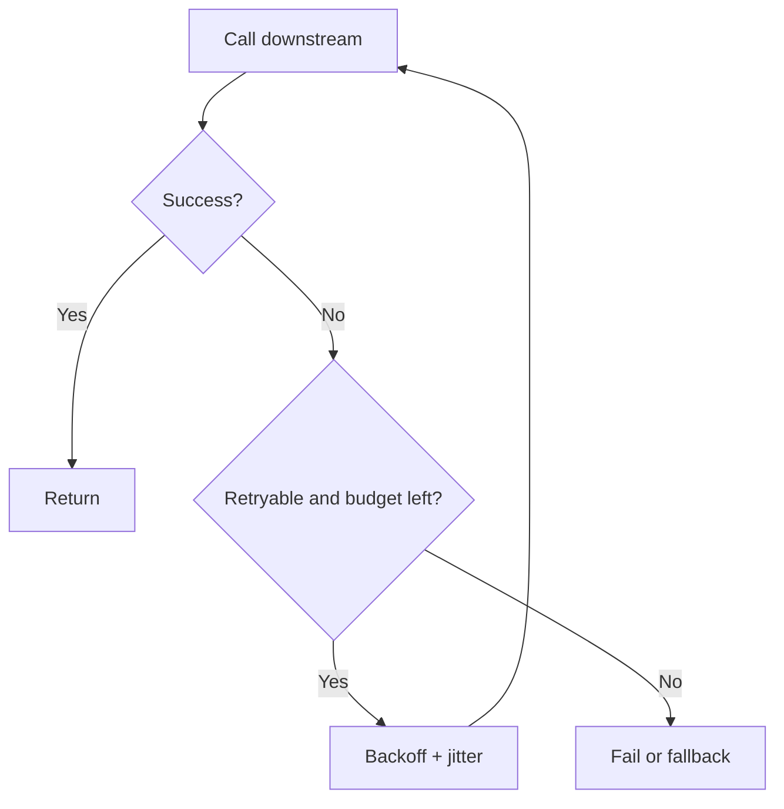

# 重试策略

重试只能用于临时故障，并且要有最大次数、退避、jitter 和幂等保障。没有边界的重试会把局部故障放大成系统故障。

## 延伸阅读

- [AWS Builders Library: Making retries safe with idempotent APIs](https://aws.amazon.com/builders-library/making-retries-safe-with-idempotent-APIs/)
