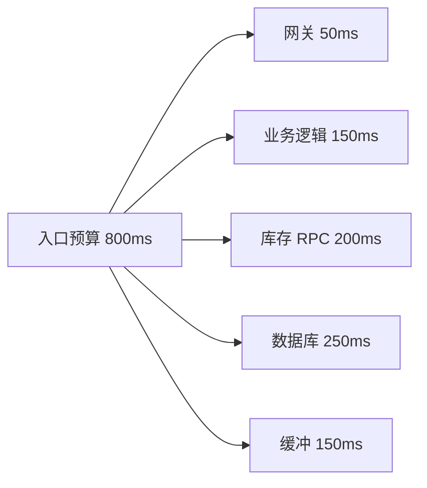
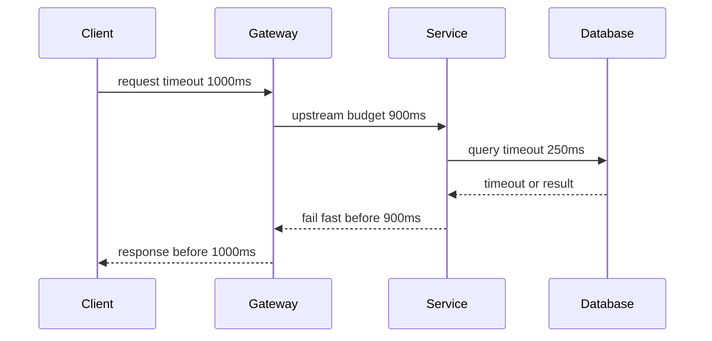
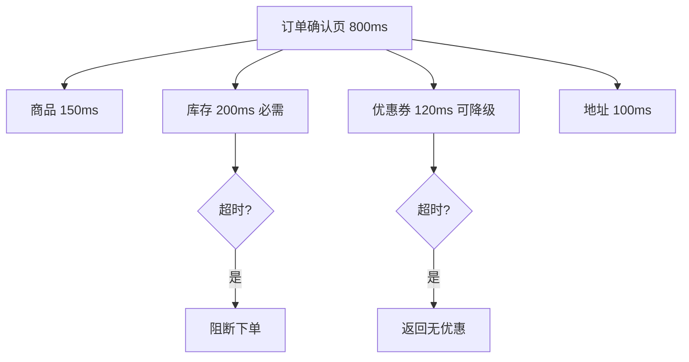

import Tabs from '@theme/Tabs';
import TabItem from '@theme/TabItem';

# 超时控制

超时控制是防止请求、线程、连接和队列被无限占用的基础机制。高可靠系统不会让一次下游卡顿无限拖住入口请求，而是为每一层分配明确的时间预算。

## 先理解这些概念

- **时间预算**：一次请求总共允许花多久，以及每个步骤能分到多久。
- **连接超时**：建立连接最多等多久。
- **读取超时**：连接建立后，等待响应数据最多等多久。
- **请求总超时**：一次完整调用最多允许多久。
- **连接池等待超时**：池里没有空闲连接时，最多等多久。
- **取消传播**：上游超时后，通知下游停止继续执行，避免浪费资源。

读这篇时先记住：超时不是为了让请求失败，而是为了避免资源被无限占住，让系统能恢复。



## 它是什么

超时是对等待时间的上限约束。它可以出现在 HTTP 客户端、RPC 客户端、数据库查询、连接池获取、消息消费、分布式锁、网关和服务端请求处理中。

一个完整的超时设计不是给每个调用随便写一个数字，而是从入口 SLA 倒推，把总时间预算拆给各个步骤，并确保下游超时小于上游超时。

## 为什么需要它

没有超时，局部慢调用会逐渐耗尽线程池、连接池和协程调度资源。请求越堆越多后，即使下游恢复，系统也会被积压流量和重试继续拖住。

超时的价值在于让失败尽早显性化：请求要么在预算内成功，要么快速失败、降级或返回可重试错误。

## 它解决什么问题

- 防止慢下游无限占用入口线程。
- 防止连接池等待把请求拖到整体超时之后。
- 给重试、熔断、降级提供明确边界。
- 让调用链每一层的耗时可观测、可调优。

## 核心原理

超时要按调用链自上而下设计，原则是“外层预算大于内层预算之和，并预留缓冲”。



常见超时类型：

- **连接超时**：建立 TCP/TLS 连接的最大等待时间。
- **读取超时**：连接已建立后等待响应数据的最大时间。
- **请求总超时**：一次完整操作的最大耗时，通常最重要。
- **连接池等待超时**：从池里拿连接的最大等待时间。
- **查询超时**：数据库执行 SQL 的最大时间。

## 最小示例

<Tabs groupId="language">
<TabItem value="java" label="Java">

```java
import java.net.URI;
import java.net.http.HttpClient;
import java.net.http.HttpRequest;
import java.net.http.HttpResponse;
import java.time.Duration;

class TimeoutExample {
    private final HttpClient client = HttpClient.newBuilder()
        .connectTimeout(Duration.ofMillis(100))
        .build();

    String callInventory(String sku) throws Exception {
        HttpRequest request = HttpRequest.newBuilder()
            .uri(URI.create("https://inventory.local/stock/" + sku))
            .timeout(Duration.ofMillis(250))
            .GET()
            .build();
        return client.send(request, HttpResponse.BodyHandlers.ofString()).body();
    }
}
```

</TabItem>
<TabItem value="go" label="Go">

```go
package timeout

import (
    "context"
    "net/http"
    "time"
)

func CallInventory(parent context.Context, sku string) (*http.Response, error) {
    ctx, cancel := context.WithTimeout(parent, 250*time.Millisecond)
    defer cancel()

    req, err := http.NewRequestWithContext(ctx, http.MethodGet, "https://inventory.local/stock/"+sku, nil)
    if err != nil {
        return nil, err
    }

    client := &http.Client{Timeout: 300 * time.Millisecond}
    return client.Do(req)
}
```

</TabItem>
<TabItem value="typescript" label="TypeScript">

```ts
async function callInventory(sku: string, timeoutMs = 250) {
  const controller = new AbortController();
  const timer = setTimeout(() => controller.abort(), timeoutMs);
  try {
    const res = await fetch(`https://inventory.local/stock/${sku}`, {
      signal: controller.signal,
    });
    return await res.json();
  } finally {
    clearTimeout(timer);
  }
}
```

</TabItem>
<TabItem value="python" label="Python">

```python
import httpx


async def call_inventory(sku: str):
    timeout = httpx.Timeout(connect=0.1, read=0.25, write=0.1, pool=0.05)
    async with httpx.AsyncClient(timeout=timeout) as client:
        response = await client.get(f"https://inventory.local/stock/{sku}")
        response.raise_for_status()
        return response.json()
```

</TabItem>
</Tabs>

## 工程实践

- 从用户可接受延迟倒推入口总超时，再拆分到网关、服务、数据库和 RPC。
- 下游超时必须小于上游剩余预算，避免上游已经超时而下游还在执行。
- 数据库连接池等待超时通常要短，避免请求卡在排队阶段。
- 对非关键依赖设置更短超时和降级路径，例如推荐、营销、埋点。
- 记录超时原因：连接超时、读超时、池等待超时、查询超时要分开统计。
- 超时后要取消下游工作，能传递 cancellation token 或 context 的地方都要传。

## 常见坑

- 只设置客户端读取超时，没有设置连接超时和请求总超时。
- 下游超时比入口超时还长，导致后台继续消耗资源。
- 连接池等待没有超时，流量尖峰时请求全部卡住。
- 超时后立刻多次重试，把慢依赖打得更慢。
- 用平均延迟设置超时，忽略 P95/P99 和偶发 GC 暂停。

## 完整案例

订单确认页需要读取商品、库存、优惠券和地址。入口目标 P99 是 800ms。最初每个下游都使用默认 2s 超时，库存服务抖动时，订单确认页线程池被占满，地址和优惠券明明正常也无法响应。

改造后：

1. 网关入口总超时 900ms，订单服务内部预算 800ms。
2. 商品查询 150ms，库存查询 200ms，优惠券 120ms，地址 100ms。
3. 优惠券超时返回“暂无可用优惠”，库存超时阻断下单。
4. 所有下游调用传递 request deadline，并记录剩余预算。
5. 库存连续超时触发熔断，保护订单服务线程池。



## 检查清单

- 是否有入口总超时和每个下游的子预算？
- 是否设置了连接、读取、请求总超时和连接池等待超时？
- 下游超时是否小于上游剩余预算？
- 超时后是否能取消下游工作？
- 可降级依赖和强依赖是否使用不同超时策略？
- 监控是否区分不同类型的 timeout？

## 这篇文章在系统里怎么用

超时控制适用于所有外部依赖：数据库、Redis、RPC、HTTP 第三方接口、消息处理。系统设计时，要从入口 SLA 倒推每一段预算，而不是每个调用随便写一个默认超时。

超时通常要和重试、熔断、降级一起设计。强依赖超时可能阻断主流程，弱依赖超时可以返回默认值或旧值。

## 术语回看

- [P99](../system-design/glossary.md#p99)
- [削峰](../system-design/glossary.md#削峰)
- [补偿](../system-design/glossary.md#补偿)

## 延伸阅读

- [AWS Builders Library: Timeouts, retries, and backoff with jitter](https://aws.amazon.com/builders-library/timeouts-retries-and-backoff-with-jitter/)
- [Google SRE Book: Handling Overload](https://sre.google/sre-book/handling-overload/)
- [Envoy: Timeouts](https://www.envoyproxy.io/docs/envoy/latest/faq/configuration/timeouts)
