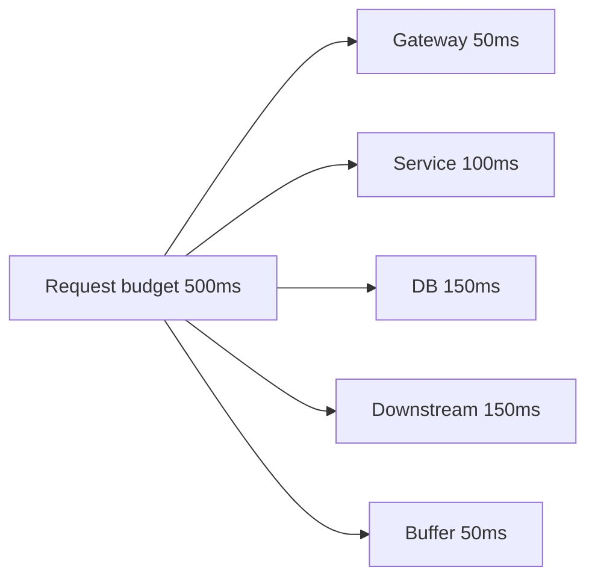

# 超时控制

超时是防止资源被无限占用的基本机制。入口超时、下游调用超时、数据库查询超时和连接池等待超时要配成一个一致的时间预算。

## 延伸阅读

- [AWS Builders Library: Timeouts, retries, and backoff with jitter](https://aws.amazon.com/builders-library/timeouts-retries-and-backoff-with-jitter/)
