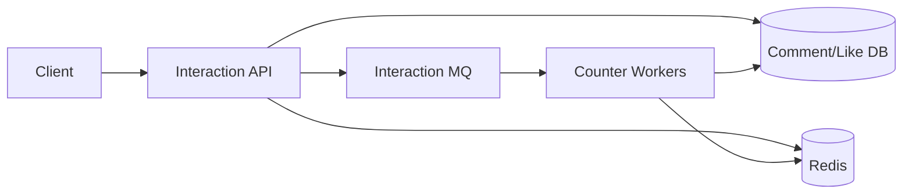
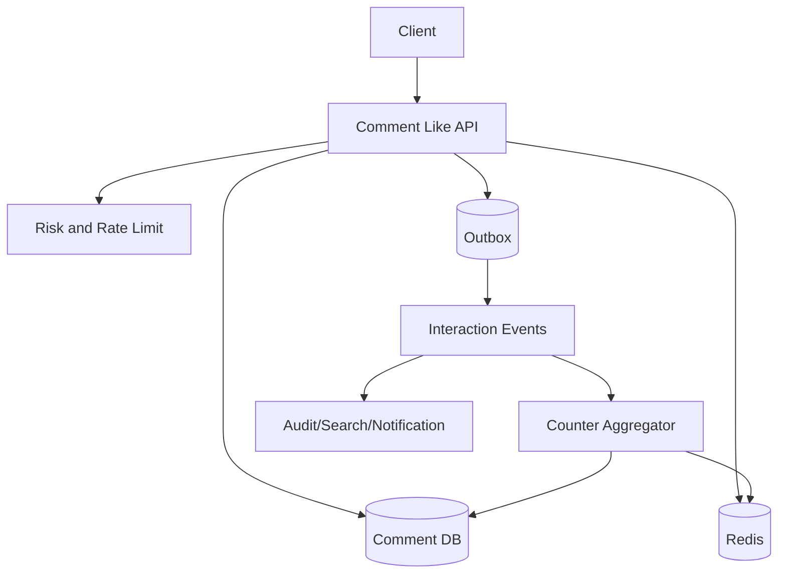
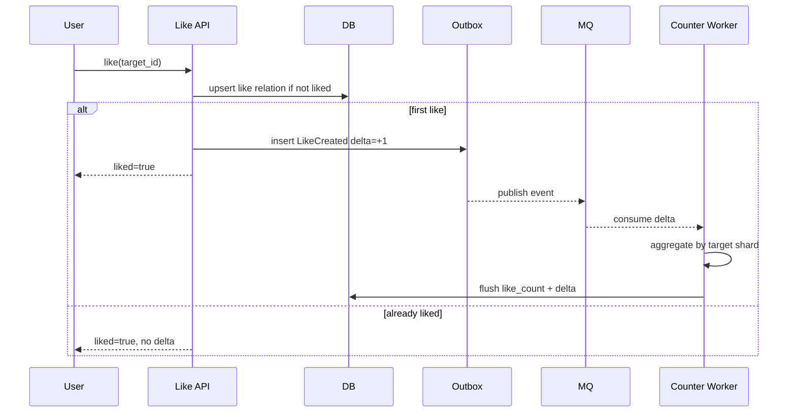
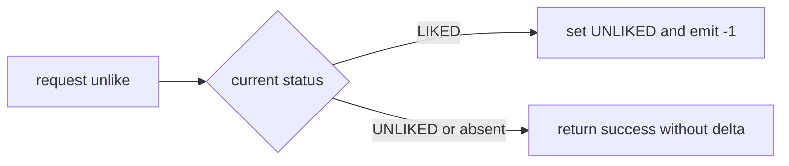
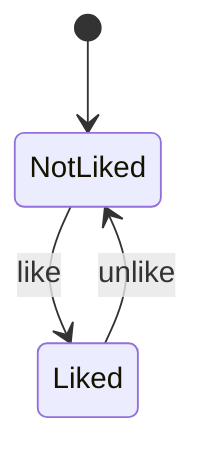
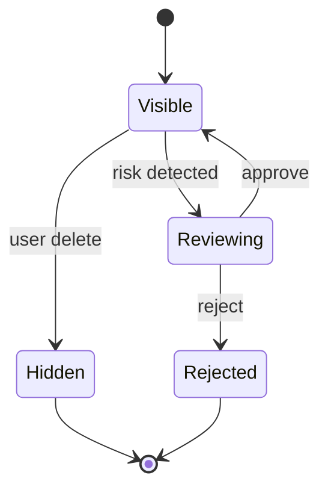
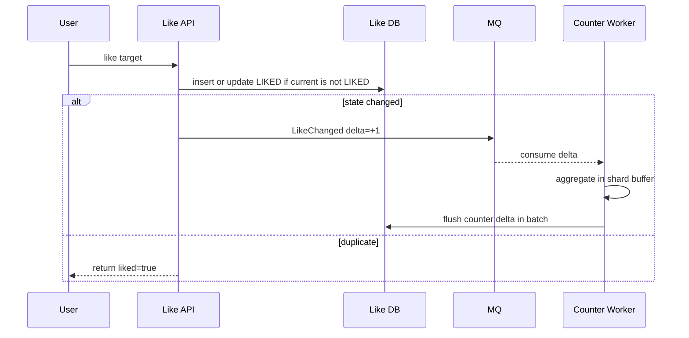
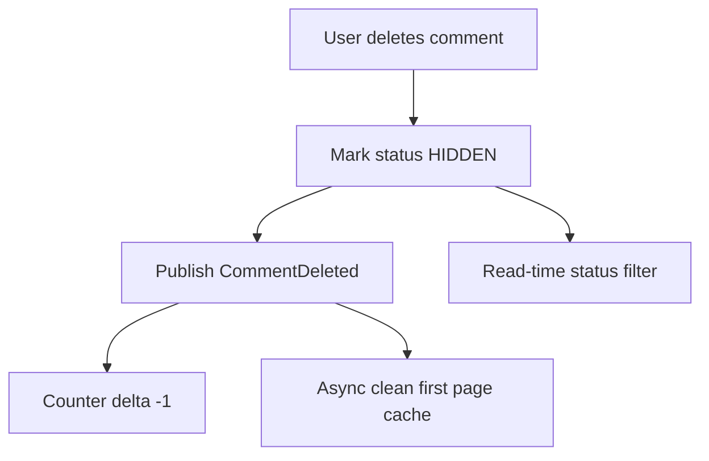

# 评论点赞系统设计

评论点赞系统常见于微博、短视频、电商和社区。它的难点不是“插入一条评论”或“点赞数加一”，而是热点内容下大量互动、重复点击、计数一致性、楼中楼分页和恶意刷量。



## 先理解这些概念

- **评论主体**：被评论的对象，例如微博、视频、商品、文章。下面用 `target` 表示。
- **一级评论**：直接评论主体的评论。
- **二级评论 / 楼中楼**：回复某条评论的评论。
- **点赞幂等**：同一个用户对同一个对象重复点赞，只能算一次。
- **计数读模型**：点赞数、评论数这类高频展示数据，通常单独做缓存或聚合表。
- **热点对象**：热门微博、热门视频下的评论和点赞会集中打到同一组 key 或行。

评论点赞系统的核心心智模型是：行为记录要准确，计数展示可以最终一致；写行为先落幂等记录，再异步聚合计数。

## 业务场景与核心挑战

用户可以发布评论、回复评论、删除评论、点赞或取消点赞。详情页要展示评论列表、评论数、点赞数、我是否点赞、热门评论和最新评论。

核心挑战：

- 点赞和取消点赞会被用户快速重复点击。
- 热门内容的点赞计数更新非常集中。
- 评论列表需要稳定分页，不能重复或漏评论。
- 删除评论后，列表和计数都要最终修正。
- “我是否点赞”是用户维度状态，不能只看总数。
- 恶意刷评论、刷赞需要限流、风控和审核。

## 功能需求与非功能需求

功能需求：发表评论、回复评论、删除评论、点赞、取消点赞、评论分页、热门评论、互动计数、用户点赞状态。

非功能需求：

- 点赞接口可重试，重复请求不会重复加计数。
- 热门对象下计数更新不能打爆数据库单行。
- 评论分页稳定，支持按时间和热度排序。
- 删除、审核和屏蔽要在读取时生效。
- 互动事件可追溯，方便风控和数据分析。

## 核心数据模型

| 表/存储 | 关键字段 | 说明 |
| --- | --- | --- |
| `comments` | `comment_id`, `target_type`, `target_id`, `parent_id`, `user_id`, `content`, `status`, `created_at` | 评论权威表 |
| `comment_likes` | `target_type`, `target_id`, `user_id`, `status`, `updated_at` | 点赞关系表 |
| `comment_counters` | `target_type`, `target_id`, `comment_count`, `like_count` | 计数聚合表 |
| `interaction_events` | `event_id`, `event_type`, `target_id`, `user_id`, `delta` | 互动事件 |

关键唯一约束：

```sql
create unique index uk_like_target_user
on comment_likes(target_type, target_id, user_id);

create index idx_comments_target_cursor
on comments(target_type, target_id, created_at desc, comment_id desc);
```

Redis Key 可以这样设计：

```text
comment:list:{target_type}:{target_id}:latest -> ZSet(comment_id, created_at)
comment:count:{target_type}:{target_id} -> {comment_count,like_count}
like:user:{user_id}:target:{target_type}:{target_id} -> 1
like:hot:{target_type}:{target_id}:shard:{0..31} -> count_delta
comment:detail:{comment_id} -> comment snapshot
```

## 高层架构图



## 关键流程时序图

点赞时不要直接 `like_count + 1`。正确做法是先写用户点赞关系，只有从未点赞变为已点赞时才产生 `+1` 事件。



取消点赞同理，只有从已点赞变为未点赞时才产生 `-1` 事件。



## 一致性与状态机

点赞关系和计数不是同一个一致性级别。点赞关系要准确，计数允许短暂延迟。



评论状态也建议显式建模，删除或审核失败时不要物理删除。



## 高并发瓶颈分析

- **热点计数行**：热门内容的 `like_count` 如果每次都更新同一行，会形成数据库行锁热点。
- **用户重复点击**：前端连点、网络重试会产生重复点赞和取消点赞。
- **热门评论列表**：所有人都看同一篇内容的第一页评论，缓存 key 可能很热。
- **深分页**：评论很多时用 offset 会越来越慢，也会因为新评论插入导致重复。
- **审核链路**：同步调用审核服务会增加发表评论延迟。

## 缓存、MQ、数据库的使用方式

- 数据库保存评论正文和用户点赞关系，是权威来源。
- Redis 缓存评论第一页、评论详情、计数快照和“我是否点赞”的短期状态。
- MQ 承接点赞、评论、删除事件，用于计数聚合、通知、搜索和风控。
- 热点计数使用分片累加或内存聚合，定期 flush 到数据库。
- 评论列表用 cursor 分页，游标建议是 `created_at + comment_id`。

## 失败场景与补偿

- 点赞事件发送失败：用 Outbox 保证关系表写成功后事件最终发布。
- 计数重复消费：事件有 `event_id`，聚合侧做去重或幂等累加。
- 计数和关系不一致：离线任务按 `comment_likes` 重算并修正 `comment_counters`。
- 热点 key 压力高：评论第一页加本地缓存，点赞计数分片，非关键计数返回旧值。
- 删除评论后列表仍显示：读评论详情时校验 `status`，后台异步清理列表缓存。

## 扩展方案与取舍

| 方案 | 优点 | 代价 |
| --- | --- | --- |
| 关系表唯一约束 | 点赞幂等可靠 | 写入需要处理冲突和状态切换 |
| 计数异步聚合 | 写链路稳定 | 计数短暂不准 |
| Redis ZSet 评论列表 | 首页读取快 | 删除和审核需要清理或读时过滤 |
| Cursor 分页 | 稳定且性能好 | 前端需要保存游标 |
| 热门评论单独读模型 | 展示快 | 热度算法和更新逻辑更复杂 |

## 面试版总结

评论点赞系统要把“行为记录”和“展示计数”分开。点赞关系表用 `target + user_id` 唯一约束保证幂等，只有状态从未点赞变已点赞时才发 `+1` 事件；取消点赞只有从已点赞变未点赞时发 `-1`。计数通过 MQ 异步聚合，热点对象用分片计数或批量 flush，避免数据库单行热点。评论列表用 cursor 分页，缓存第一页和评论详情，删除或审核状态在读时二次校验。计数不准时靠离线重算和补偿任务修正。

## 深挖：关系准确，计数最终一致

### 业务边界和澄清问题

评论点赞系统要先区分“行为事实”和“展示数字”。行为事实必须准确，展示数字可以短暂延迟。

| 问题 | 为什么要问 | 对设计的影响 |
| --- | --- | --- |
| 点赞对象是帖子、评论还是回复？ | 决定 target 模型 | `target_type + target_id` |
| 点赞是否允许取消？ | 决定状态机 | `LIKED/UNLIKED` 而非只插入 |
| 评论是否需要审核？ | 决定可见性状态 | 读时过滤和异步审核 |
| 是否有热门评论？ | 决定读模型 | 热度排序和异步更新 |
| 计数必须实时准确吗？ | 决定写路径 | 同步强一致或异步聚合 |

可控边界：支持帖子评论、楼中楼回复、点赞/取消点赞、评论审核和删除；点赞关系准确，计数最终一致。

### 容量估算

假设社区业务：

```text
DAU：10,000,000
发评论峰值：5,000 QPS
点赞峰值：80,000 QPS
热门帖子点赞峰值：20,000 QPS
评论列表读取峰值：100,000 QPS
```

推导：

- 点赞写入远高于评论写入，必须幂等且避免计数行热点。
- 评论列表读远高于写，第一页和热门评论需要缓存。
- 热门对象的点赞计数不能每次同步更新数据库同一行。
- 离线重算是必要兜底，否则计数和关系迟早会漂移。

### 表结构和索引

评论表：

```sql
create table comments (
  comment_id varchar(64) primary key,
  target_type varchar(32) not null,
  target_id varchar(64) not null,
  parent_id varchar(64),
  user_id varchar(64) not null,
  content text not null,
  status varchar(32) not null,
  created_at timestamp not null
);

create index idx_comments_target_cursor
on comments(target_type, target_id, created_at desc, comment_id desc);
```

点赞关系表：

```sql
create table likes (
  target_type varchar(32) not null,
  target_id varchar(64) not null,
  user_id varchar(64) not null,
  status varchar(32) not null,
  updated_at timestamp not null,
  primary key (target_type, target_id, user_id)
);
```

计数表：

```sql
create table interaction_counters (
  target_type varchar(32) not null,
  target_id varchar(64) not null,
  like_count bigint not null default 0,
  comment_count bigint not null default 0,
  updated_at timestamp not null,
  primary key (target_type, target_id)
);
```

### Redis Key 和事件

```text
comment:first_page:{target_type}:{target_id} -> first page comment ids
comment:detail:{comment_id} -> comment snapshot
counter:{target_type}:{target_id} -> like_count/comment_count snapshot
counter:delta:{target_type}:{target_id}:shard:{0..31} -> pending delta
like:state:{target_type}:{target_id}:{user_id} -> LIKED/UNLIKED
```

MQ Topic：

```text
interaction.comment.created
interaction.comment.deleted
interaction.like.changed
interaction.counter.flush
```

点赞事件只发状态变化，不发重复请求：

```json
{
  "eventId": "evt_1",
  "targetType": "post",
  "targetId": "p1001",
  "userId": "u1",
  "delta": 1
}
```

### 点赞并发和计数聚合



计数 worker 可以每 1 秒或每 1000 条聚合一次，批量更新数据库：

```sql
update interaction_counters
set like_count = like_count + ?, updated_at = now()
where target_type = ? and target_id = ?;
```

### 评论删除和审核

删除不要物理删除。读列表时必须校验状态：



审核可以先进入 `REVIEWING`，审核通过后变 `VISIBLE`，拒绝后变 `REJECTED`。是否先展示取决于业务风控要求。

### 故障场景深挖

| 故障 | 风险 | 处理 |
| --- | --- | --- |
| 用户重复点赞 | 计数重复加 | 关系表主键 + 状态变化才发 delta |
| LikeChanged 重复消费 | 计数重复加 | event_id 去重或聚合幂等 |
| 计数 worker 延迟 | 展示数字滞后 | 返回旧计数，监控 lag |
| 评论已删但缓存仍显示 | 用户看到脏数据 | 读时查状态兜底，异步清缓存 |
| 热门对象计数 key 过热 | Redis 单分片压力 | 分片 delta、本地聚合、限流 |
| 计数长期不准 | 信任受损 | 按关系表离线重算修正 |

### 演进路线

| 阶段 | 设计重点 |
| --- | --- |
| 小规模 | 关系表 + 同步计数更新 |
| 中规模 | MQ 异步计数、评论第一页缓存 |
| 热点内容 | 计数分片、本地聚合、热门评论读模型 |
| 风控加强 | 审核队列、反刷赞、黑名单、频率限制 |
| 数据分析 | 明细进入 OLAP，支持互动趋势和推荐特征 |

### 10 分钟面试表达

可以按这个顺序讲：

1. 先说明行为记录准确，展示计数最终一致。
2. 点赞关系用 `target_type + target_id + user_id` 主键防重复。
3. 只有状态从未点赞变已点赞时才发 `+1`，取消点赞发 `-1`。
4. 计数通过 MQ 异步聚合，热点对象用分片 delta 和批量 flush。
5. 评论列表用 cursor 分页，缓存第一页和评论详情。
6. 删除和审核通过状态字段表达，读取时过滤兜底。
7. 计数不准靠离线重算修正。
8. 监控点赞 QPS、计数 lag、热门 key、重复事件、审核积压。

## 术语回看

- [幂等](./glossary.md#幂等)
- [热点 / 热 Key](./glossary.md#热点--热-key)
- [最终一致性](./glossary.md#最终一致性)
- [游标分页](./glossary.md#游标分页)
- [Outbox](./glossary.md#outbox)

## 工程检查清单

- 点赞关系是否有 `target + user_id` 唯一约束？
- 点赞和取消点赞是否只在状态变化时发计数 delta？
- 计数更新是否避免同步打数据库热点行？
- 评论列表是否使用 cursor 分页？
- 删除、审核、屏蔽是否在读取时校验状态？
- 互动事件是否可重放、可去重、可补偿？
- 是否有刷赞、刷评论的限流和风控？

## 延伸阅读

- [Redis: Sorted sets](https://redis.io/docs/latest/develop/data-types/sorted-sets/)
- [Microservices.io: Transactional Outbox](https://microservices.io/patterns/data/transactional-outbox.html)
- [AWS Builders Library: Making retries safe with idempotent APIs](https://aws.amazon.com/builders-library/making-retries-safe-with-idempotent-APIs/)
- [Designing Data-Intensive Applications](https://dataintensive.net/)
