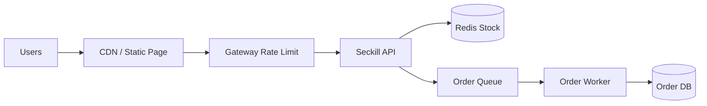
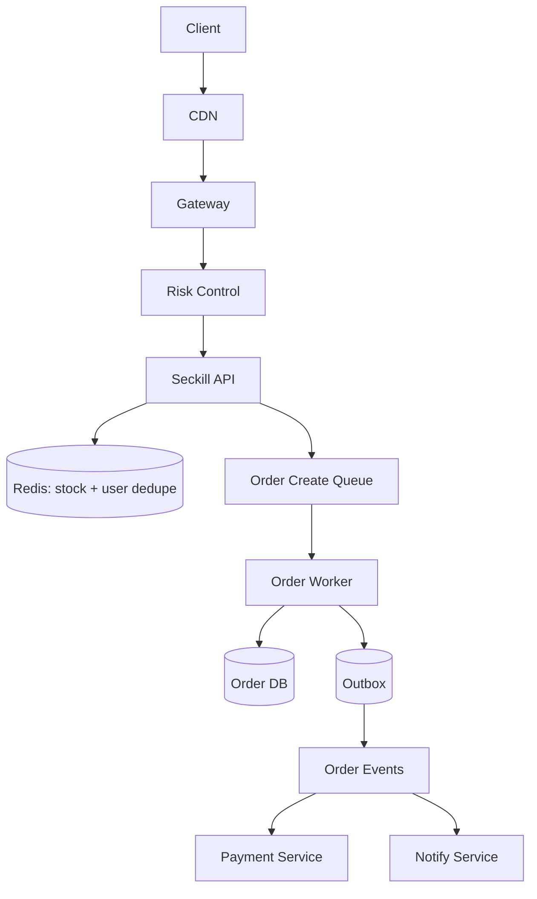
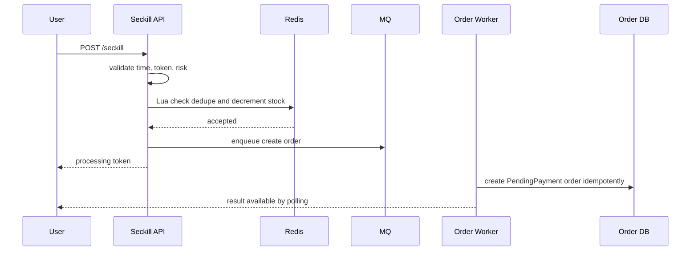
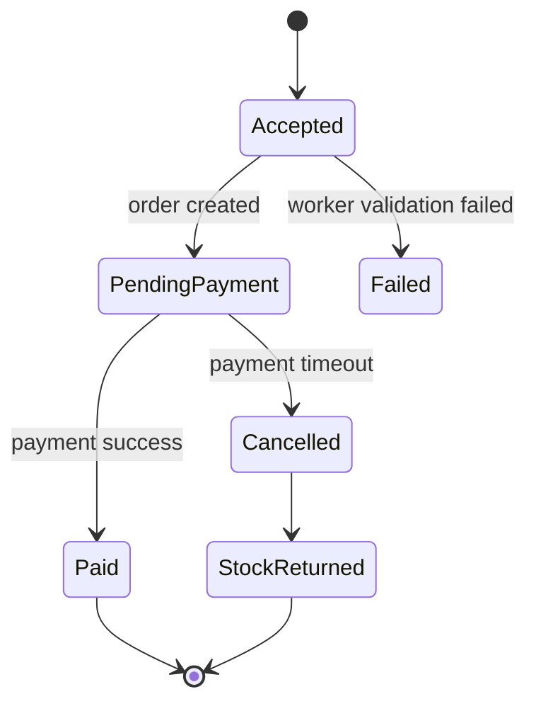

# 秒杀系统设计

秒杀系统的核心是用很少的库存承接极大的瞬时请求。它不是把普通下单接口扩容十倍就能解决的问题，而是要在入口、缓存、库存、队列、订单和支付之间逐层削峰，尽早拦截无效请求。

## 先理解这些概念

- **秒杀**：库存很少、流量很大、时间很集中。比如 100 件商品，10 万人同时抢。
- **削峰**：把瞬间涌入的请求挡掉一部分、排队一部分，让后端按能承受的速度处理。
- **预扣库存**：先在 Redis 里扣一个名额，说明用户拿到“创建订单资格”；真正订单稍后异步写数据库。
- **异步下单**：接口先返回“处理中”，后台 worker 从 MQ 里慢慢创建订单。
- **防刷**：拦截脚本、重复点击、异常用户，避免无效请求消耗库存服务。
- **库存对账**：活动后检查 Redis 预扣、订单库和库存流水是否一致，发现差异再修正。

读秒杀系统时要先接受一个事实：绝大多数请求不会成功。设计重点不是让每个请求都走完整下单链路，而是尽早、便宜地失败。

## 业务场景与核心挑战

活动开始瞬间，大量用户同时点击购买某个低库存商品。系统需要判断活动是否开始、用户是否有资格、库存是否还有、是否重复下单，并在高峰期保护数据库和支付链路。这里的“保护”意思是：不要让注定失败的大量请求进入数据库。

核心挑战：

- 请求量远大于库存量，大多数请求注定失败。
- 热点商品会形成 Redis 热 key 和库存写热点。
- 用户重复点击、脚本刷接口、黄牛抢购都需要防护。
- 下单链路不能同步打数据库，否则数据库会被瞬时流量击穿。
- 成功抢到资格后，还要处理支付超时和库存回补。

## 功能需求与非功能需求

功能需求：活动配置、资格校验、抢购、库存扣减、异步下单、支付、超时释放、结果查询。

非功能需求：

- 活动开始时入口不崩，失败请求快速返回。
- 库存不能超卖，允许少量排队等待结果。
- 用户不能重复抢同一活动商品。
- 活动配置和库存预热必须可靠。
- 支付超时后库存和资格可恢复。

## 核心数据模型

| 表/存储 | 关键字段 | 说明 |
| --- | --- | --- |
| `seckill_activity` | `activity_id`, `sku_id`, `start_at`, `end_at`, `limit_per_user` | 活动配置 |
| `redis_stock` | `activity_id`, `available` | Redis 预扣库存 |
| `user_purchase` | `activity_id`, `user_id`, `order_id` | 用户去重 |
| `orders` | `order_id`, `user_id`, `sku_id`, `status`, `expire_at` | 秒杀订单 |
| `stock_ledger` | `activity_id`, `order_id`, `delta` | 库存流水，便于对账 |

## 高层架构图

## 关键流程时序图

抢购请求只做轻量判断和 Redis 原子预扣，成功后进入队列异步创建订单。轻量判断包括活动时间、用户资格、风控 token、是否重复抢购。

Redis Lua 的职责是把“用户去重”和“库存扣减”放到一个原子操作里。原子操作可以理解为“中间不会被别人插队打断”，这样能避免同一个用户重复抢购，也避免库存扣成负数。

## 一致性与状态机

秒杀系统常用“Redis 预扣 + DB 最终确认”。Redis 承接瞬时并发，数据库异步落单并记录库存流水。这里的预扣不是最终结果，只是先拿到资格；最终是否成功，要看订单是否落库、用户是否支付。支付超时后释放订单占用，并根据策略回补库存或进入下一轮。

## 高并发瓶颈分析

- **入口流量**：活动开始瞬间请求量可能超过正常峰值百倍，需要 CDN、网关限流和排队页。
- **库存 key**：单商品库存是天然热 key，Lua 操作要短，必要时做库存分片。
- **重复请求**：同一用户重复点击会放大流量，必须在 Redis 里快速去重。
- **订单队列**：消费者能力决定最终落单速度，队列积压要可观测。
- **结果查询**：用户轮询抢购结果也会形成读峰值，需要短 TTL 缓存。

## 缓存、MQ、数据库的使用方式

- CDN 承接静态活动页和活动配置，减少源站请求。
- Redis 保存活动状态、库存、用户去重和抢购结果。
- MQ 用来削峰，把抢购成功资格先排队，再由后台 worker 按数据库能承受的速度转为订单。
- 数据库保存最终订单、库存流水和支付状态。最终正确性以数据库和库存流水为准。
- Outbox 发布订单创建、支付成功、取消等事件，避免订单状态变化了但消息丢失。

## 失败场景与补偿

- Redis 预扣成功但 MQ 发送失败：使用本地 outbox 或可靠队列生产确认；失败时回补库存。
- Worker 创建订单失败：记录失败原因，回补库存并清理用户占用。
- 支付超时：关单任务条件更新订单状态，释放库存或进入候补池。
- Redis 库存和 DB 不一致：活动结束后按库存流水对账，必要时人工修正。
- MQ 积压过高：入口降级为排队中或直接售罄，保护订单库。

## 扩展方案与取舍

| 方案 | 优点 | 代价 |
| --- | --- | --- |
| Redis 原子预扣 | 吞吐高，DB 压力小 | 需要对账和补偿 |
| 库存分片 | 降低单 key 热点 | 结束时聚合和回补更复杂 |
| 队列异步下单 | 削峰明显 | 用户需要查询结果 |
| 静态化活动页 | 源站压力低 | 配置更新需要发布机制 |
| 风控前置 | 减少无效流量 | 误杀需要兜底申诉 |

## 面试版总结

秒杀系统要尽早过滤请求。静态页走 CDN，网关做限流和防刷，服务端校验活动 token 和用户资格。库存放 Redis，用 Lua 原子完成去重和预扣，成功请求进入 MQ，后台 worker 异步创建待支付订单。数据库只承接少量成功请求，支付超时后关单释放库存。全链路要有结果查询、队列积压监控、库存对账和补偿任务。可以把它理解成：入口挡流量，Redis 抢资格，MQ 排队，数据库做最终确认。

## 术语回看

- [削峰](./glossary.md#削峰)
- [预扣库存](./glossary.md#预扣库存)
- [热点 / 热 Key](./glossary.md#热点--热-key)
- [幂等](./glossary.md#幂等)
- [对账](./glossary.md#对账)

## 工程检查清单

- 活动配置、库存和页面是否提前预热？
- 入口是否有限流、防刷和排队策略？
- Redis 扣库存和用户去重是否原子？
- 是否避免所有请求直接打数据库？
- 抢购结果查询是否有缓存保护？
- MQ 积压、Redis 错误率、订单创建失败率是否有告警？
- 库存回补和活动后对账是否有流程？

## 延伸阅读

- [Redis: EVAL command](https://redis.io/docs/latest/commands/eval/)
- [Google SRE Book: Handling Overload](https://sre.google/sre-book/handling-overload/)
- [AWS Builders Library: Avoiding insurmountable queue backlogs](https://aws.amazon.com/builders-library/avoiding-insurmountable-queue-backlogs/)
- [Microservices.io: Saga](https://microservices.io/patterns/data/saga.html)
