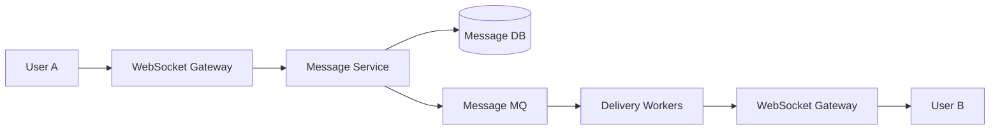
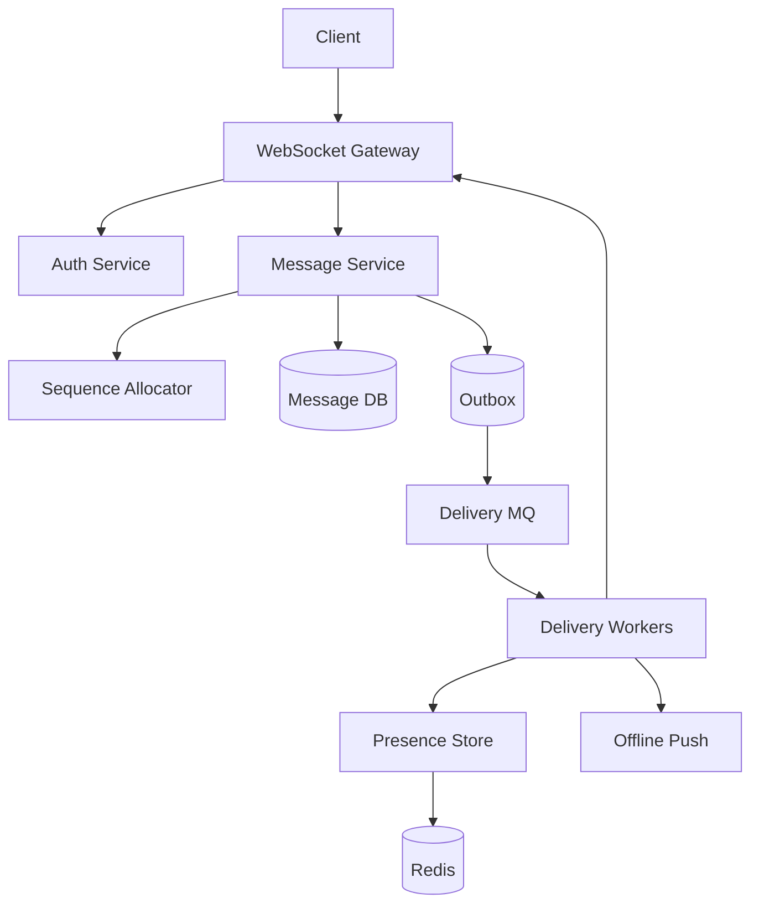
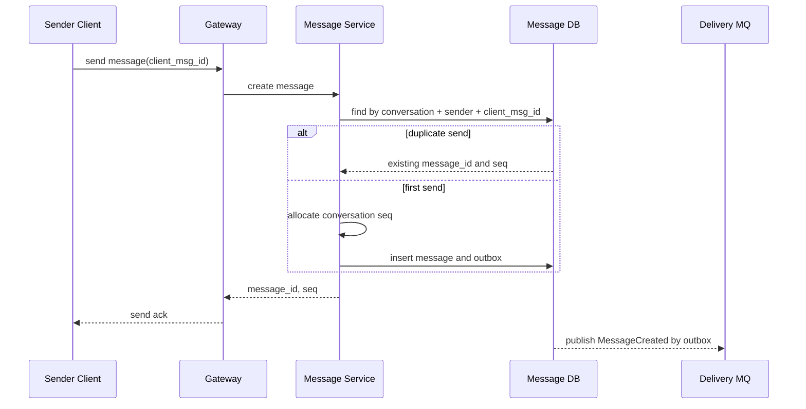
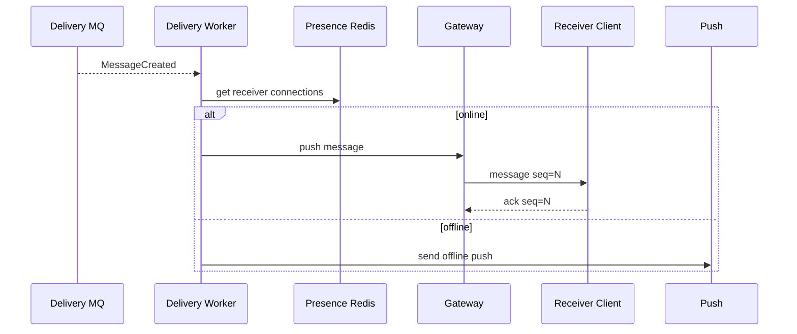
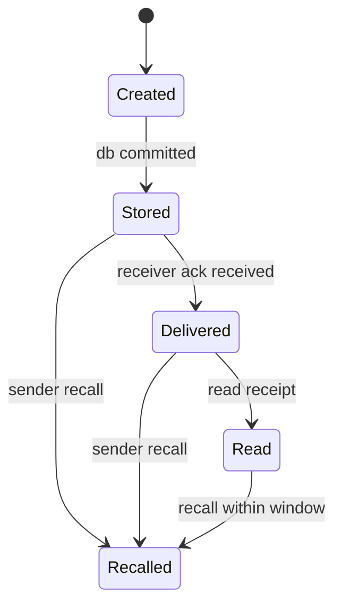

# 即时聊天系统设计

即时聊天系统的核心不是“把 A 的消息发给 B”，而是长连接管理、消息可靠投递、会话内顺序、离线消息、重复 ACK、群聊 fanout 和多端同步。



## 先理解这些概念

- **长连接**：客户端和服务端保持一条持续连接，常用 WebSocket。服务端可以主动推消息给客户端。
- **连接网关**：负责维护连接、鉴权、心跳和推送，不直接承载复杂业务状态。
- **会话**：两个人或一个群的聊天容器，例如 `conversation_id`。
- **消息序号**：会话内递增的序号，例如 `seq`。它用来保证客户端按顺序展示。
- **ACK**：确认消息。客户端收到消息后告诉服务端“我收到了”，服务端再推进已投递状态。
- **离线消息**：用户不在线时，消息先落库，等用户上线后拉取或推送。
- **多端同步**：同一个用户可能同时登录手机、网页、桌面端，消息和已读状态要同步。

即时聊天系统的核心心智模型是：消息先可靠落库，再异步投递；投递可以重复，客户端和服务端用消息 ID、序号和 ACK 去重。

## 业务场景与核心挑战

用户发送单聊消息、群聊消息、图片消息和系统消息。在线用户希望实时收到；离线用户上线后能补齐；同一会话内消息顺序要稳定；用户换设备后能继续看到历史消息。

核心挑战：

- 网关是有状态服务，连接数很大，扩缩容和故障迁移复杂。
- 消息不能只存在内存里，网关重启不能丢消息。
- 同一会话要有稳定顺序，跨会话不需要全局顺序。
- 消息可能重复投递，客户端不能重复展示。
- 群聊 fanout 成本高，大群不能同步写所有成员收件箱。
- 已读、未读、多端同步是读模型，容易和消息状态不一致。

## 功能需求与非功能需求

功能需求：连接登录、心跳、单聊、群聊、离线消息、消息 ACK、历史消息、撤回、已读回执、多端同步、Push 通知。

非功能需求：

- 在线消息端到端延迟尽量低，例如 P99 小于 300ms 到 1s。
- 已发送消息不能因为网关重启丢失。
- 同一会话内按 `seq` 有序展示。
- 消息投递至少一次，客户端和服务端都要幂等。
- 大群消息不能拖垮发送链路。

## 核心数据模型

| 表/存储 | 关键字段 | 说明 |
| --- | --- | --- |
| `conversations` | `conversation_id`, `type`, `created_at` | 会话 |
| `conversation_members` | `conversation_id`, `user_id`, `role`, `joined_at` | 成员关系 |
| `messages` | `message_id`, `conversation_id`, `sender_id`, `seq`, `content`, `status`, `created_at` | 消息权威表 |
| `user_inboxes` | `user_id`, `conversation_id`, `last_message_id`, `unread_count`, `updated_at` | 用户会话列表读模型 |
| `message_acks` | `user_id`, `conversation_id`, `last_ack_seq` | 已收或已读进度 |
| `connections` | `connection_id`, `user_id`, `device_id`, `gateway_id`, `last_heartbeat_at` | 在线连接状态 |

关键约束：

```sql
create unique index uk_message_client_id
on messages(conversation_id, sender_id, client_msg_id);

create unique index uk_message_seq
on messages(conversation_id, seq);
```

Redis Key 可以这样设计：

```text
im:conn:{user_id} -> set(gateway_id:connection_id:device_id)
im:conv:seq:{conversation_id} -> latest_seq
im:ack:{user_id}:{conversation_id} -> last_ack_seq
im:online:{gateway_id} -> heartbeat timestamp
im:rate:send:{user_id}:{minute} -> count
```

## 高层架构图



## 关键流程时序图

发送消息时，服务端先用 `client_msg_id` 做幂等，再分配会话内 `seq`，落库成功后才发布投递事件。



投递时，在线用户走 WebSocket；离线用户只更新 inbox 和 Push，真正消息仍从消息库拉取。



## 一致性与状态机

消息状态要区分“服务端已保存”和“对方已收到”。不要把发送成功等同于对方已读。



客户端展示顺序以 `conversation_id + seq` 为准。收到 `seq=10` 但本地缺 `seq=9` 时，可以先缓存 10，再拉取缺口。

## 高并发瓶颈分析

- **连接网关**：大量 WebSocket 长连接消耗内存和文件描述符，需要按连接数扩容。
- **会话序号分配**：热门群聊的 `seq` 分配可能成为单点瓶颈。
- **大群 fanout**：万人群如果每条消息都同步写每个成员 inbox，会造成写放大。
- **ACK 风暴**：消息推给很多设备后，大量 ACK 会反向冲击服务端。
- **离线补拉**：用户上线后一次拉大量历史消息，需要分页和限速。

## 缓存、MQ、数据库的使用方式

- 数据库保存消息正文和会话成员，是最终权威来源。
- Redis 保存在线连接、会话最新序号、ACK 进度和发送限流计数。
- MQ 用于消息投递、Push 通知、会话列表更新和搜索索引同步。
- Outbox 保证消息落库后投递事件最终发布。
- 大群可以采用读扩散：消息只写群消息表，用户打开会话时按 seq 拉取。

## 失败场景与补偿

- 客户端发送超时后重试：`client_msg_id` 唯一约束返回同一条消息，避免重复发送。
- 网关推送成功但 ACK 丢失：服务端会重推，客户端按 `message_id` 或 `seq` 去重。
- 网关宕机：Presence 心跳过期后清理连接，客户端重连后按 last_ack_seq 补拉。
- Delivery MQ 重复投递：投递侧按 `message_id + receiver_id + device_id` 做去重或允许客户端幂等。
- 会话序号缺口：客户端发现缺 seq，调用历史消息接口补齐。
- 大群积压：降低已读回执实时性，优先保证消息正文和在线投递。

## 扩展方案与取舍

| 方案 | 优点 | 代价 |
| --- | --- | --- |
| WebSocket 网关无业务状态 | 易扩缩容 | 需要独立消息服务和 Presence |
| 会话内递增 seq | 展示顺序清晰 | 热门会话需要高性能序号分配 |
| 至少一次投递 + 幂等 | 不容易丢消息 | 客户端要处理重复 |
| 小群写扩散 inbox | 会话列表快 | 群越大写放大越严重 |
| 大群读扩散 | 写链路轻 | 打开会话时拉取更重 |

## 面试版总结

即时聊天系统要先把连接层和消息层拆开。WebSocket Gateway 负责连接、心跳和推送，消息服务负责幂等、分配会话序号、落库和发布投递事件。发送端用 `client_msg_id` 防重复，同一会话用递增 `seq` 保证展示顺序。消息落库后通过 Outbox + MQ 投递，在线用户走网关推送，离线用户更新 inbox 并发 Push。ACK 可以丢，所以投递至少一次，客户端按 `message_id` 和 `seq` 去重。小群可以写扩散更新成员 inbox，大群更适合读扩散。

## 术语回看

- [Fanout](./glossary.md#fanout)
- [读扩散 / 写扩散](./glossary.md#读扩散--写扩散)
- [幂等](./glossary.md#幂等)
- [Outbox](./glossary.md#outbox)
- [最终一致性](./glossary.md#最终一致性)

## 工程检查清单

- 发送消息是否有 `client_msg_id` 幂等键？
- 消息是否先落库，再异步投递？
- 同一会话是否有稳定递增 `seq`？
- 客户端是否能处理重复消息和 seq 缺口？
- Presence 是否能在网关宕机后自动过期？
- 小群和大群是否采用不同 fanout 策略？
- ACK、已读和未读是否可以补偿重算？

## 延伸阅读

- [RFC 6455: The WebSocket Protocol](https://www.rfc-editor.org/rfc/rfc6455)
- [Discord Engineering: How Discord Stores Trillions of Messages](https://discord.com/blog/how-discord-stores-trillions-of-messages)
- [Slack Engineering: Flannel, an application-level edge cache](https://slack.engineering/flannel-an-application-level-edge-cache-to-make-slack-scale/)
- [Microservices.io: Transactional Outbox](https://microservices.io/patterns/data/transactional-outbox.html)
