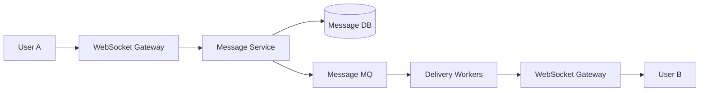
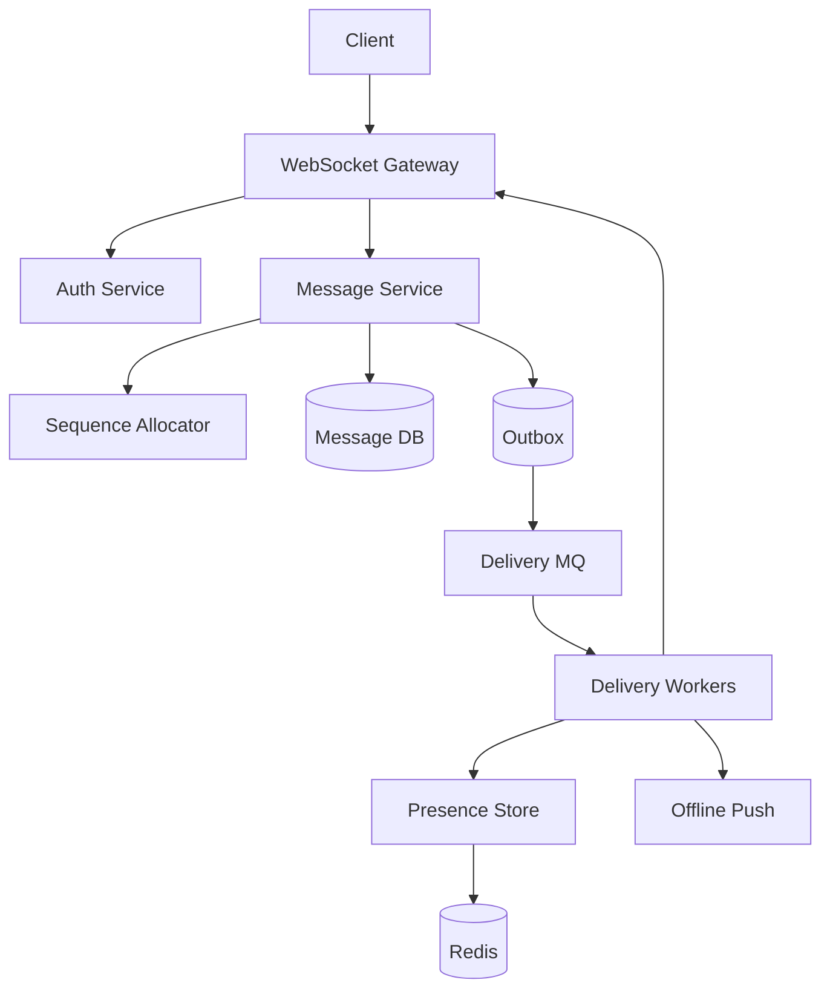
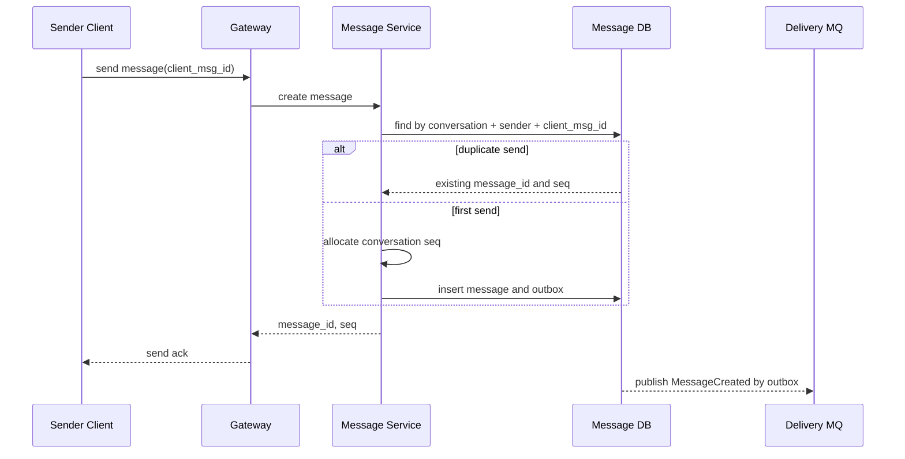
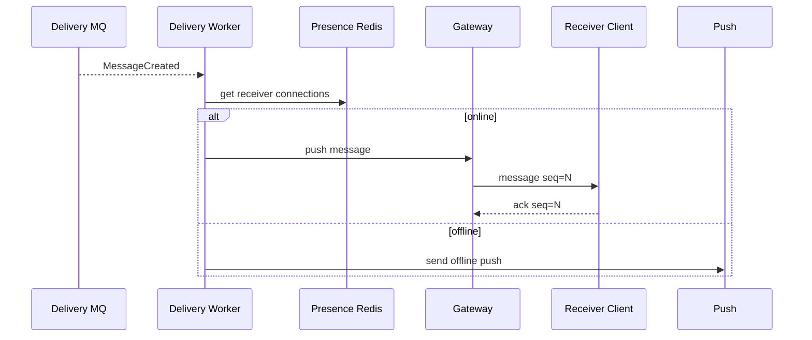
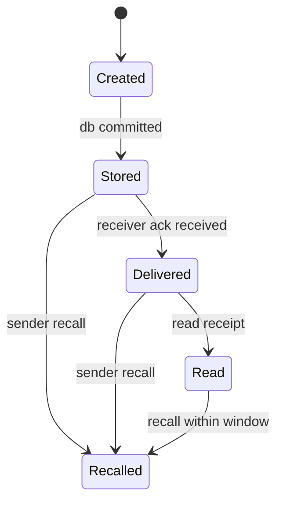
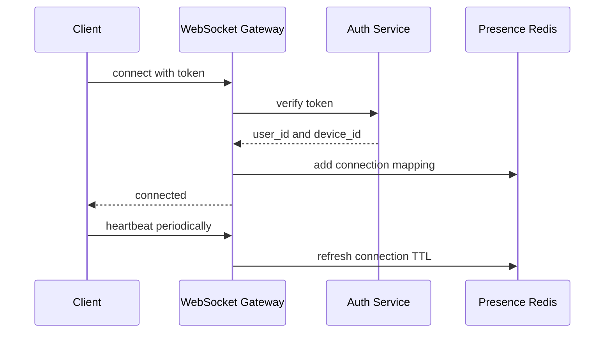
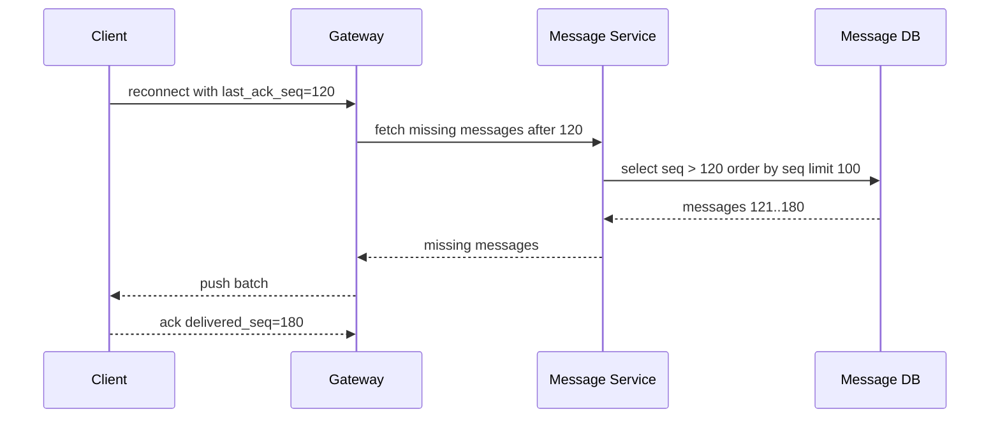

# 即时聊天系统设计

即时聊天系统的核心不是“把 A 的消息发给 B”，而是长连接管理、消息可靠投递、会话内顺序、离线消息、重复 ACK、群聊 fanout 和多端同步。



## 先理解这些概念

- **长连接**：客户端和服务端保持一条持续连接，常用 WebSocket。服务端可以主动推消息给客户端。
- **连接网关**：负责维护连接、鉴权、心跳和推送，不直接承载复杂业务状态。
- **会话**：两个人或一个群的聊天容器，例如 `conversation_id`。
- **消息序号**：会话内递增的序号，例如 `seq`。它用来保证客户端按顺序展示。
- **ACK**：确认消息。客户端收到消息后告诉服务端“我收到了”，服务端再推进已投递状态。
- **离线消息**：用户不在线时，消息先落库，等用户上线后拉取或推送。
- **多端同步**：同一个用户可能同时登录手机、网页、桌面端，消息和已读状态要同步。

即时聊天系统的核心心智模型是：消息先可靠落库，再异步投递；投递可以重复，客户端和服务端用消息 ID、序号和 ACK 去重。

## 业务场景与核心挑战

用户发送单聊消息、群聊消息、图片消息和系统消息。在线用户希望实时收到；离线用户上线后能补齐；同一会话内消息顺序要稳定；用户换设备后能继续看到历史消息。

核心挑战：

- 网关是有状态服务，连接数很大，扩缩容和故障迁移复杂。
- 消息不能只存在内存里，网关重启不能丢消息。
- 同一会话要有稳定顺序，跨会话不需要全局顺序。
- 消息可能重复投递，客户端不能重复展示。
- 群聊 fanout 成本高，大群不能同步写所有成员收件箱。
- 已读、未读、多端同步是读模型，容易和消息状态不一致。

## 功能需求与非功能需求

功能需求：连接登录、心跳、单聊、群聊、离线消息、消息 ACK、历史消息、撤回、已读回执、多端同步、Push 通知。

非功能需求：

- 在线消息端到端延迟尽量低，例如 P99 小于 300ms 到 1s。
- 已发送消息不能因为网关重启丢失。
- 同一会话内按 `seq` 有序展示。
- 消息投递至少一次，客户端和服务端都要幂等。
- 大群消息不能拖垮发送链路。

## 核心数据模型

| 表/存储 | 关键字段 | 说明 |
| --- | --- | --- |
| `conversations` | `conversation_id`, `type`, `created_at` | 会话 |
| `conversation_members` | `conversation_id`, `user_id`, `role`, `joined_at` | 成员关系 |
| `messages` | `message_id`, `conversation_id`, `sender_id`, `seq`, `content`, `status`, `created_at` | 消息权威表 |
| `user_inboxes` | `user_id`, `conversation_id`, `last_message_id`, `unread_count`, `updated_at` | 用户会话列表读模型 |
| `message_acks` | `user_id`, `conversation_id`, `last_ack_seq` | 已收或已读进度 |
| `connections` | `connection_id`, `user_id`, `device_id`, `gateway_id`, `last_heartbeat_at` | 在线连接状态 |

关键约束：

```sql
create unique index uk_message_client_id
on messages(conversation_id, sender_id, client_msg_id);

create unique index uk_message_seq
on messages(conversation_id, seq);
```

Redis Key 可以这样设计：

```text
im:conn:{user_id} -> set(gateway_id:connection_id:device_id)
im:conv:seq:{conversation_id} -> latest_seq
im:ack:{user_id}:{conversation_id} -> last_ack_seq
im:online:{gateway_id} -> heartbeat timestamp
im:rate:send:{user_id}:{minute} -> count
```

## 高层架构图



## 关键流程时序图

发送消息时，服务端先用 `client_msg_id` 做幂等，再分配会话内 `seq`，落库成功后才发布投递事件。



投递时，在线用户走 WebSocket；离线用户只更新 inbox 和 Push，真正消息仍从消息库拉取。



## 一致性与状态机

消息状态要区分“服务端已保存”和“对方已收到”。不要把发送成功等同于对方已读。



客户端展示顺序以 `conversation_id + seq` 为准。收到 `seq=10` 但本地缺 `seq=9` 时，可以先缓存 10，再拉取缺口。

## 高并发瓶颈分析

- **连接网关**：大量 WebSocket 长连接消耗内存和文件描述符，需要按连接数扩容。
- **会话序号分配**：热门群聊的 `seq` 分配可能成为单点瓶颈。
- **大群 fanout**：万人群如果每条消息都同步写每个成员 inbox，会造成写放大。
- **ACK 风暴**：消息推给很多设备后，大量 ACK 会反向冲击服务端。
- **离线补拉**：用户上线后一次拉大量历史消息，需要分页和限速。

## 缓存、MQ、数据库的使用方式

- 数据库保存消息正文和会话成员，是最终权威来源。
- Redis 保存在线连接、会话最新序号、ACK 进度和发送限流计数。
- MQ 用于消息投递、Push 通知、会话列表更新和搜索索引同步。
- Outbox 保证消息落库后投递事件最终发布。
- 大群可以采用读扩散：消息只写群消息表，用户打开会话时按 seq 拉取。

## 失败场景与补偿

- 客户端发送超时后重试：`client_msg_id` 唯一约束返回同一条消息，避免重复发送。
- 网关推送成功但 ACK 丢失：服务端会重推，客户端按 `message_id` 或 `seq` 去重。
- 网关宕机：Presence 心跳过期后清理连接，客户端重连后按 last_ack_seq 补拉。
- Delivery MQ 重复投递：投递侧按 `message_id + receiver_id + device_id` 做去重或允许客户端幂等。
- 会话序号缺口：客户端发现缺 seq，调用历史消息接口补齐。
- 大群积压：降低已读回执实时性，优先保证消息正文和在线投递。

## 扩展方案与取舍

| 方案 | 优点 | 代价 |
| --- | --- | --- |
| WebSocket 网关无业务状态 | 易扩缩容 | 需要独立消息服务和 Presence |
| 会话内递增 seq | 展示顺序清晰 | 热门会话需要高性能序号分配 |
| 至少一次投递 + 幂等 | 不容易丢消息 | 客户端要处理重复 |
| 小群写扩散 inbox | 会话列表快 | 群越大写放大越严重 |
| 大群读扩散 | 写链路轻 | 打开会话时拉取更重 |

## 面试版总结

即时聊天系统要先把连接层和消息层拆开。WebSocket Gateway 负责连接、心跳和推送，消息服务负责幂等、分配会话序号、落库和发布投递事件。发送端用 `client_msg_id` 防重复，同一会话用递增 `seq` 保证展示顺序。消息落库后通过 Outbox + MQ 投递，在线用户走网关推送，离线用户更新 inbox 并发 Push。ACK 可以丢，所以投递至少一次，客户端按 `message_id` 和 `seq` 去重。小群可以写扩散更新成员 inbox，大群更适合读扩散。

## 深挖：长连接和消息可靠性

### 业务边界和澄清问题

即时聊天系统要先明确是“强实时 IM”还是“站内私信”。两者对连接和可靠性的要求不同。

| 问题 | 为什么要问 | 对设计的影响 |
| --- | --- | --- |
| 是否必须 WebSocket？ | 决定是否维护长连接 | 强实时用 WebSocket，弱实时可轮询 |
| 单聊、群聊还是万人大群？ | 决定 fanout 策略 | 小群写扩散，大群读扩散 |
| 消息是否必须严格有序？ | 决定 seq 粒度 | 通常只保证会话内有序 |
| 支持多少设备在线？ | 决定 connection 模型 | user_id 下有多个 device connection |
| 已读回执是否实时？ | 决定 ACK 压力 | 可批量、可降级 |

这里按单聊 + 普通群聊 + 大群的通用 IM 设计：WebSocket 在线推送，离线可补拉和 Push，会话内有序，不要求全局有序。

### 容量估算

假设：

```text
DAU：20,000,000
同时在线：2,000,000
每用户平均设备连接：1.3
总 WebSocket 连接：2,600,000
消息发送峰值：50,000 msg/s
普通群平均成员：50
大群成员：100,000+
```

推导：

- 连接网关按连接数扩容，而不是只按 QPS 扩容。
- 如果单机承载 50,000 连接，2,600,000 连接需要至少 52 台网关，实际还要预留容量。
- 小群 50 人写扩散可以接受；10 万人大群同步写 inbox 会产生巨大写放大。
- 消息写库 QPS 是发送消息数；投递 QPS 是消息数乘以在线接收设备数。

### 连接网关和 Presence

连接网关应尽量无业务状态，只维护连接和推送通道。用户连接信息写入 Presence Store：

```text
im:conn:{user_id} -> set(gateway_id:connection_id:device_id)
im:gateway:{gateway_id}:heartbeat -> timestamp
im:device:{user_id}:{device_id} -> last_seen_at
```

连接建立流程：



网关宕机时，连接 TTL 会过期。客户端重连后带上 `last_ack_seq`，服务端按会话补拉缺失消息。

### 消息 ID、Seq 和幂等

三个 ID 不要混用：

| 字段 | 谁生成 | 作用 |
| --- | --- | --- |
| `client_msg_id` | 客户端 | 发送重试幂等 |
| `message_id` | 服务端 | 全局唯一消息标识 |
| `seq` | 服务端按会话分配 | 会话内排序和补拉 |

表结构可以这样设计：

```sql
create table messages (
  message_id varchar(64) primary key,
  conversation_id varchar(64) not null,
  sender_id varchar(64) not null,
  client_msg_id varchar(128) not null,
  seq bigint not null,
  content text not null,
  status varchar(32) not null,
  created_at timestamp not null,
  unique (conversation_id, sender_id, client_msg_id),
  unique (conversation_id, seq)
);

create table conversation_seq (
  conversation_id varchar(64) primary key,
  next_seq bigint not null
);
```

分配 seq 可以用数据库行、Redis `INCR` 或专门的序号服务。热门大群要避免单点瓶颈，可以按会话分片或使用专门序号分配器。

### ACK、已读和离线补拉

ACK 至少分两类：

- **送达 ACK**：客户端收到消息。
- **已读 ACK**：用户打开会话看到消息。

不要每条消息都强同步更新数据库，可以按会话维护进度：

```sql
create table message_progress (
  user_id varchar(64) not null,
  conversation_id varchar(64) not null,
  delivered_seq bigint not null,
  read_seq bigint not null,
  updated_at timestamp not null,
  primary key (user_id, conversation_id)
);
```

离线补拉流程：



### 小群和大群策略

小群可以写扩散：消息发送后更新每个成员的 inbox，用户会话列表读取很快。

大群更适合读扩散：消息只写群消息表，成员打开群时按 seq 拉取。否则 10 万人大群每发一条消息都写 10 万个 inbox，成本过高。

| 场景 | 策略 | 原因 |
| --- | --- | --- |
| 单聊 | 写双方 inbox | 读会话列表快 |
| 小群 | 写扩散到成员 inbox | 成员数有限 |
| 大群 | 读扩散 | 避免巨大写放大 |
| 系统广播 | 批次任务或读时合并 | 避免一次写全量用户 |

### 故障场景深挖

| 故障 | 表现 | 处理 |
| --- | --- | --- |
| 发送请求超时 | 客户端不知道是否成功 | 用 `client_msg_id` 重试，服务端返回同一消息 |
| MQ 投递重复 | 客户端收到重复消息 | 客户端按 `message_id` 去重 |
| ACK 丢失 | 服务端以为未送达 | 允许重推，客户端幂等 |
| 网关宕机 | 在线连接断开 | Presence TTL 过期，客户端重连补拉 |
| seq 缺口 | 客户端看到 122 但缺 121 | 暂存后续消息，拉取缺口 |
| 大群消息积压 | 投递延迟增加 | 降级已读回执，读扩散拉取正文 |

### 监控指标

```text
im_gateway_connections{gateway_id}
im_gateway_heartbeat_timeout_total
im_message_send_qps
im_message_store_latency_ms
im_delivery_lag_messages
im_client_ack_delay_ms
im_missing_seq_fetch_total
im_push_fail_total{provider}
```

这些指标能回答：连接是否稳定、消息是否写入慢、投递是否积压、客户端 ACK 是否延迟、是否频繁补拉缺口。

### 演进路线

| 阶段 | 设计重点 |
| --- | --- |
| 站内私信 | HTTP 轮询 + 消息表 + 未读数 |
| 实时单聊 | WebSocket Gateway + Presence + 离线补拉 |
| 群聊 | 会话 seq、小群写扩散、大群读扩散 |
| 多端同步 | device 维度连接、read_seq 同步、冲突处理 |
| 大规模 IM | 网关分区、专用消息存储、跨地域路由、热点大群隔离 |

### 10 分钟面试表达

可以按这个顺序讲：

1. 先说明只保证会话内有序，不保证全局有序。
2. 连接层和消息层拆开，WebSocket Gateway 只管连接和推送。
3. Presence 记录 user 到 gateway connection 的映射，TTL 心跳保证故障自动清理。
4. 发送消息用 `client_msg_id` 幂等，服务端分配 `message_id` 和会话内 `seq`。
5. 消息先落库，再通过 Outbox/MQ 投递。
6. 在线用户推 WebSocket，离线用户靠 Push 和上线补拉。
7. ACK 丢失允许重推，客户端按 `message_id/seq` 去重。
8. 小群写扩散，大群读扩散，避免写放大。

## 术语回看

- [Fanout](./glossary.md#fanout)
- [读扩散 / 写扩散](./glossary.md#读扩散--写扩散)
- [幂等](./glossary.md#幂等)
- [Outbox](./glossary.md#outbox)
- [最终一致性](./glossary.md#最终一致性)

## 工程检查清单

- 发送消息是否有 `client_msg_id` 幂等键？
- 消息是否先落库，再异步投递？
- 同一会话是否有稳定递增 `seq`？
- 客户端是否能处理重复消息和 seq 缺口？
- Presence 是否能在网关宕机后自动过期？
- 小群和大群是否采用不同 fanout 策略？
- ACK、已读和未读是否可以补偿重算？

## 延伸阅读

- [RFC 6455: The WebSocket Protocol](https://www.rfc-editor.org/rfc/rfc6455)
- [Discord Engineering: How Discord Stores Trillions of Messages](https://discord.com/blog/how-discord-stores-trillions-of-messages)
- [Slack Engineering: Flannel, an application-level edge cache](https://slack.engineering/flannel-an-application-level-edge-cache-to-make-slack-scale/)
- [Microservices.io: Transactional Outbox](https://microservices.io/patterns/data/transactional-outbox.html)
