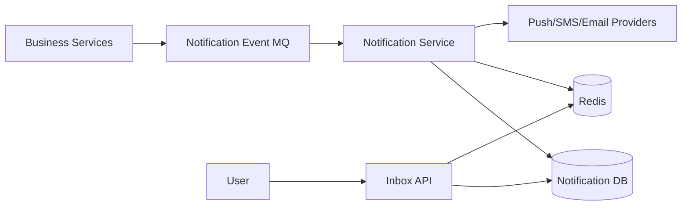
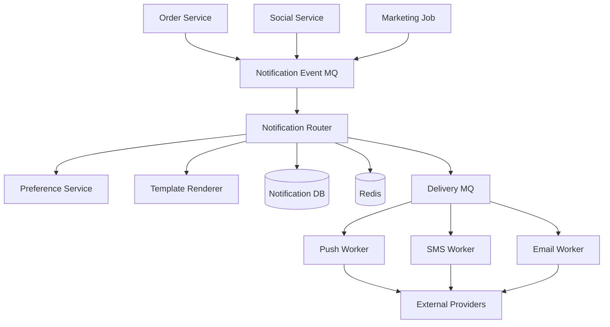
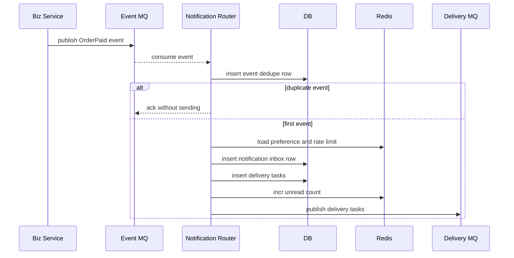
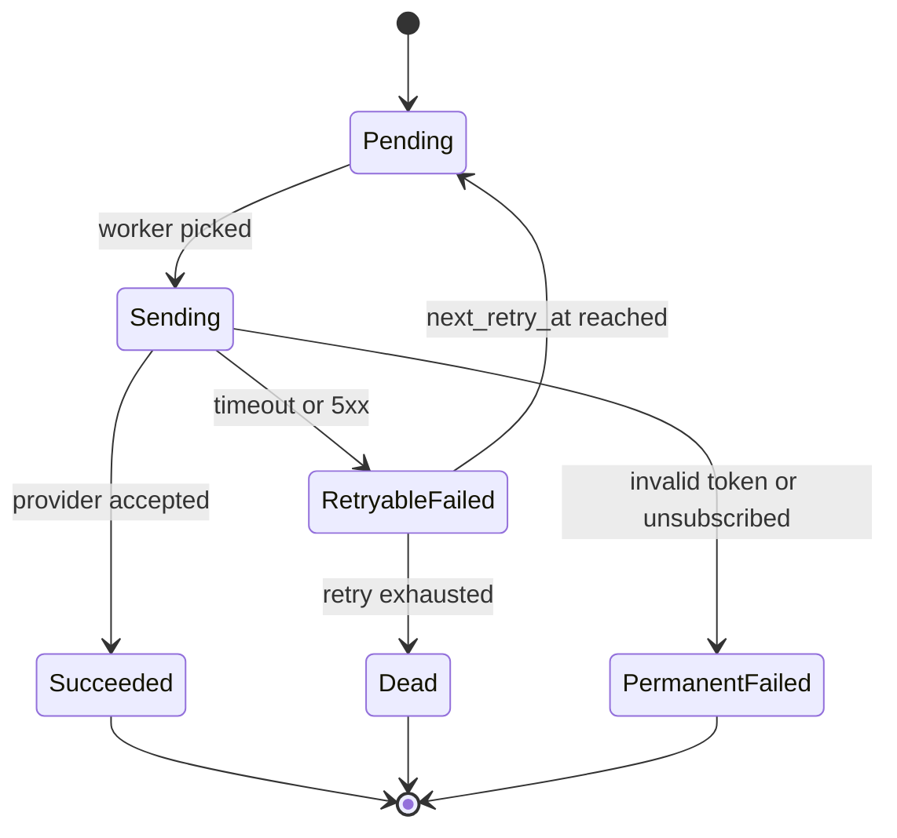
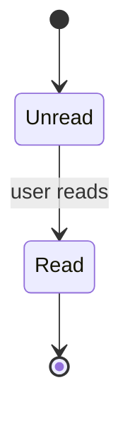
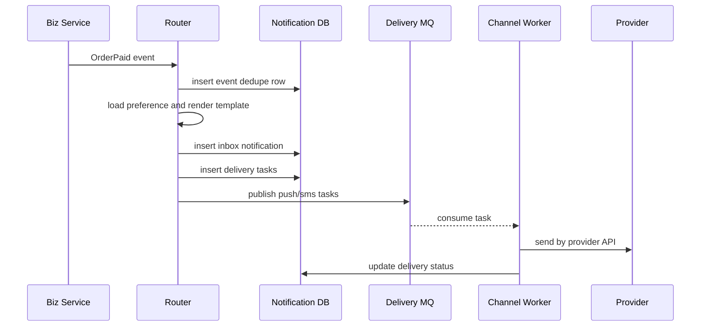
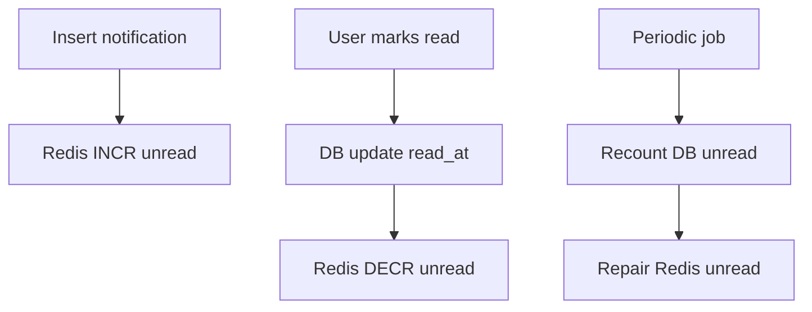
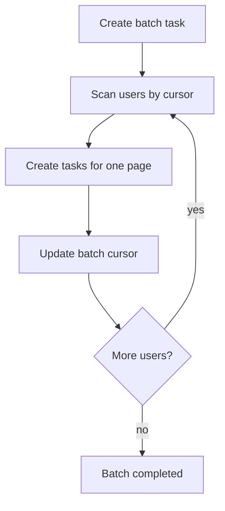

# 通知中心系统设计

通知中心负责把业务事件变成用户能看到的提醒，例如站内信、App Push、短信、邮件。它的核心不是“发一条消息”，而是控制重复、频率、渠道失败、用户偏好、未读数和最终可追踪。



## 先理解这些概念

- **通知事件**：业务系统发出的事实，例如 `OrderPaid`、`CommentReplied`、`CouponExpiring`。
- **通知任务**：通知中心根据事件生成的投递任务，例如给用户 1001 发一条站内信和 Push。
- **渠道**：站内信、App Push、短信、邮件、企业微信等。
- **模板**：通知内容的格式，业务只传变量，通知中心渲染最终文案。
- **用户偏好**：用户可能关闭营销 Push，但保留订单物流短信。
- **未读数**：通常是读模型，展示要快，但允许通过补偿修正。
- **去重窗口**：同类通知在一段时间内只发一次，避免刷屏。

通知中心的核心心智模型是：业务系统只表达“发生了什么”，通知中心决定“要不要发、发给谁、通过什么渠道发、失败怎么补”。

## 业务场景与核心挑战

订单支付成功要通知买家，评论被回复要通知作者，优惠券快过期要提醒用户，系统公告要批量发给大量用户。用户打开通知页时，要看到站内信列表和未读数。

核心挑战：

- 同一个业务事件可能重复投递，通知不能重复刷屏。
- 不同渠道的失败语义不同，Push、短信、邮件都可能限流或延迟。
- 大批量通知不能一次性写爆数据库。
- 用户偏好、黑名单、免打扰时间要生效。
- 未读数容易和通知列表不一致。
- 营销通知和交易通知优先级不同，不能互相拖垮。

## 功能需求与非功能需求

功能需求：接收通知事件、模板渲染、渠道投递、站内信列表、未读数、已读、批量已读、用户偏好、失败重试、投递查询。

非功能需求：

- 交易通知优先级高于营销通知。
- 同一业务事件同一用户同一渠道只投递一次。
- 渠道失败可重试，重试不能无限放大。
- 通知投递链路可追踪，能定位哪个渠道失败。
- 批量通知要分批、限速、可暂停。

## 核心数据模型

| 表/存储 | 关键字段 | 说明 |
| --- | --- | --- |
| `notification_events` | `event_id`, `event_type`, `biz_id`, `payload_hash` | 事件去重 |
| `notifications` | `notification_id`, `user_id`, `type`, `title`, `content`, `read_at`, `created_at` | 站内信 |
| `delivery_tasks` | `task_id`, `notification_id`, `channel`, `status`, `retry_count`, `next_retry_at` | 渠道投递任务 |
| `notification_preferences` | `user_id`, `type`, `channel`, `enabled` | 用户偏好 |
| `notification_templates` | `template_id`, `version`, `channel`, `content` | 模板配置 |

关键唯一约束：

```sql
create unique index uk_notification_event
on notification_events(event_type, biz_id, user_id);

create unique index uk_delivery_channel
on delivery_tasks(notification_id, channel);
```

Redis Key 可以这样设计：

```text
notif:unread:{user_id} -> unread_count
notif:dedupe:{event_type}:{biz_id}:{user_id}:{channel} -> 1
notif:pref:{user_id} -> hash(type_channel -> enabled)
notif:rate:{user_id}:{channel}:{yyyyMMddHHmm} -> count
notif:batch:{batch_id}:cursor -> last_user_id
```

## 高层架构图



## 关键流程时序图

业务事件进入通知中心后，先去重，再判断偏好和频率，最后生成站内信和渠道投递任务。



渠道投递要有明确状态，不要失败后无边界重试。



## 一致性与状态机

站内信写入和未读数增加最好在同一个本地事务或同一条可靠事件里完成。如果未读数放 Redis，必须允许重算。

用户已读的状态机很简单：



批量已读要避免逐条同步更新大量行，可以记录用户的 `read_all_before` 时间，再异步清理单条未读状态。

## 高并发瓶颈分析

- **大批量通知**：全量用户公告不能一次生成千万条任务，要分批扫描用户并限速。
- **未读数热点**：活跃用户频繁收通知和读通知，`notif:unread:{user_id}` 会频繁变更。
- **渠道限流**：短信和 Push 厂商通常有 QPS 限制，超过后会失败或排队。
- **重复事件**：业务系统重试、MQ 重投会导致通知事件重复。
- **模板变更**：模板错误会影响大量通知，需要灰度和回滚。

## 缓存、MQ、数据库的使用方式

- 数据库保存站内信、投递任务、事件去重和用户偏好，是审计来源。
- Redis 缓存用户偏好、未读数、去重窗口和频率控制计数。
- MQ 解耦业务事件和通知投递，按优先级拆分 topic，例如 `notification.transaction` 和 `notification.marketing`。
- 外部渠道调用放 worker，不放在业务服务同步请求里。
- 批量通知用任务表保存进度，支持暂停、恢复和失败重跑。

## 失败场景与补偿

- 业务事件重复：`event_type + biz_id + user_id` 唯一约束去重。
- Push token 失效：标记永久失败，更新用户设备 token 状态，不再重试。
- 短信渠道限流：按渠道 QPS 排队，超过重试窗口后降级或转人工策略。
- 未读数不准：按 `notifications where read_at is null` 定期重算修正 Redis。
- 批量任务中断：保存 `batch_id` 和 cursor，从上次位置继续。
- 模板渲染失败：任务进入 DLQ，修复模板后重放。

## 扩展方案与取舍

| 方案 | 优点 | 代价 |
| --- | --- | --- |
| 交易和营销 topic 分离 | 交易通知不被营销拖慢 | 运维和路由更复杂 |
| Redis 未读数 | 读取极快 | 需要重算补偿 |
| 投递任务状态机 | 可追踪、可重试 | 表和 worker 逻辑更多 |
| 用户偏好缓存 | 判断快 | 偏好修改有短暂延迟 |
| 批量任务分片 | 可控、可暂停 | 需要任务进度管理 |

## 面试版总结

通知中心要把业务事件和投递任务分开。业务服务只发 `OrderPaid`、`CommentReplied` 这类事件，通知中心用事件唯一键去重，检查用户偏好和频率限制，渲染模板后写站内信和投递任务。站内信列表以数据库为准，未读数可以放 Redis，但要能重算。渠道投递通过 MQ 和 worker 异步执行，任务有 Pending、Sending、Succeeded、RetryableFailed、Dead 等状态。交易通知和营销通知要拆优先级，批量通知要分片限速。

## 深挖：多渠道投递怎么可控

### 业务边界和澄清问题

通知中心要先区分交易通知和营销通知。交易通知是业务闭环的一部分，营销通知更关注触达率和成本。

| 问题 | 为什么要问 | 对设计的影响 |
| --- | --- | --- |
| 通知类型是交易还是营销？ | 优先级不同 | topic、限流和降级策略不同 |
| 是否必须站内信落库？ | 决定权威记录 | 交易通知通常要可追溯 |
| 用户能否关闭通知？ | 决定偏好模型 | 偏好按类型和渠道配置 |
| 是否有免打扰时间？ | 决定延迟投递 | 任务需要 `scheduled_at` |
| 是否批量触达全量用户？ | 决定任务分片 | 批次、cursor、暂停恢复 |

一个可控边界：交易通知必须可靠记录，营销通知允许限速和降级；站内信保存权威记录，Push/短信/邮件作为渠道投递。

### 容量估算

假设：

```text
交易通知峰值：10,000 events/s
营销批量任务：50,000,000 users
站内信读取峰值：80,000 QPS
Push 渠道限制：20,000 sends/s
短信渠道限制：2,000 sends/s
```

推导：

- 交易和营销必须隔离，否则营销批量会拖慢订单、支付通知。
- 外部渠道有 QPS 限制，投递任务必须排队和限速。
- 批量任务不能一次生成 5000 万条任务，需要按用户 cursor 分片。
- 未读数读取频繁，适合 Redis，但必须能从数据库重算。

### 数据模型和索引

通知事件去重：

```sql
create table notification_events (
  event_id varchar(64) primary key,
  event_type varchar(64) not null,
  biz_id varchar(128) not null,
  user_id varchar(64) not null,
  payload_hash varchar(128) not null,
  created_at timestamp not null,
  unique (event_type, biz_id, user_id)
);
```

站内信：

```sql
create table notifications (
  notification_id varchar(64) primary key,
  user_id varchar(64) not null,
  type varchar(64) not null,
  title varchar(256) not null,
  content text not null,
  read_at timestamp,
  created_at timestamp not null
);

create index idx_notifications_user_created
on notifications(user_id, created_at desc, notification_id desc);
```

投递任务：

```sql
create table delivery_tasks (
  task_id varchar(64) primary key,
  notification_id varchar(64) not null,
  user_id varchar(64) not null,
  channel varchar(32) not null,
  status varchar(32) not null,
  retry_count int not null default 0,
  next_retry_at timestamp,
  provider_message_id varchar(128),
  created_at timestamp not null,
  unique (notification_id, channel)
);
```

### Redis Key 和 Topic

```text
notif:unread:{user_id} -> unread count
notif:pref:{user_id} -> hash(type:channel -> enabled)
notif:dedupe:{event_type}:{biz_id}:{user_id}:{channel} -> 1
notif:rate:{channel}:{second} -> send count
notif:batch:{batch_id}:cursor -> last_user_id
```

Topic 按优先级拆：

```text
notification.event.transaction
notification.event.social
notification.event.marketing
notification.delivery.push
notification.delivery.sms
notification.delivery.email
```

### 路由和投递流程



路由规则可以表驱动：

| 通知类型 | 站内信 | Push | 短信 | 邮件 |
| --- | --- | --- | --- | --- |
| 订单支付成功 | 是 | 是 | 否 | 否 |
| 物流异常 | 是 | 是 | 是 | 否 |
| 优惠券过期 | 是 | 是 | 否 | 可选 |
| 安全登录提醒 | 是 | 是 | 是 | 是 |

### 未读数一致性

未读数适合 Redis，但不能只存在 Redis。



批量已读不建议逐条同步更新海量记录，可以记录 `read_all_before`，列表读取时合并判断，再异步清理。

### 批量通知任务

批量通知不要一次展开所有用户：



批量任务表要保存 `status`、`cursor`、`rate_limit`、`paused_reason`，支持暂停和恢复。

### 故障场景深挖

| 故障 | 风险 | 处理 |
| --- | --- | --- |
| 业务事件重复 | 用户收到重复通知 | `event_type + biz_id + user_id` 去重 |
| Push token 失效 | 无限重试浪费资源 | 标记永久失败，更新设备 token |
| 短信渠道限流 | 任务积压或失败 | 渠道限速、延迟重试、交易优先 |
| 模板错误 | 大量发送失败 | 模板版本、灰度、DLQ 修复后重放 |
| 未读数不准 | 用户体验异常 | 定期按 DB 重算修正 Redis |
| 营销批量拖慢交易通知 | 交易通知延迟 | topic/worker/限流隔离 |

### 演进路线

| 阶段 | 设计重点 |
| --- | --- |
| 单业务通知 | 同步写站内信，简单 Push |
| 多业务接入 | 事件去重、模板系统、用户偏好 |
| 多渠道 | 投递任务状态机、渠道限流、失败重试 |
| 大批量 | 批次任务、分片扫描、暂停恢复 |
| 平台化 | 租户隔离、A/B、触达率分析、成本控制 |

### 10 分钟面试表达

可以按这个顺序讲：

1. 先区分交易通知和营销通知，交易优先级更高。
2. 业务服务只发事件，通知中心负责路由、模板、偏好和投递。
3. 事件用业务唯一键去重，避免重复通知。
4. 站内信落库作为权威记录，未读数放 Redis 并可重算。
5. Push、短信、邮件拆成 delivery task，通过 MQ 和 worker 异步投递。
6. 渠道失败区分可重试和永久失败，重试有上限，失败进 DLQ。
7. 批量通知用 batch cursor 分片，不一次性展开全量用户。
8. 监控事件积压、投递成功率、渠道错误、未读数修正、批量任务进度。

## 术语回看

- [幂等](./glossary.md#幂等)
- [DLQ](./glossary.md#dlq)
- [最终一致性](./glossary.md#最终一致性)
- [读模型 / 写模型](./glossary.md#读模型--写模型)
- [令牌桶 / 漏桶](./glossary.md#令牌桶--漏桶)

## 工程检查清单

- 通知事件是否有业务唯一键去重？
- 站内信和渠道投递任务是否分开建模？
- 交易通知和营销通知是否拆 topic 或优先级？
- 用户偏好、黑名单、免打扰是否在发送前校验？
- 未读数是否可重算修正？
- 渠道失败是否区分可重试和永久失败？
- 批量通知是否分片、限速、可暂停、可恢复？

## 延伸阅读

- [Microservices.io: Idempotent Consumer](https://microservices.io/patterns/communication-style/idempotent-consumer.html)
- [Google SRE Book: Handling Overload](https://sre.google/sre-book/handling-overload/)
- [AWS Architecture Blog: Exponential Backoff and Jitter](https://aws.amazon.com/blogs/architecture/exponential-backoff-and-jitter/)
- [Firebase Cloud Messaging: Message handling and deprioritization](https://firebase.google.com/docs/cloud-messaging/concept-options)
