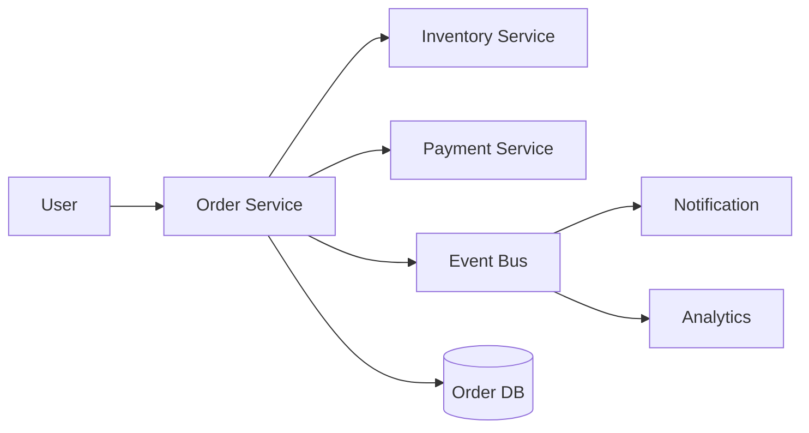
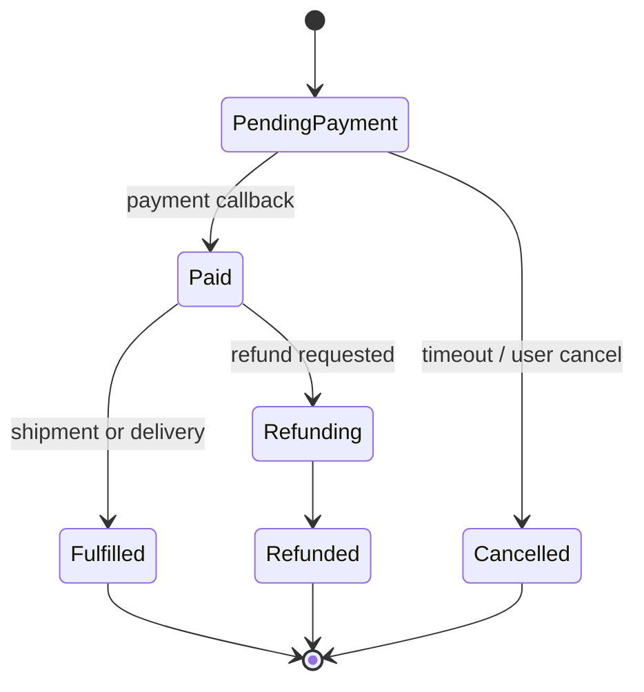

# 订单系统设计

订单系统是后端系统设计的综合题，核心不是“建一张订单表”，而是状态流转、库存一致性、支付回调、幂等、异步事件和可恢复性。

## 订单状态

## 后续扩写

- 下单、支付、取消、退款状态机。
- 支付回调幂等。
- 库存预占和释放。
- 订单事件和 outbox。

## 延伸阅读

- [Microservices.io: Saga](https://microservices.io/patterns/data/saga.html)
- [Stripe: Idempotent requests](https://docs.stripe.com/api/idempotent_requests)
