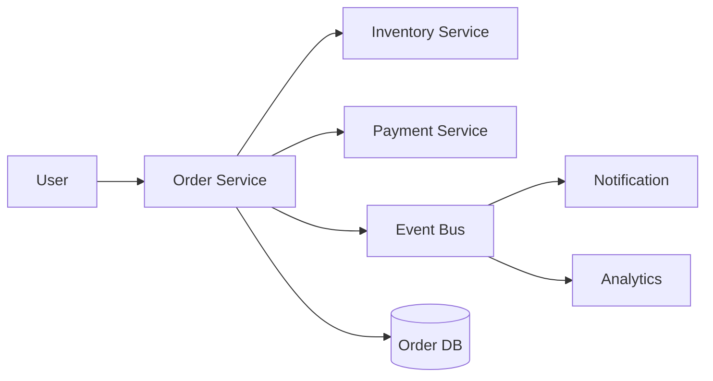
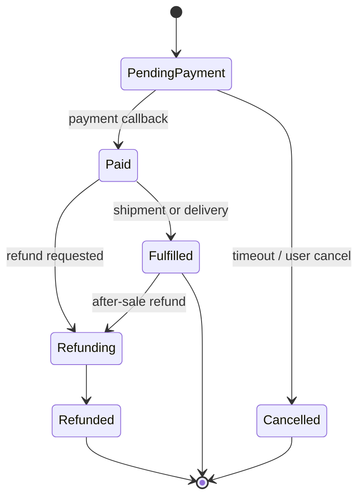
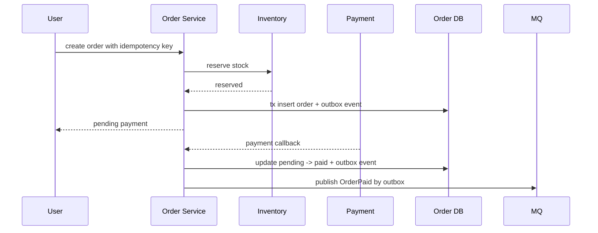
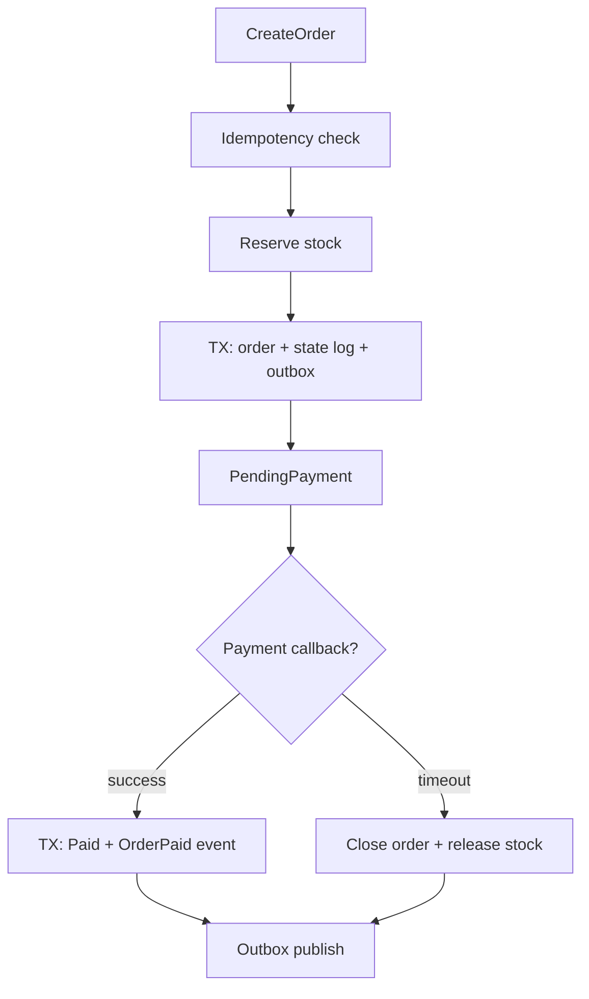
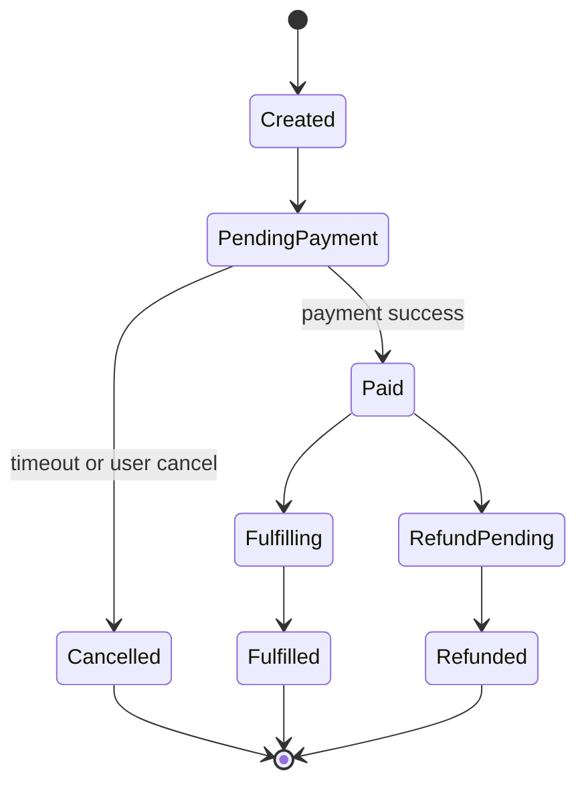
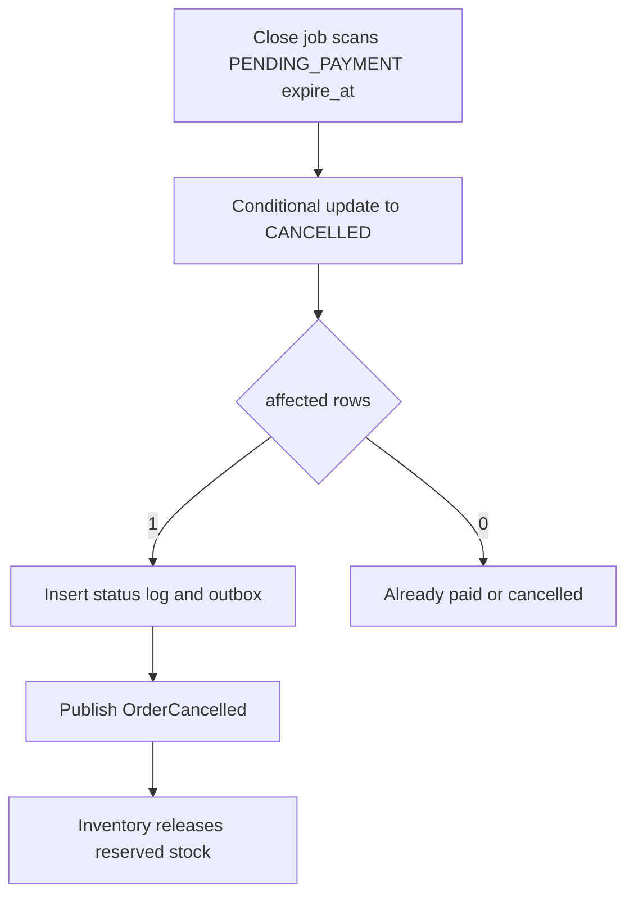

import Tabs from '@theme/Tabs';
import TabItem from '@theme/TabItem';

# 订单系统设计

订单系统是后端系统设计的综合题，核心不是“建一张订单表”，而是状态流转、库存一致性、支付回调、幂等、异步事件和可恢复性。

## 先理解这些概念

- **订单状态**：订单当前处于待支付、已支付、已取消、已退款等哪个阶段。
- **状态机**：规定订单只能按合法路径流转，不能随意改状态。
- **库存预占**：下单时先临时占住库存，支付超时再释放。
- **支付回调**：支付渠道异步通知支付结果，可能重复或延迟。
- **幂等**：重复下单、重复回调、重复关单都不能造成重复副作用。
- **Outbox**：订单状态变化后，可靠地把事件发送给下游。

读这篇时先记住：订单系统的难点不是保存订单，而是失败、重复、超时、并发时状态仍然正确。



## 它是什么

订单系统负责把用户购买意图变成可履约的业务记录。它通常包含下单、库存预占、支付、取消、超时关单、发货、退款、售后、订单查询和事件通知。

一个可靠订单系统的核心抽象是订单状态机：订单只能沿着合法路径流转，每次流转都要有幂等保护和持久化事件。

## 为什么需要它

订单处在交易链路中心，连接用户、库存、支付、履约、财务和通知。任何一个环节都可能失败、超时、重复回调或乱序到达。

如果订单状态没有严格约束，系统很容易出现已支付但取消、重复扣库存、支付回调丢失、订单事件漏发、退款和发货并发冲突等问题。

## 它解决什么问题

- 把复杂交易流程拆成明确状态和事件。
- 保证下单、支付、取消、退款等操作幂等。
- 通过库存预占和释放降低超卖风险。
- 通过 Outbox 可靠发布订单事件。
- 通过定时补偿恢复超时、丢回调和异步失败。

## 核心原理

订单状态机要定义清楚每个状态能接受哪些事件。



关键设计点：

- **订单号**：全局唯一，可按时间或业务分片生成。
- **幂等键**：下单请求、支付回调、退款请求都要有唯一业务键。
- **条件更新**：状态流转使用 `where status = expected`，防止并发重复推进。
- **库存预占**：下单时预占，超时未支付释放，支付成功确认占用。
- **支付回调**：按支付单号幂等处理，回调乱序时以支付渠道最终状态为准。
- **订单事件**：订单创建、支付成功、取消、退款等通过 outbox 发布。



## 最小示例

下面示例展示订单状态条件更新：只有 `PENDING_PAYMENT` 可以变成 `PAID`。

<Tabs groupId="language">
<TabItem value="java" label="Java">

```java
class OrderStateService {
    boolean markPaid(String orderId, String paymentId) {
        int updated = jdbc.update("""
            update orders
            set status = 'PAID', payment_id = ?, paid_at = now()
            where id = ? and status = 'PENDING_PAYMENT'
            """, paymentId, orderId);
        return updated == 1;
    }
}
```

</TabItem>
<TabItem value="go" label="Go">

```go
package order

func MarkPaid(db DB, orderID string, paymentID string) (bool, error) {
    rows, err := db.Exec(`update orders
        set status = 'PAID', payment_id = ?, paid_at = now()
        where id = ? and status = 'PENDING_PAYMENT'`, paymentID, orderID)
    if err != nil {
        return false, err
    }
    return rows == 1, nil
}
```

</TabItem>
<TabItem value="typescript" label="TypeScript">

```ts
async function markPaid(db: Database, orderId: string, paymentId: string) {
  const result = await db.orders.updateMany({
    where: { id: orderId, status: "PENDING_PAYMENT" },
    data: { status: "PAID", paymentId, paidAt: new Date() },
  });
  return result.count === 1;
}
```

</TabItem>
<TabItem value="python" label="Python">

```python
async def mark_paid(db, order_id: str, payment_id: str) -> bool:
    result = await db.execute(
        """update orders
           set status = 'PAID', payment_id = $1, paid_at = now()
           where id = $2 and status = 'PENDING_PAYMENT'""",
        payment_id,
        order_id,
    )
    return result.rowcount == 1
```

</TabItem>
</Tabs>

## 工程实践

- 订单表保留当前状态，订单状态流水表记录每次状态变化和触发事件。
- 下单接口使用幂等键，避免重复点击创建多个订单。
- 支付回调用支付渠道交易号和订单号做唯一约束，重复回调返回成功。
- 状态流转必须使用条件更新或版本号，不允许无条件覆盖状态。
- 订单创建、支付成功、取消、退款等事件使用 Outbox Pattern 可靠发布。
- 定时任务扫描超时未支付订单，执行关单和释放库存；任务本身也要幂等。
- 查询接口可以做读模型或缓存，但写入侧状态机必须以数据库为准。

## 常见坑

- 支付回调直接把订单设为已支付，不检查当前状态。
- 取消订单和支付回调并发，最后状态被后写覆盖。
- 下单成功但订单事件发送失败，下游库存或通知永远不知道。
- 只记录订单当前状态，没有状态流水，事故后无法还原过程。
- 关单任务释放库存没有幂等，重复执行导致库存增加过多。
- 订单查询强依赖多个下游实时聚合，导致详情页不稳定。

## 完整案例

一个订单从创建到支付成功的可靠链路可以这样设计：

1. 客户端提交下单请求，带 `Idempotency-Key`。
2. 订单服务检查幂等记录，调用库存服务预占库存。
3. 本地事务写入订单、状态流水、outbox 事件和幂等结果。
4. 用户跳转支付，支付渠道异步回调订单服务。
5. 回调处理使用支付单号去重，条件更新 `PENDING_PAYMENT -> PAID`。
6. 同一事务写入 `OrderPaid` outbox 事件。
7. 发布器投递事件，通知履约、积分、搜索和消息服务。
8. 关单任务扫描超时未支付订单，条件更新为 `CANCELLED` 并释放库存。



这个设计不要求所有服务在一个分布式事务里提交，而是让订单服务维护权威状态，下游通过事件最终一致地跟进。失败可以通过幂等重试、outbox 重发、关单扫描和状态流水补偿恢复。

## 深挖：订单系统怎么讲到项目级

### 业务边界和澄清问题

订单系统不是支付系统，也不是库存系统。它的核心职责是维护订单生命周期，并把库存、支付、履约这些外部变化收敛成订单状态。

| 问题 | 为什么要问 | 对设计的影响 |
| --- | --- | --- |
| 订单是实物、电商、票务还是虚拟商品？ | 履约状态不同 | 是否需要发货、出票、核销 |
| 库存是订单服务内管，还是独立库存服务？ | 决定事务边界 | 本地事务或跨服务事件补偿 |
| 是否允许拆单？ | 决定订单模型 | 主订单、子订单、履约单 |
| 是否允许改价、优惠、退款？ | 决定金额模型 | 需要金额快照和调整流水 |
| 支付超时多久关单？ | 决定关单任务 | `expire_at` 索引和条件更新 |

一个面试可控边界：单商品订单，不做拆单，库存由库存服务预占，支付由支付系统回调，订单服务维护权威状态和事件发布。

### 容量估算

假设：

```text
日订单量：1,000,000
创建订单峰值：3,000 QPS
订单详情查询峰值：30,000 QPS
待支付订单超时：15 分钟
支付回调峰值：5,000 QPS
下游消费者：库存、支付、履约、通知、搜索
```

推导：

- 写入 QPS 不一定极高，但状态正确性要求高。
- 查询 QPS 远高于写入，订单详情可以有读模型或短 TTL 缓存。
- 关单扫描不能全表扫，要按 `status + expire_at` 建索引。
- 订单事件会被多个系统消费，Outbox 和消费者幂等是基础设施。

### 表结构、索引和事件

订单表：

```sql
create table orders (
  order_id varchar(64) primary key,
  user_id varchar(64) not null,
  sku_id varchar(64) not null,
  quantity int not null,
  amount_cents bigint not null,
  status varchar(32) not null,
  idempotency_key varchar(128) not null,
  expire_at timestamp,
  version int not null default 0,
  created_at timestamp not null,
  updated_at timestamp not null,
  unique (user_id, idempotency_key)
);

create index idx_orders_user_created
on orders(user_id, created_at desc, order_id desc);

create index idx_orders_close_scan
on orders(status, expire_at);
```

状态流水：

```sql
create table order_status_logs (
  log_id varchar(64) primary key,
  order_id varchar(64) not null,
  from_status varchar(32),
  to_status varchar(32) not null,
  reason varchar(128) not null,
  created_at timestamp not null
);
```

Outbox：

```sql
create table outbox_events (
  event_id varchar(64) primary key,
  aggregate_type varchar(32) not null,
  aggregate_id varchar(64) not null,
  event_type varchar(64) not null,
  payload text not null,
  status varchar(32) not null,
  created_at timestamp not null
);
```

MQ Topic：

```text
order.created
order.paid
order.cancelled
order.fulfilled
order.refunded
```

### 状态推进和条件更新

订单状态必须单向推进，不能让旧消息覆盖新状态。



支付回调更新：

```sql
update orders
set status = 'PAID', version = version + 1, updated_at = now()
where order_id = ?
  and status = 'PENDING_PAYMENT';
```

如果影响行数为 0，要查询当前状态：已支付说明重复回调，已取消说明需要走支付退款或异常处理。

### 关单补偿流程



关单任务要幂等：重复扫描同一订单，只有第一次条件更新成功，后续不会重复释放库存。

### 故障场景深挖

| 故障 | 风险 | 处理 |
| --- | --- | --- |
| 用户重复提交订单 | 重复订单 | `user_id + idempotency_key` 唯一约束 |
| 库存预占成功但订单创建失败 | 库存被占住 | 释放库存或补偿扫描孤儿预占 |
| 支付成功但订单已取消 | 资金和订单冲突 | 触发退款或人工差错处理 |
| OrderPaid 事件发布失败 | 履约不知道订单已支付 | Outbox 重试发布 |
| 消费者重复消费 OrderPaid | 重复发货/通知 | 消费者按事件 ID 幂等 |
| 关单任务和支付回调并发 | 状态竞态 | 条件更新，只有一个成功 |

### 演进路线

| 阶段 | 设计重点 |
| --- | --- |
| 单体订单 | 本地事务、状态机、唯一约束 |
| 服务拆分 | 库存/支付/履约事件化，Outbox 保证事件可靠 |
| 高并发活动 | Redis 预扣、MQ 削峰、异步创建订单 |
| 多业务线 | 主订单/子订单、金额快照、履约单、退款单 |
| 平台化 | 多租户、审计、风控、数据归档、冷热分层 |

### 10 分钟面试表达

可以按这个顺序讲：

1. 先说明订单服务维护订单权威状态，不直接替代库存和支付。
2. 创建订单用幂等键和唯一约束防重复。
3. 库存预占成功后，本地事务写订单、状态流水和 outbox。
4. 支付回调用条件更新推进 `PENDING_PAYMENT -> PAID`。
5. 关单任务扫描超时未支付订单，条件更新为取消并发布释放库存事件。
6. 订单事件通过 Outbox 发布，下游消费者必须幂等。
7. 所有关键状态变化都写状态流水，方便审计和排障。
8. 监控订单创建成功率、支付回调延迟、关单积压、outbox 积压和状态冲突数。

## 检查清单

- 订单状态和合法流转是否明确？
- 每个写接口和外部回调是否幂等？
- 状态更新是否使用条件更新或版本号？
- 库存预占、确认、释放是否有一致的业务键？
- 订单事件是否可靠发布，是否使用 outbox？
- 是否有订单状态流水和审计字段？
- 超时关单、支付回调丢失、消息发布失败是否有补偿任务？
- 查询链路是否避免强依赖多个慢下游？

## 这篇文章在系统里怎么用

订单系统是把前面所有基础能力组合起来的案例：事务和锁保证关键写入正确，幂等保证重试安全，MQ 和 Outbox 保证事件可靠发布，超时关单和补偿任务恢复异常状态。

系统设计时，可以按订单生命周期讲：创建订单、库存预占、待支付、支付成功、出票/履约、取消、退款。每一步都要说明状态如何推进、失败如何恢复。

## 术语回看

- [状态机](./glossary.md#状态机)
- [幂等](./glossary.md#幂等)
- [Outbox](./glossary.md#outbox)
- [补偿](./glossary.md#补偿)
- [最终一致性](./glossary.md#最终一致性)

## 延伸阅读

- [Microservices.io: Saga](https://microservices.io/patterns/data/saga.html)
- [Microservices.io: Transactional Outbox](https://microservices.io/patterns/data/transactional-outbox.html)
- [Stripe: Idempotent requests](https://docs.stripe.com/api/idempotent_requests)
- [AWS Builders Library: Avoiding insurmountable queue backlogs](https://aws.amazon.com/builders-library/avoiding-insurmountable-queue-backlogs/)
