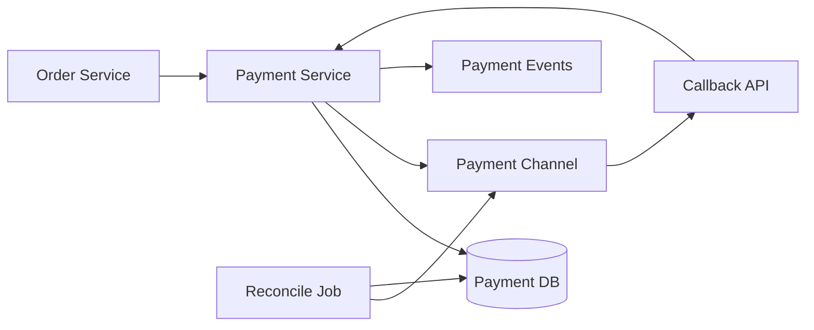
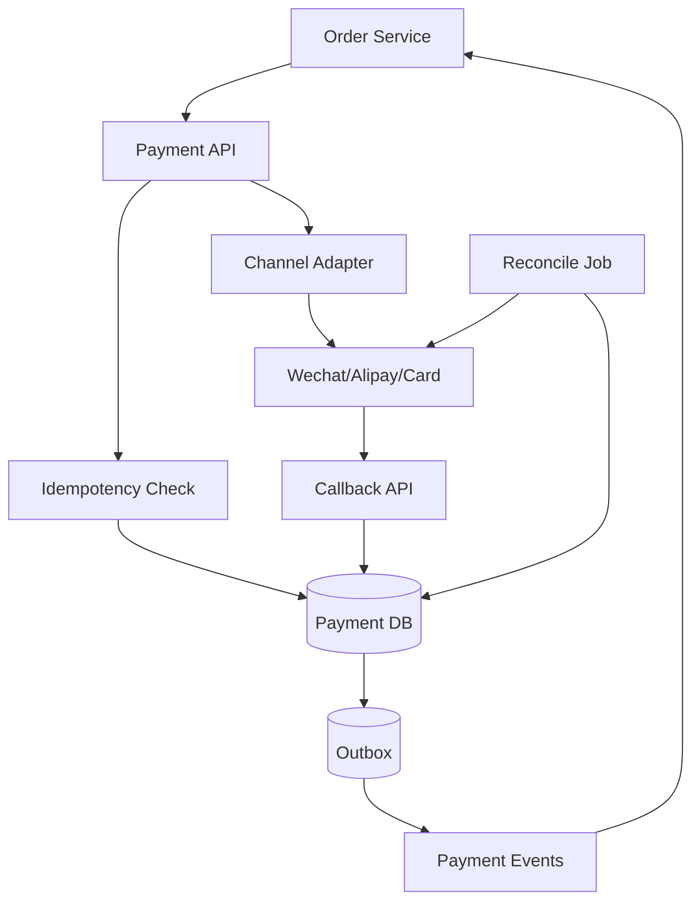
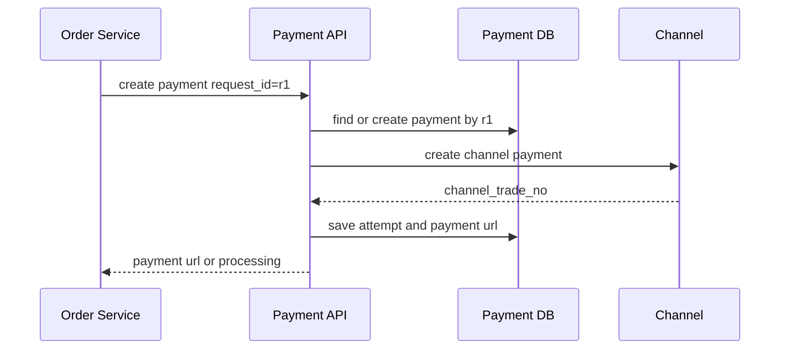
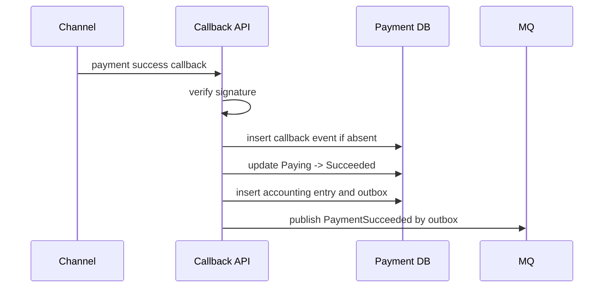
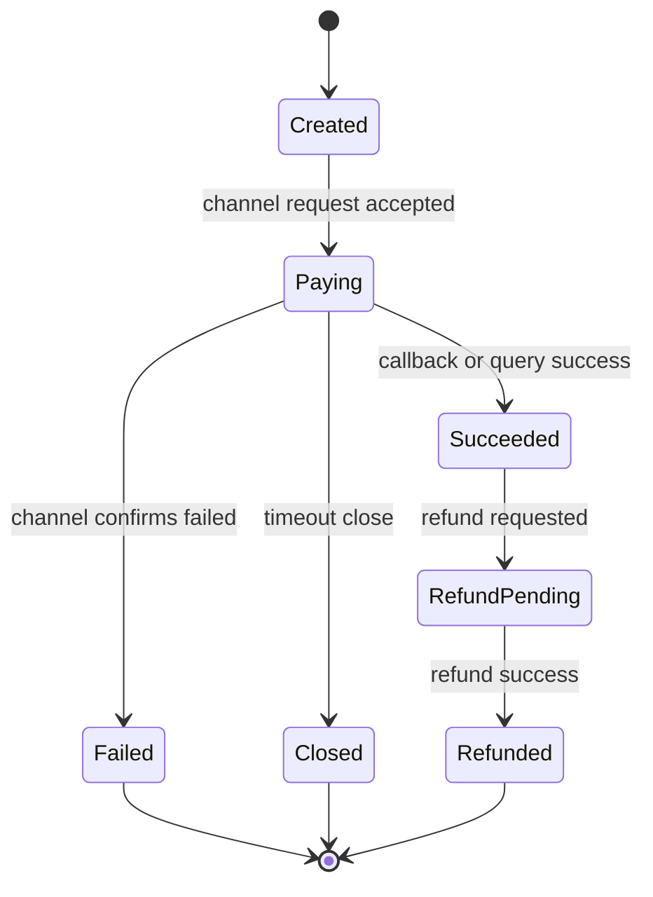

# 支付系统设计

支付系统的核心目标是资金状态正确、请求可重试、回调可幂等、账务可对齐。它不追求所有外部渠道调用都同步成功，而是通过状态机、幂等键、渠道流水、对账和补偿保证最终正确。

## 先理解这些概念

- **支付单**：系统内部记录的一次支付请求。订单和支付单不要混为一谈，一个订单可能有多次支付尝试。
- **支付渠道**：微信、支付宝、银行卡等外部系统。你的系统要通过渠道完成真实扣款。
- **回调**：用户支付后，渠道主动通知你的系统支付结果。回调可能重复、延迟、乱序，也可能丢失。
- **查单**：你的系统主动去渠道查询某笔支付的最终状态，用来补偿丢失或不确定的回调。
- **幂等**：同一个创建支付请求、同一个回调、同一个退款请求重复执行，结果都只能生效一次。
- **对账**：把本地支付流水和渠道账单逐笔比对，确认钱和状态没有差异。

支付系统最重要的心智模型是：外部渠道不完全受你控制，所以本地必须保存清楚的状态、流水和幂等记录，再用回调、查单、对账把结果修正到一致。

## 业务场景与核心挑战

订单服务发起支付，支付系统创建支付单并调用第三方渠道。用户完成支付后，渠道异步回调支付结果。异步回调的意思是：支付结果不是在创建支付请求时立刻返回，而是稍后由渠道再通知你。系统还要支持查询支付状态、关闭支付、退款、对账和异常补偿。

核心挑战：

- 创建支付、支付回调、退款请求都可能重复。
- 渠道回调可能延迟、乱序、重复或丢失。
- 用户看到的订单状态要和支付状态最终一致。
- 资金相关操作必须可审计、可对账、可补偿。
- 支付渠道不可用时，主业务要明确失败或处理中边界。

## 功能需求与非功能需求

功能需求：创建支付单、拉起渠道支付、接收回调、查询状态、关闭支付、发起退款、对账、补偿通知订单。

非功能需求：

- 同一业务支付请求只能创建一笔有效支付单。
- 回调和查询补偿都要幂等推进状态。
- 资金状态变化必须有流水和审计日志。
- 支付成功事件不能丢，订单服务最终能收到。
- 支付和退款链路要有可观测性和告警。

## 核心数据模型

| 表/存储 | 关键字段 | 说明 |
| --- | --- | --- |
| `payment_orders` | `payment_id`, `merchant_order_id`, `status`, `amount` | 支付单 |
| `payment_attempts` | `attempt_id`, `payment_id`, `channel`, `channel_trade_no` | 渠道请求记录 |
| `payment_callbacks` | `callback_id`, `channel`, `event_id`, `payload_hash` | 回调去重 |
| `refund_orders` | `refund_id`, `payment_id`, `status`, `amount` | 退款单 |
| `accounting_entries` | `entry_id`, `biz_id`, `direction`, `amount` | 账务流水 |
| `outbox_events` | `event_id`, `event_type`, `payload`, `status` | 支付事件可靠发布 |

`merchant_order_id`、`payment_request_id`、`channel_trade_no`、`refund_request_id` 都应该有唯一约束。唯一约束是支付系统最重要的安全网之一：即使代码重试或回调重复，数据库也会阻止重复创建同一笔业务记录。

## 高层架构图

## 关键流程时序图

创建支付单时，内部支付单和渠道请求要用幂等键保护。幂等键可以理解为“这次业务意图的身份证”，同一个身份证重复请求，只能得到同一笔支付结果。

渠道回调只负责幂等推进支付状态，不直接相信请求顺序。比如“支付成功”回调可能比“支付中”通知先到，也可能同一个成功回调来两次，所以状态更新必须检查当前状态。

## 一致性与状态机

支付状态只能单向推进。重复回调、主动查单和对账任务都走同一套状态机。状态机的作用是规定哪些状态变化是合法的，避免后到的旧消息把新状态覆盖掉。

账务流水建议和状态变更在同一个本地事务里写入。支付成功事件通过 outbox 发布，订单服务幂等消费后把订单置为已支付。

## 高并发瓶颈分析

- **创建支付单**：用户重复点击和订单服务重试会造成重复创建，需要幂等键。
- **渠道回调**：回调可能集中到达，签名验签和数据库状态更新要轻量。
- **状态查询**：用户支付后频繁刷新结果，需要缓存短时间的支付状态。
- **退款**：退款通常比支付低频，但资金风险更高，要严格审计。
- **对账**：大批量账单处理不能影响在线支付链路。

## 缓存、MQ、数据库的使用方式

- 数据库是支付状态、渠道流水和账务流水的权威存储。
- Redis 可缓存短期支付状态和幂等处理中状态，但不能替代数据库唯一约束和状态条件更新。
- MQ 用于通知订单、积分、财务、风控等下游支付结果。因为通知可能失败，消费者也必须幂等。
- Outbox 保证支付成功、退款成功等事件可靠发布，避免本地状态成功但消息丢失。
- 对账任务从渠道账单和本地流水比对，发现差异后生成补偿工单或自动修复任务。

## 失败场景与补偿

- 创建渠道支付超时：本地状态保持 `Paying` 或 `Unknown`，通过查单确认。
- 回调丢失：定时查单或对账任务补偿支付结果。
- 回调重复：回调事件唯一约束和状态条件更新保证幂等。
- 支付成功事件发布失败：Outbox publisher 重试，订单服务幂等消费。
- 退款成功但通知失败：退款状态以支付库为准，下游通过事件重放恢复。
- 本地和渠道账单不一致：对账生成差错记录，进入人工或自动补偿流程。

## 扩展方案与取舍

| 方案 | 优点 | 代价 |
| --- | --- | --- |
| 每渠道 adapter | 隔离渠道差异 | 需要统一错误码和状态映射 |
| 幂等表 + 唯一约束 | 重试安全 | 需要处理 processing 超时 |
| 查单补偿 | 弥补回调丢失 | 增加渠道 API 调用 |
| Outbox 事件 | 支付事件不丢 | 下游必须幂等消费 |
| 日终对账 | 资金闭环 | 延迟发现部分问题 |

## 面试版总结

支付系统要围绕状态机和幂等设计。创建支付单用业务请求号去重，渠道调用保存 attempt，回调用事件 ID 去重并验签。支付状态只能从 Created/Paying 推进到 Succeeded、Failed 或 Closed。支付成功后同一事务写账务流水和 outbox 事件，订单服务异步幂等消费。回调丢失靠查单和对账补偿，账务差异要有审计和处理流程。简单说：请求可以重试，回调可以重复，消息可以重放，但资金结果只能生效一次。

## 术语回看

- [幂等](./glossary.md#幂等)
- [状态机](./glossary.md#状态机)
- [补偿](./glossary.md#补偿)
- [Outbox](./glossary.md#outbox)
- [对账](./glossary.md#对账)

## 工程检查清单

- 创建支付、回调、退款是否都有幂等键和唯一约束？
- 渠道回调是否验签、去重、条件更新状态？
- 支付状态机是否禁止非法回退和覆盖？
- 支付成功是否写账务流水和 outbox 事件？
- 订单服务消费支付事件是否幂等？
- 是否有查单、关单、退款和对账补偿任务？
- 是否有资金差错告警、审计日志和人工处理入口？

## 延伸阅读

- [Stripe: Idempotent requests](https://docs.stripe.com/api/idempotent_requests)
- [Microservices.io: Transactional Outbox](https://microservices.io/patterns/data/transactional-outbox.html)
- [AWS Builders Library: Making retries safe with idempotent APIs](https://aws.amazon.com/builders-library/making-retries-safe-with-idempotent-APIs/)
- [Google SRE Book: Data Integrity](https://sre.google/sre-book/data-integrity/)
