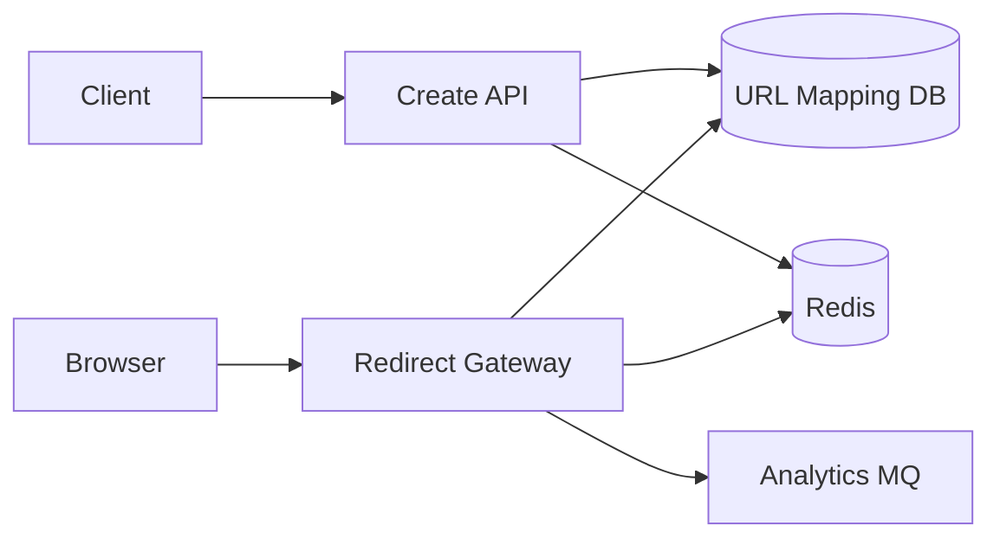
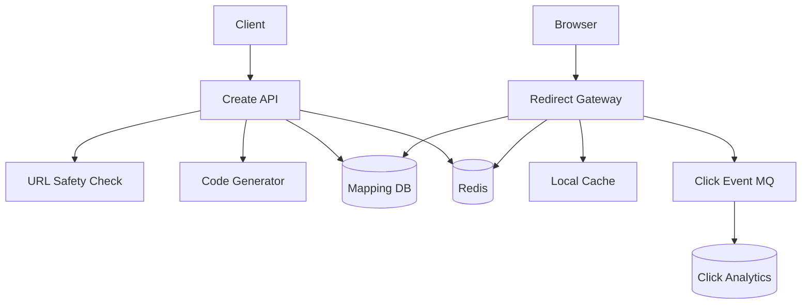
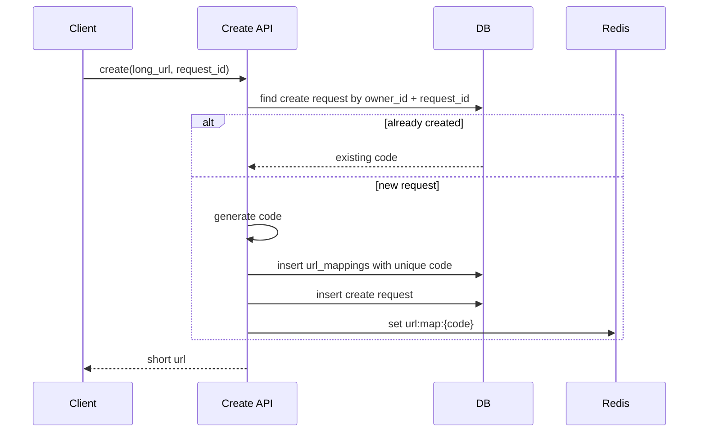
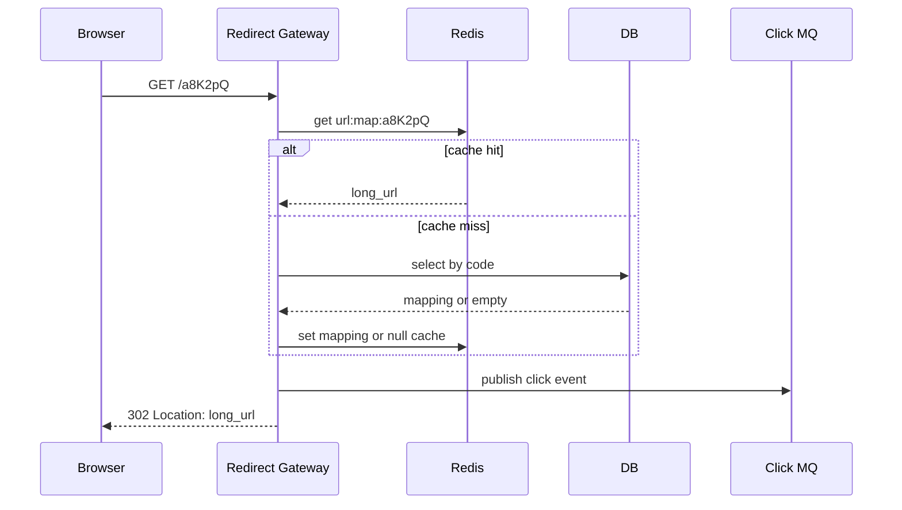
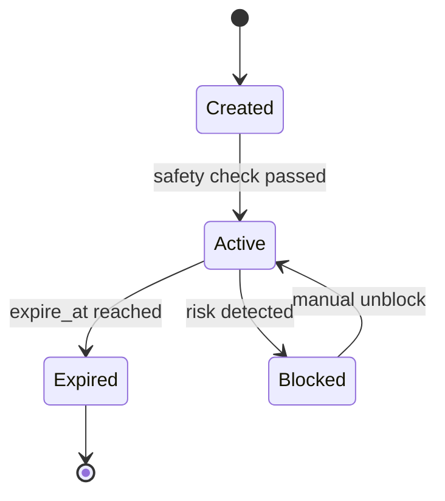

# 短链接系统设计

短链接系统看起来只是把一个长 URL 变短，但真正的难点在于：跳转请求非常多，创建请求要防重复，短码不能冲突，恶意链接要拦截，缓存失效时不能把数据库打穿。



## 先理解这些概念

- **短码**：短链接里的唯一标识，例如 `https://s.example/a8K2pQ` 里的 `a8K2pQ`。
- **长链映射**：短码到原始 URL 的映射关系，例如 `a8K2pQ -> https://example.com/products/123?...`。
- **302 跳转**：服务端返回临时跳转，让浏览器访问长 URL。短链接通常用 302，方便统计每次访问。
- **301 跳转**：永久跳转，浏览器和搜索引擎可能缓存结果。适合长期不变且不需要精细统计的链接。
- **防穿透**：不存在的短码被大量访问时，不能每次都查数据库。
- **访问统计**：点击量、来源、设备、地域等通常异步记录，不要阻塞跳转。

短链接系统的核心心智模型是：创建链路要保证短码唯一，跳转链路要尽量只读缓存，统计链路要异步化。

## 业务场景与核心挑战

用户输入一个长 URL，系统生成短链接。其他用户访问短链接时，系统查到原始 URL 并返回跳转。运营还要看到点击统计，安全团队要能封禁恶意链接。

核心挑战：

- 跳转 QPS 远高于创建 QPS，读链路必须极短。
- 短码不能冲突，否则会跳到错误页面。
- 不存在的短码、恶意扫描会造成缓存穿透。
- 热门活动链接可能形成 Redis 热 key。
- 点击统计不能影响跳转延迟。
- 链接封禁、过期、权限变化要尽快生效。

## 功能需求与非功能需求

功能需求：创建短链接、访问跳转、设置过期时间、自定义短码、封禁链接、点击统计、查询链接详情。

非功能需求：

- 跳转接口 P99 尽量低于 50ms 到 100ms。
- 短码全局唯一，创建请求可重试。
- 缓存不可用时服务可降级，但不能放大数据库压力。
- 统计事件允许少量延迟，但不能长期丢失。
- 恶意链接和不存在短码要有风控与限流。

## 核心数据模型

| 表/存储 | 关键字段 | 说明 |
| --- | --- | --- |
| `url_mappings` | `code`, `long_url`, `owner_id`, `status`, `expire_at` | 短码映射权威表 |
| `url_create_requests` | `request_id`, `owner_id`, `code` | 创建请求幂等表 |
| `blocked_urls` | `code`, `reason`, `blocked_at` | 封禁记录 |
| `click_events` | `event_id`, `code`, `ip_hash`, `ua`, `referer`, `created_at` | 点击明细，通常进日志或 OLAP |

关键约束：

```sql
create unique index uk_url_mappings_code on url_mappings(code);
create unique index uk_url_create_request on url_create_requests(owner_id, request_id);
```

Redis Key 可以这样设计：

```text
url:map:{code} -> {long_url,status,expire_at}
url:null:{code} -> 1                 # 不存在短码的短 TTL 空值缓存
url:block:{code} -> reason           # 封禁缓存
url:hot:{code}:shard:{0..15} -> count # 热点点击计数分片
```

## 高层架构图



## 关键流程时序图

创建短链接时，`request_id` 是幂等键。用户重复点击“生成”，或者前端超时重试，都应该返回同一个短链接。



跳转链路要尽量简单：先本地缓存，再 Redis，再数据库。访问统计只投递事件，不同步写数据库计数。



## 一致性与状态机

短链接状态不要只靠删除缓存表达，要在数据库里有明确状态。



读缓存时也要带上 `status` 和 `expire_at`，避免已封禁或已过期链接还继续跳转。

## 高并发瓶颈分析

- **热门短链跳转**：单个短码可能被大量访问，Redis 单 key、网关本地缓存和统计 MQ 都可能成为瓶颈。
- **恶意扫描短码**：大量不存在短码会穿透到数据库，需要空值缓存、布隆过滤器或限流。
- **创建短码冲突**：随机短码有概率重复，需要唯一索引兜底和重试。
- **统计写放大**：每次跳转同步更新数据库点击数会拖慢主链路。
- **封禁生效延迟**：本地缓存 TTL 太长会导致封禁后仍可访问。

## 缓存、MQ、数据库的使用方式

- Redis 缓存 `code -> long_url/status/expire_at`，热点短链可以加本地缓存。
- 数据库是短码映射、状态和过期时间的权威来源。
- MQ 承接点击事件，异步写入 OLAP、报表和风控系统。
- 空值缓存保存不存在短码，TTL 要短，例如 30 秒到 5 分钟。
- 自定义短码创建必须走唯一约束，不能只靠先查再插。

## 失败场景与补偿

- Redis 未命中且数据库不存在：写 `url:null:{code}`，短 TTL，返回 404。
- Redis 故障：网关限流回源数据库，热门链接可用本地缓存兜底。
- MQ 发送失败：点击统计可以本地缓冲或降级丢弃低价值统计，但跳转优先成功。
- 短码冲突：捕获唯一键冲突后重新生成，最多重试固定次数。
- 封禁后缓存未失效：封禁时删除 `url:map:{code}` 并写 `url:block:{code}`，本地缓存使用短 TTL。

## 扩展方案与取舍

| 方案 | 优点 | 代价 |
| --- | --- | --- |
| 自增 ID + Base62 | 短码短且无冲突 | 可能暴露业务增长，需要号段或混淆 |
| 随机码 + 唯一约束 | 简单，难猜 | 有冲突概率，需要重试 |
| Redis 缓存映射 | 跳转快 | 需要处理失效、穿透和热点 |
| 点击事件进 MQ | 跳转链路轻 | 统计最终一致 |
| 本地缓存热点链接 | 极低延迟 | 封禁生效可能有短延迟 |

## 面试版总结

短链接系统读多写少。创建短链用 `request_id` 做幂等，短码用 Base62 或随机码生成，并由数据库唯一索引保证不冲突。跳转时先查本地缓存和 Redis，未命中再查数据库；不存在短码写短 TTL 空值缓存防穿透。点击统计通过 MQ 异步处理，避免同步更新计数拖慢跳转。状态上要支持 Active、Blocked、Expired，封禁和过期必须在读链路校验。热点短链用本地缓存、计数分片和限流保护。

## 术语回看

- [幂等](./glossary.md#幂等)
- [回源](./glossary.md#回源)
- [热点 / 热 Key](./glossary.md#热点--热-key)
- [最终一致性](./glossary.md#最终一致性)

## 工程检查清单

- 创建请求是否有 `request_id` 幂等保护？
- `code` 是否有数据库唯一索引？
- 不存在短码是否有空值缓存或布隆过滤保护？
- 跳转链路是否避免同步写统计表？
- 封禁、过期是否在缓存值和数据库状态里都能表达？
- 热门短链是否有本地缓存、限流和统计分片？
- Redis 故障时是否有回源限流和降级策略？

## 延伸阅读

- [Redis: Caching patterns](https://redis.io/learn/howtos/solutions/caching-architecture/)
- [Microservices.io: Idempotent Consumer](https://microservices.io/patterns/communication-style/idempotent-consumer.html)
- [Cloudflare: How to stop running out of ephemera](https://blog.cloudflare.com/how-to-stop-running-out-of-ephemeral-ports-and-start-to-love-long-lived-connections/)
- [Martin Fowler: Event Sourcing](https://martinfowler.com/eaaDev/EventSourcing.html)
