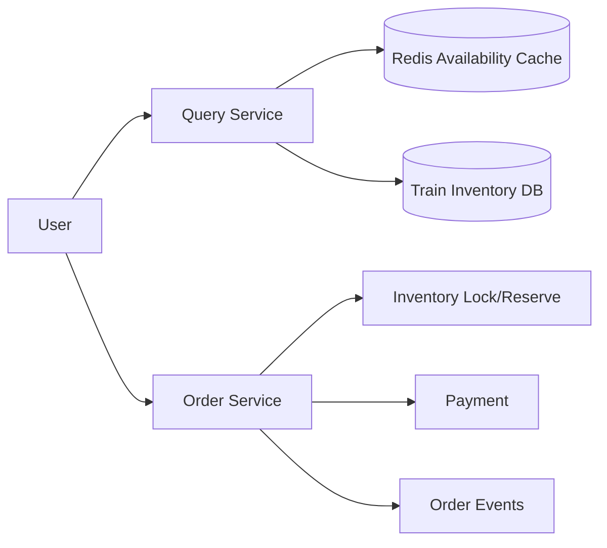
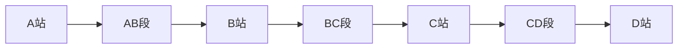
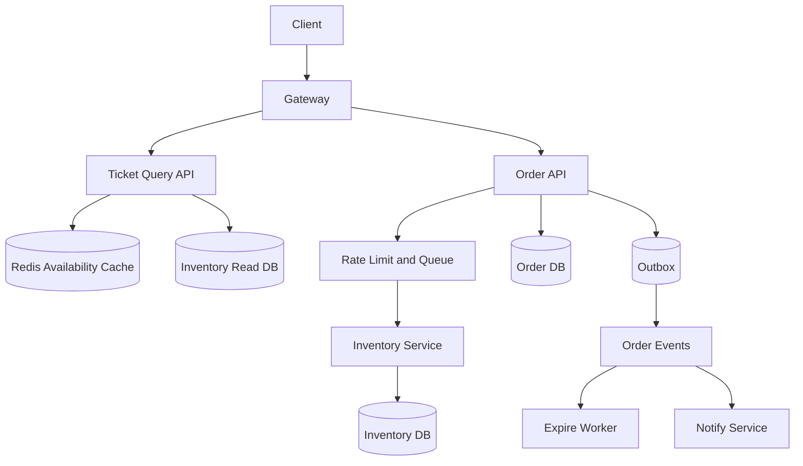
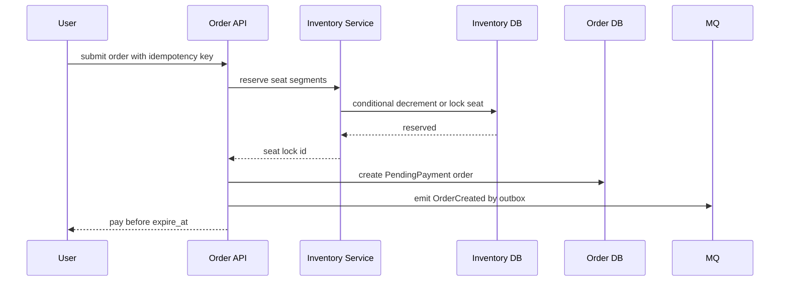
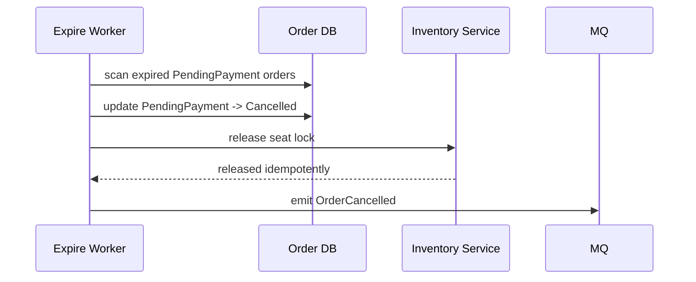
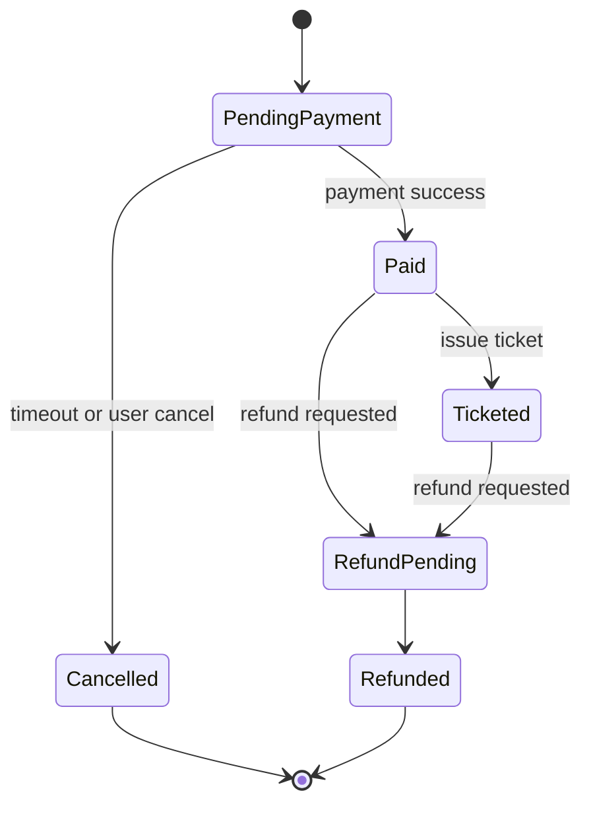
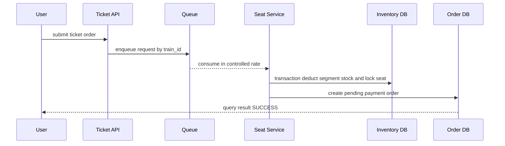
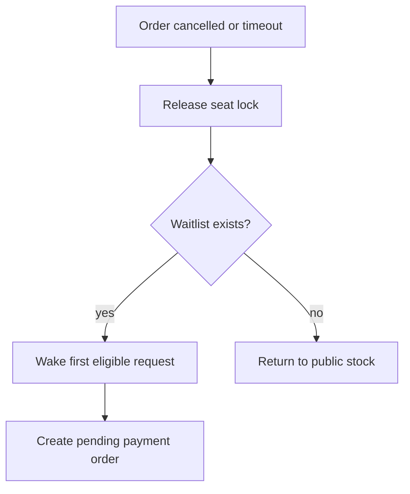

# 火车票购票系统设计

火车票购票系统的核心压力点是“读请求极高、库存强约束、订单状态复杂”。它不像微博 Feed 可以接受较宽松的最终一致：同一座位不能卖给两个人，余票展示可以短暂不准，但支付成功后的出票结果必须正确。



## 先理解这些概念

- **余票查询**：用户看到“还有几张票”。这个数字可以短暂不准，因为真正能不能买到要以下单占座为准。
- **占座**：用户提交订单后，系统先临时锁住一个座位或一份库存，给用户一段支付时间。
- **区间库存**：火车票不是简单的“商品库存”。A-B-C-D 四站中，买 A 到 D 会占用 AB、BC、CD 三段；买 B 到 C 只占用 BC 一段。
- **强一致**：同一座位不能同时卖给两个人。查询页可以不准，但最终出票必须正确。
- **支付超时释放**：用户占座后不支付，系统要把占用释放回库存。
- **候补**：当前没票时，用户排队等待别人退票或超时释放后自动补上。

读这篇时可以抓住一条主线：查询可以靠缓存扛流量，但下单占座必须回到权威库存做原子校验。

## 业务场景与核心挑战

用户按出发地、目的地、日期查询车次，选择席别后提交订单，系统需要占座，用户在限定时间内支付。支付成功后出票，超时未支付释放座位。热门线路在开票瞬间会出现极高并发。

核心挑战：

- 查询流量远高于下单流量，余票缓存必须能扛住读峰值。
- 座位库存不能超卖，尤其是同一车次、区间、席别。
- 火车票是区间库存，不只是简单商品库存。
- 支付超时、取消、失败回调都要释放占座。
- 候补、改签、退票会重新影响库存和订单状态。

## 功能需求与非功能需求

功能需求：车次查询、余票查询、提交订单、占座、支付、出票、取消、退票、候补。

非功能需求：

- 查询接口高可用，允许秒级缓存延迟。
- 下单接口必须防止超卖和重复占座。
- 支付回调必须幂等处理。
- 未支付订单按时释放库存。
- 高峰期能限流和排队，保护库存服务。

## 核心数据模型

| 表/存储 | 关键字段 | 说明 |
| --- | --- | --- |
| `trains` | `train_id`, `date`, `stations` | 车次基础信息 |
| `seat_inventory` | `train_id`, `date`, `seat_type`, `segment`, `available` | 区间余票库存 |
| `seat_locks` | `lock_id`, `order_id`, `seat_id`, `expires_at` | 临时占座 |
| `orders` | `order_id`, `user_id`, `status`, `amount`, `expire_at` | 订单状态 |
| `tickets` | `ticket_id`, `order_id`, `passenger_id`, `seat_id` | 已出票记录 |
| `waitlist` | `request_id`, `route`, `seat_type`, `status` | 候补请求 |

区间库存可以把车站序列映射为多个 segment，也就是相邻两站之间的一小段。例如 A-B-C-D 中，A 到 D 会占用 AB、BC、CD 三段；B 到 C 只占用 BC 一段。判断能否卖票时，要确认用户要经过的每一段都有余量。



## 高层架构图



## 关键流程时序图

提交订单要先通过限流，再在库存服务中原子占座，最后创建待支付订单。这里的“原子”意思是：要么所有相关区间都占成功，要么全部失败，不能只占了一半。



支付超时释放库存：



## 一致性与状态机

订单状态机是购票系统的主线。库存和支付都围绕状态流转做幂等。



库存一致性通常由数据库条件更新或座位锁表保证：同一个座位或同一段库存只能被一个有效订单占用。支付回调只允许 `PendingPayment -> Paid`，重复回调返回已处理结果。这里的条件更新和订单文章里的状态机是同一类思想：只有当前状态符合预期，才允许推进。

## 高并发瓶颈分析

- **余票查询**：同一热门线路会形成缓存热点，需要按车次、日期、席别缓存。
- **库存扣减**：同一车次席别是写热点，必须限制进入库存服务的并发。
- **区间库存**：跨多个 segment 的原子扣减比普通商品库存复杂。
- **订单创建**：用户重复提交需要幂等键，避免重复占座。
- **超时释放**：大量未支付订单同时过期，会形成释放流量尖峰。

## 缓存、MQ、数据库的使用方式

- Redis 缓存余票快照，用短 TTL 和主动刷新承接查询峰值。
- 数据库保存库存权威状态。权威状态意思是：最终判断有没有票，以数据库中的库存或座位锁为准，而不是以缓存展示为准。
- 扣减库存使用事务和条件更新，避免并发下把同一段库存卖成负数。
- MQ 用于订单创建、支付成功、超时关单、候补唤醒和通知。它的作用是把慢操作异步化，不阻塞用户请求。
- Outbox 保证订单状态变化后事件不丢，比如订单取消后释放库存的事件不能丢。
- 本地缓存可以缓存车次基础信息和站点映射，减少数据库查询。

## 失败场景与补偿

- 占座成功但创建订单失败：释放 seat lock，或由补偿任务扫描孤儿锁。
- 支付成功但回调延迟：订单查询主动向支付渠道查单并补偿状态。
- 关单任务失败：按 `expire_at` 周期性扫描，条件更新保证幂等。
- 余票缓存不准：下单以库存数据库为准，查询页提示“余票可能变化”。
- 候补唤醒失败：候补请求保留状态，由 worker 重试。

## 扩展方案与取舍

| 方案 | 优点 | 代价 |
| --- | --- | --- |
| 余票缓存 | 查询快，保护数据库 | 可能短暂不准 |
| 请求排队 | 保护库存服务 | 用户等待增加 |
| 座位级锁定 | 精确防重 | 实现复杂，写压力高 |
| 席别库存扣减 | 吞吐高 | 选座能力弱 |
| 候补队列 | 提升转化 | 状态和公平性复杂 |

## 面试版总结

火车票系统要把查询和下单分开。查询走缓存和读库，允许短暂不准；下单必须进入库存服务，通过限流和队列保护写热点。库存扣减以数据库事务或座位锁为准，因为同一座位不能卖给两个人。订单状态从待支付到已支付、已出票、取消或退款。支付回调和关单任务都要幂等。余票变化、订单超时和候补唤醒通过 MQ 异步处理，Outbox 保证事件可靠发布。

## 深挖：区间库存和座位锁

### 业务边界和澄清问题

火车票系统的复杂度来自“区间”。同一座位从 A 到 E 可以卖给 A-B、B-C、C-E 多段，但不能卖给区间重叠的两个人。

| 问题 | 为什么要问 | 对设计的影响 |
| --- | --- | --- |
| 是否支持选座？ | 决定是否需要座位级锁 | 不选座可先扣席别库存 |
| 是否支持中转？ | 路径搜索复杂度不同 | 单程直达或多段组合 |
| 余票查询是否必须准确？ | 决定缓存策略 | 查询可近似，下单强一致 |
| 支付前是否锁座？ | 决定锁超时 | 待支付期间座位不可售 |
| 是否有候补？ | 决定取消后的唤醒流程 | 需要候补队列和公平策略 |

一个可控边界：只做单程直达，不做中转；查询按车次和席别展示余票；下单时锁定具体座位，15 分钟未支付释放。

### 容量估算

假设春运高峰：

```text
日查询量：500,000,000
查询峰值：200,000 QPS
下单峰值：20,000 QPS
支付回调峰值：10,000 QPS
热门车次座位数：1,000
站点数：20，区间组合约 190
```

推导：

- 查询远高于下单，必须缓存车次、站点、余票快照。
- 下单不能信查询缓存，必须进入库存服务做强校验。
- 一个车次有多个站点区间，不能只用 `train_id + seat_type` 一个库存数。
- 热门车次下单要排队或限流，保护座位锁和库存数据库。

### 区间库存模型

简化表结构：

```sql
create table train_segments (
  train_id varchar(64) not null,
  from_station varchar(32) not null,
  to_station varchar(32) not null,
  seat_type varchar(32) not null,
  available int not null,
  version int not null default 0,
  primary key (train_id, from_station, to_station, seat_type)
);

create table seat_locks (
  lock_id varchar(64) primary key,
  train_id varchar(64) not null,
  seat_id varchar(64) not null,
  from_station varchar(32) not null,
  to_station varchar(32) not null,
  order_id varchar(64) not null,
  status varchar(32) not null,
  expire_at timestamp not null,
  created_at timestamp not null
);
```

如果用户买 B 到 D，就要扣减所有被覆盖的小区间，例如 B-C、C-D。实际实现通常会把站点映射成序号，库存表里存 `segment_index`，避免直接比较站名。条件更新必须覆盖所有目标小区间，且影响行数等于期望区间数，否则回滚。

```sql
update train_segments
set available = available - 1, version = version + 1
where train_id = ?
  and seat_type = ?
  and segment_index >= ?
  and segment_index < ?
  and available > 0;
```

```pseudo
function deductSegments(trainId, seatType, fromIndex, toIndex):
    expected = toIndex - fromIndex

    begin transaction
        affected = update train_segments
                   set available = available - 1, version = version + 1
                   where train_id = trainId
                     and seat_type = seatType
                     and segment_index >= fromIndex
                     and segment_index < toIndex
                     and available > 0

        if affected != expected:
            rollback
            return SOLD_OUT

        insert seat_locks(...)
    commit
```

不能只判断 SQL 是否执行成功。比如 B-D 需要扣 B-C、C-D 两段，如果只有一段库存大于 0，数据库会更新 1 行；此时必须回滚，否则会出现部分区间被扣、订单却不能成立的脏状态。

### Redis Key 和 MQ Topic

查询缓存：

```text
train:route:{from}:{to}:{date} -> train list snapshot
train:stock:{train_id}:{date}:{seat_type} -> segment stock snapshot
train:station-map:{train_id} -> station index map
ticket:result:{user_id}:{request_id} -> PROCESSING / SUCCESS / FAILED
```

写链路事件：

```text
ticket.order.create
ticket.seat.locked
ticket.payment.succeeded
ticket.order.cancelled
ticket.waitlist.wakeup
```

### 下单和锁座流程



热门车次可以按 `train_id + date` 分队列，避免一个大热点拖慢所有车次。

### 候补和取消补偿

取消订单后，不一定直接把票放回公开库存。可以先唤醒候补队列：



候补要注意公平性：按请求时间、乘车区间、席别匹配，不要让后来的短区间总是插队。

### 故障场景深挖

| 故障 | 风险 | 处理 |
| --- | --- | --- |
| 查询缓存显示有票但下单失败 | 用户体验差 | 查询提示余票可能变化，下单以库存库为准 |
| 区间库存扣了一半 | 数据不一致 | 同一事务扣所有覆盖区间，失败回滚 |
| 座位锁创建成功但订单失败 | 座位被占住 | 孤儿锁扫描按 `expire_at` 释放 |
| 支付成功但锁已过期 | 钱票不一致 | 支付回调条件更新，异常进入退款或人工处理 |
| 候补唤醒消息丢失 | 候补用户没被通知 | Outbox + 重试，候补状态可扫描补偿 |
| 热门车次队列积压 | 用户长时间处理中 | 限流、排队页、按车次隔离消费者 |

### 演进路线

| 阶段 | 设计重点 |
| --- | --- |
| 小规模 | 查询缓存 + DB 事务锁座 |
| 高峰购票 | 按车次排队、限流、异步下单、结果查询 |
| 支持选座 | 座位级锁、区间重叠检测 |
| 支持候补 | 候补队列、公平唤醒、取消回补 |
| 大规模票务 | 车次分片、冷热线路隔离、库存服务独立扩容 |

### 10 分钟面试表达

可以按这个顺序讲：

1. 先说明查询和下单分离，查询允许短暂不准，下单必须强一致。
2. 火车票难点是区间库存，同一座位不能卖给重叠区间。
3. 查询用缓存和读库，下单进入库存服务，热门车次排队限流。
4. 下单事务里扣所有覆盖区间库存并创建座位锁。
5. 创建待支付订单，支付超时释放座位或唤醒候补。
6. 支付回调、关单、候补唤醒都用条件更新保证幂等。
7. 故障靠孤儿锁扫描、库存对账、Outbox 重发和候补补偿恢复。
8. 监控查询命中率、下单成功率、车次队列 lag、锁释放失败和库存差异。

## 术语回看

- [最终一致性](./glossary.md#最终一致性)
- [幂等](./glossary.md#幂等)
- [补偿](./glossary.md#补偿)
- [状态机](./glossary.md#状态机)
- [读写分离](./glossary.md#读写分离)

## 工程检查清单

- 查询缓存是否和库存权威写入分离？
- 下单是否有幂等键和限流排队？
- 区间库存扣减是否原子？
- 支付回调是否使用条件状态更新？
- 超时关单和释放库存是否幂等？
- 是否有孤儿占座扫描和补偿任务？
- 候补和退票是否能正确回补库存？

## 延伸阅读

- [Designing Data-Intensive Applications](https://dataintensive.net/)
- [Google SRE Book: Handling Overload](https://sre.google/sre-book/handling-overload/)
- [PostgreSQL: Explicit Locking](https://www.postgresql.org/docs/current/explicit-locking.html)
- [Microservices.io: Saga](https://microservices.io/patterns/data/saga.html)
