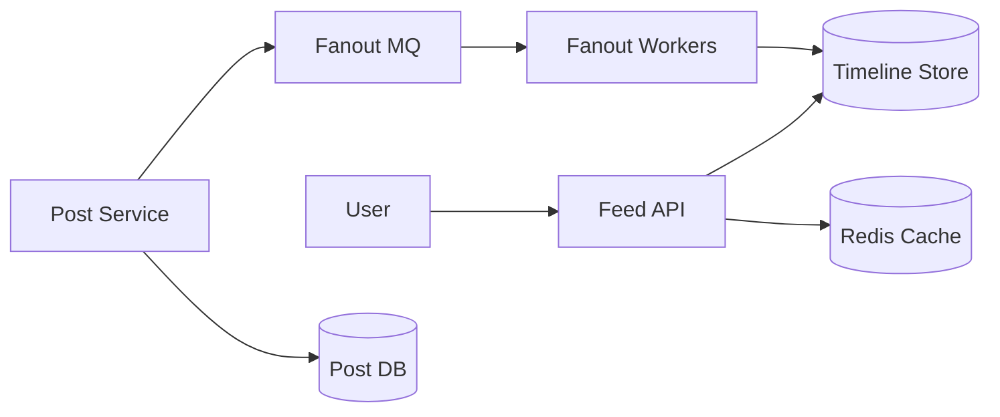
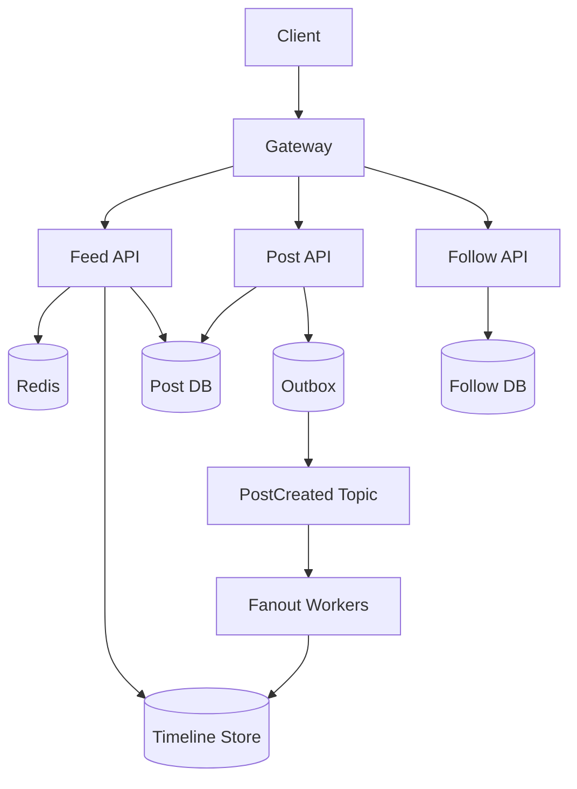
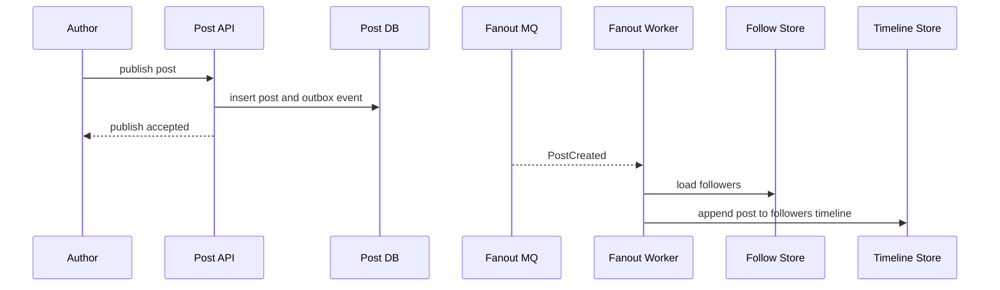
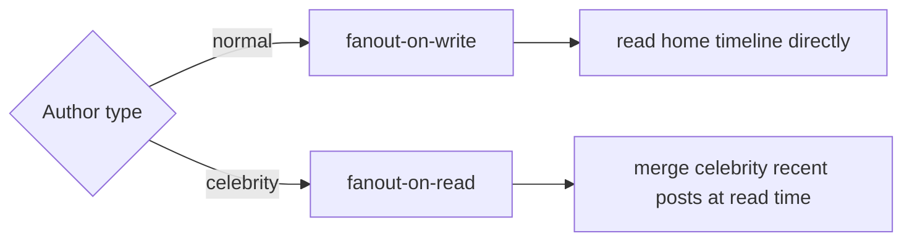
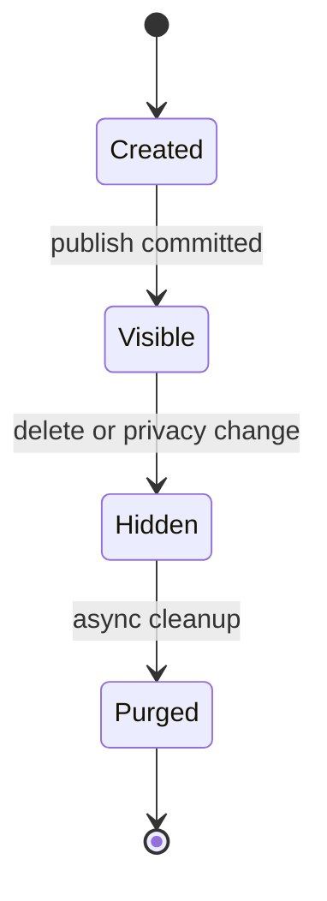
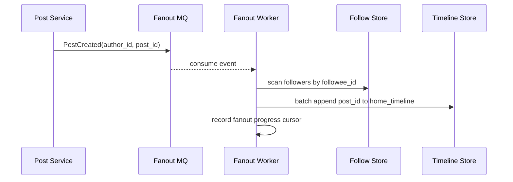
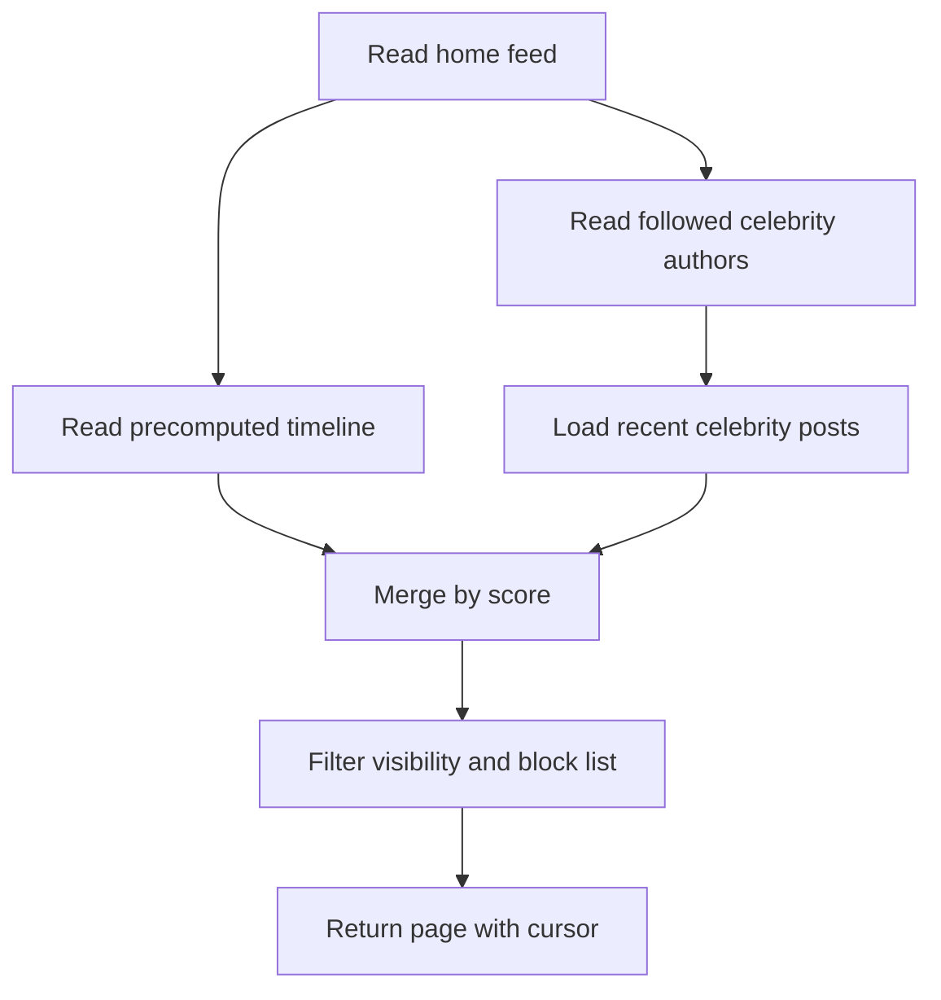
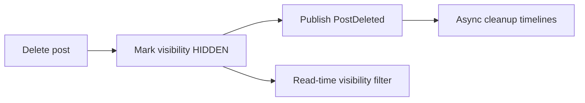

# 微博 Feed 系统设计

微博 Feed 系统的核心不是“发一条动态并查出来”，而是在关注关系、热点用户、实时性和海量读请求之间做取舍。

如果你第一次看到 Feed、fanout、读扩散、写扩散这些词，先不用急着看架构图。可以把微博首页想成一个列表：你关注的人发了什么，系统要把这些内容按时间或推荐分数排好，然后快速返回给你。



## 先理解这些概念

- **Feed**：内容流。微博首页、朋友圈、推荐流都可以叫 Feed。
- **时间线**：按时间或排序分数排列的 Feed。首页时间线一般只存微博 ID，不直接存完整正文。
- **关注关系**：用户 A 关注用户 B，表示 A 的首页可能要看到 B 的微博。
- **Fanout**：一次写入扩散成很多份。B 发一条微博，要不要推给所有粉丝，就是 fanout 问题。
- **写扩散**：B 发微博时，立刻把微博 ID 写进所有粉丝的首页时间线。读首页很快，但大 V 发文会很重。
- **读扩散**：B 发微博时只写 B 自己的微博列表。A 刷首页时，再查 A 关注的人最近发了什么并合并排序。写很轻，但读首页更复杂。
- **最终一致**：B 发微博后，粉丝首页晚几秒看到通常可以接受，不要求所有粉丝时间线立即一致。

这篇文章后面会反复围绕一个问题展开：一条微博到底是在“发的时候”分发，还是在“读的时候”合并。

## 业务场景与核心挑战

用户可以发布微博、关注他人、刷新首页时间线、查看个人主页、点赞评论转发。首页 Feed 要尽量新、快、稳定，同时能承受热点事件中少数大 V 的巨大影响力。

核心挑战：

- 关注关系是大规模多对多图，读写都很频繁。
- 普通用户和大 V 的 fanout 成本完全不同。
- 首页 Feed 要低延迟，但允许秒级最终一致。
- 热点微博、热点用户容易形成 Redis 热 key。
- Feed 分页必须稳定，不能重复或漏数据。

## 功能需求与非功能需求

功能需求：发布微博、关注/取关、首页 Feed、个人主页、互动计数、删除/可见性控制。

非功能需求：

- 首页 Feed P99 低于 500ms。
- 发布微博后普通关注者秒级可见。
- 大 V 发文不能拖垮写入链路。
- 时间线可以最终一致，但删除和权限变更要尽快生效。
- 系统要能降级：互动计数、推荐插入、非核心卡片可暂时隐藏。

## 核心数据模型

| 表/存储 | 关键字段 | 说明 |
| --- | --- | --- |
| `posts` | `post_id`, `author_id`, `content`, `created_at`, `visibility` | 微博正文权威存储 |
| `follows` | `follower_id`, `followee_id`, `created_at` | 关注关系 |
| `home_timeline` | `user_id`, `post_id`, `author_id`, `score` | 用户首页时间线，可存 KV/宽表 |
| `user_posts` | `author_id`, `post_id`, `created_at` | 个人主页列表 |
| `post_counters` | `post_id`, `likes`, `comments`, `reposts` | 互动计数，可异步聚合 |

首页 Feed 的游标建议使用 `score + post_id`，其中 `score` 可以是发布时间或排序分数，`post_id` 用于打破并列。

## 高层架构图



## 关键流程时序图

普通用户发文适合写扩散，也就是 fanout-on-write：发布后异步写入粉丝首页时间线，读 Feed 时直接读预计算列表。



大 V 发文不适合完全写扩散，因为粉丝太多，一条微博可能要写入几百万甚至上千万个首页列表。常见做法是混合模式：普通作者写扩散，大 V 读扩散或延迟合并。



## 一致性与状态机

Feed 系统通常接受最终一致。这里的最终一致是指：发布成功后，个人主页立即可见；首页 Feed 通过 MQ 异步分发，允许短暂延迟，几秒后所有相关时间线逐步追上。

删除和权限变化需要更谨慎：可以先把 `posts.visibility` 标记为不可见，Feed 读取时做二次过滤；后台再异步清理各用户时间线中的引用。



## 高并发瓶颈分析

- **写扩散瓶颈**：大 V 粉丝过多，单条微博产生千万级 timeline 写入。
- **读扩散瓶颈**：用户关注很多人时，每次刷新需要合并多个作者列表。
- **热点 key**：热点微博详情、互动计数、大 V 最近微博容易打满 Redis 单分片。
- **分页稳定性**：Feed 插入新内容时，offset 分页会重复或漏数据，应使用 cursor。
- **互动计数**：点赞评论计数不应同步强一致更新到主链路。

## 缓存、MQ、数据库的使用方式

- Redis 缓存首页第一页、热点微博详情、作者基础信息和互动计数快照。
- MQ 用于微博发布后的 fanout，也就是把一条微博分发到多个粉丝时间线；也用于互动计数异步聚合、搜索索引同步和通知。
- 数据库保存微博正文、关注关系和权限状态，是最终权威来源。
- Timeline Store 是时间线存储，保存“某个用户首页应该看到哪些微博 ID”。它可以用 Redis ZSet、Cassandra/HBase、MySQL 分库分表或专用 KV，取决于规模。
- Outbox 是可靠发消息模式，用于保证微博正文写入成功后，分发事件不会丢。

## 失败场景与补偿

- Fanout worker 失败：事件可重试，失败多次进入 DLQ，修复后按作者和时间范围补发。
- Timeline 写入部分成功：记录 fanout 进度，按粉丝分片重试。
- 删除微博后 Feed 仍看到：读取时根据 post 权限二次过滤，后台异步清理。
- Redis 热点：本地缓存、key 拆分、读副本、返回旧计数。
- MQ 积压：优先保证普通用户发文，降级互动计数和推荐插入。

## 扩展方案与取舍

| 方案 | 优点 | 代价 |
| --- | --- | --- |
| fanout-on-write | 读快，首页 Feed 简单 | 大 V 写放大严重 |
| fanout-on-read | 写轻，适合大 V | 读时聚合成本高 |
| 混合 fanout | 兼顾普通用户和大 V | 逻辑复杂，需要作者分级 |
| 预计算第一页 | 首页极快 | 新鲜度和失效策略复杂 |
| 互动计数异步聚合 | 写链路稳定 | 计数短暂不准 |

## 面试版总结

微博 Feed 可以先讲混合 fanout。fanout 就是“把一条微博分发给很多粉丝”。普通用户发文走写扩散，把微博 ID 异步写入粉丝时间线；大 V 发文不全量扩散，读首页时把大 V 最近微博和用户时间线合并。正文和权限以 Post DB 为准，时间线只存引用。分页用 cursor，热点微博和计数用缓存，发布事件用 Outbox + MQ 保证可靠分发。删除和权限变化通过读时过滤加后台清理保证最终一致。

## 深挖：混合 Fanout 怎么落地

### 业务边界和澄清问题

Feed 系统面试要先澄清“首页 Feed”还是“推荐 Feed”。这两类系统差别很大。

| 问题 | 为什么要问 | 对设计的影响 |
| --- | --- | --- |
| Feed 是关注流还是推荐流？ | 关注流可解释性强，推荐流依赖排序模型 | 关注关系 + fanout，或召回排序系统 |
| 是否要求严格时间序？ | 决定 cursor 和排序字段 | 时间线按 `created_at/post_id`，推荐按 score |
| 发文后多久要可见？ | 决定同步还是异步 fanout | 秒级最终一致通常可接受 |
| 大 V 粉丝量级是多少？ | 决定写扩散阈值 | 超阈值走读扩散 |
| 删除和权限变更多久生效？ | 决定读时过滤和异步清理 | 权限以 Post DB 为准 |

这里按关注流设计：用户首页主要展示关注对象发布的微博，允许秒级延迟，不做复杂推荐排序。

### 容量估算

假设：

```text
DAU：50,000,000
平均关注数：300
日发文用户：5,000,000
日发文量：20,000,000
首页刷新峰值：200,000 QPS
普通用户粉丝中位数：200
大 V 粉丝：1,000,000 到 100,000,000
```

推导：

- 首页刷新远高于发文，所以大部分用户适合写扩散，换取读快。
- 大 V 一条微博不能写入千万粉丝 timeline，否则写放大会拖垮 MQ 和存储。
- Timeline 只存 post id，不存正文，避免重复存大对象。
- 首页第一页必须缓存或预计算，因为它是最高频读取。

### 数据模型和存储选择

关注关系：

```sql
create table follows (
  follower_id bigint not null,
  followee_id bigint not null,
  created_at timestamp not null,
  primary key (follower_id, followee_id)
);

create index idx_follows_followee
on follows(followee_id, follower_id);
```

微博正文：

```sql
create table posts (
  post_id bigint primary key,
  author_id bigint not null,
  content text not null,
  visibility varchar(32) not null,
  created_at timestamp not null
);

create index idx_posts_author_created
on posts(author_id, created_at desc, post_id desc);
```

Timeline Store 可以是 Redis ZSet、宽表或 KV。概念上保存：

```text
home_timeline:{user_id} -> ZSet(score=created_at_or_rank, value=post_id)
user_posts:{author_id} -> ZSet(score=created_at, value=post_id)
feed:first_page:{user_id} -> cached hydrated feed cards, TTL 10s-60s
post:detail:{post_id} -> post snapshot
post:counter:{post_id} -> like/comment/repost count
celebrity:authors -> set(author_id)
```

MQ Topic：

```text
post.created
post.deleted
post.visibility_changed
feed.fanout.normal
feed.fanout.retry
```

### 混合 fanout 策略

常见策略不是二选一，而是按作者粉丝数分层：

| 作者类型 | 粉丝数 | 策略 |
| --- | --- | --- |
| 普通用户 | `< 10,000` | 写扩散到粉丝首页 timeline |
| 中等用户 | `10,000 - 1,000,000` | 分批写扩散，低优先级补齐 |
| 大 V | `> 1,000,000` | 不全量写扩散，读首页时合并其最近微博 |

写扩散流程：



大 V 读扩散流程：



### 读首页的合并算法

读首页不能每次把 300 个关注者全查一遍。可以这样做：

1. 先读用户预计算 timeline 的前 N 条 post id。
2. 查用户关注的大 V 列表，通常数量较少。
3. 拉取这些大 V 最近一小段微博，例如每人 5 到 20 条。
4. 按 `score, post_id` 合并排序。
5. 批量查询正文、作者、计数和权限。
6. 过滤不可见内容，数量不够再补拉。

Cursor 建议包含最后一条的 `score + post_id`，不要用 offset：

```text
cursor = base64({score: 1783846400, post_id: 900001})
```

### 删除、屏蔽和权限变化

Timeline 里只存 post id，所以删除微博时不用强制同步删除所有 timeline。更稳的是：

- 先把 `posts.visibility` 改成 `HIDDEN`。
- Feed 读取时批量校验可见性。
- 后台异步清理 timeline 引用。
- 对热点删除事件，提高异步清理优先级。



### 故障和补偿

| 故障 | 表现 | 处理 |
| --- | --- | --- |
| Fanout worker 失败 | 部分粉丝首页缺微博 | 记录 follower cursor，按分片重试 |
| MQ 积压 | 首页更新时间变慢 | 降级推荐插入，优先普通发文 fanout |
| Timeline 写入部分成功 | 部分用户可见，部分不可见 | fanout progress 表 + 补偿扫描 |
| 大 V 热点读取 | 大 V 最近微博 key 很热 | 本地缓存、读副本、短 TTL 快照 |
| 删除后仍可见 | timeline 残留 post id | 读时权限过滤兜底 |

### 演进路线

| 阶段 | 设计重点 |
| --- | --- |
| 小规模 | 读扩散即可，按关注列表合并最近微博 |
| 中规模 | 普通用户写扩散，首页 timeline 预计算 |
| 大规模 | 混合 fanout，大 V 读扩散，timeline 分布式存储 |
| 超大规模 | 多级缓存、分区域存储、推荐插入、冷热分层、专用 Feed 服务 |

### 10 分钟面试表达

可以按这个顺序讲：

1. 先说明是关注流，不是推荐流。
2. 做容量估算：首页读多，发文写少，但大 V 写放大严重。
3. 数据模型：posts、follows、user_posts、home_timeline。
4. 普通用户发文走写扩散，大 V 走读扩散。
5. 首页读取合并预计算 timeline 和大 V 最近微博。
6. Timeline 只存 post id，正文和权限以 Post DB 为准。
7. 删除和权限变化通过读时过滤兜底，异步清理 timeline。
8. 监控 fanout lag、首页 P99、timeline 写失败、热点 post 读取、MQ 积压。

## 术语回看

- [读扩散 / 写扩散](./glossary.md#读扩散--写扩散)
- [Feed / 时间线](./glossary.md#feed--时间线)
- [Fanout](./glossary.md#fanout)
- [最终一致性](./glossary.md#最终一致性)

## 工程检查清单

- 是否区分普通用户和大 V 的 fanout 策略？
- 首页 Feed 是否使用 cursor 分页而不是 offset？
- Timeline 是否只存 post 引用，读取时是否校验可见性？
- 发布事件是否有 Outbox 或可靠投递机制？
- Fanout 是否可分片、可重试、可补偿？
- 热点微博、热点用户和互动计数是否有缓存保护？
- MQ 积压时是否有优先级和降级策略？

## 延伸阅读

- [Designing Data-Intensive Applications](https://dataintensive.net/)
- [Twitter Engineering: Timelines at Scale](https://blog.x.com/engineering/en_us/a/2013/new-tweets-per-second-record-and-how)
- [Redis: Sorted sets](https://redis.io/docs/latest/develop/data-types/sorted-sets/)
- [Microservices.io: Transactional Outbox](https://microservices.io/patterns/data/transactional-outbox.html)
