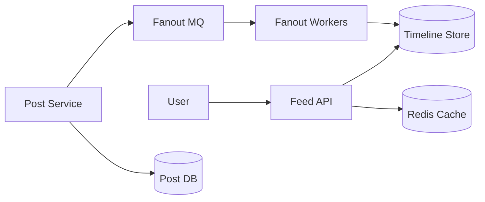
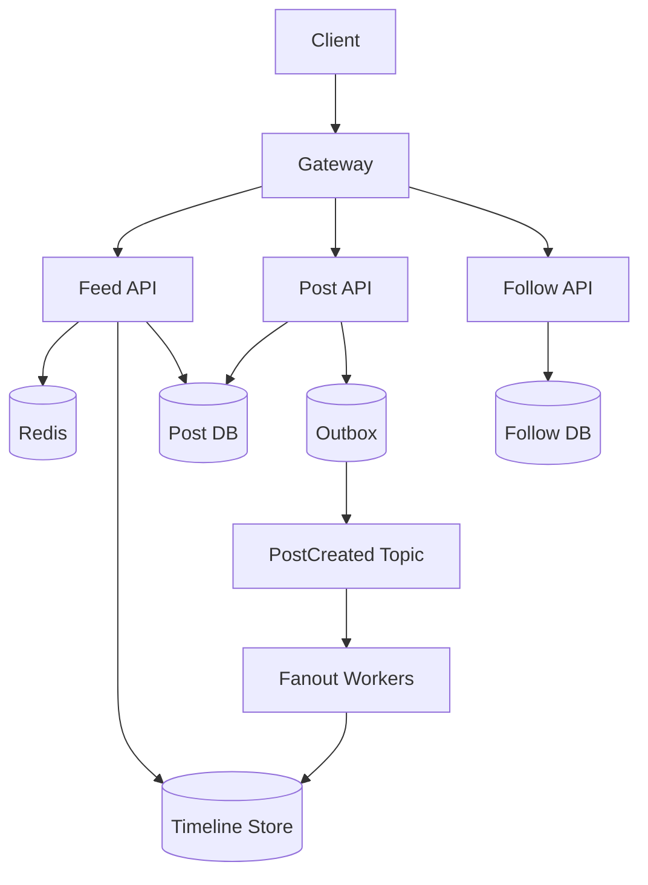
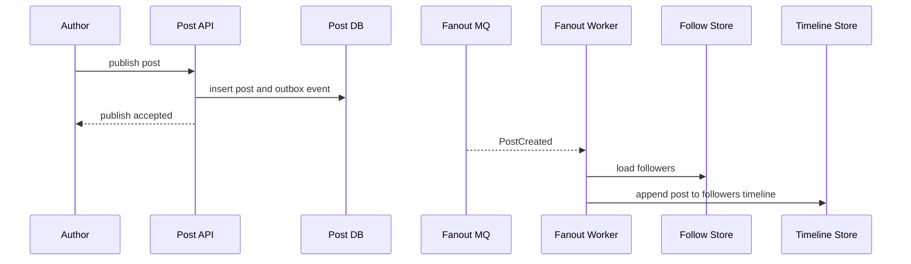
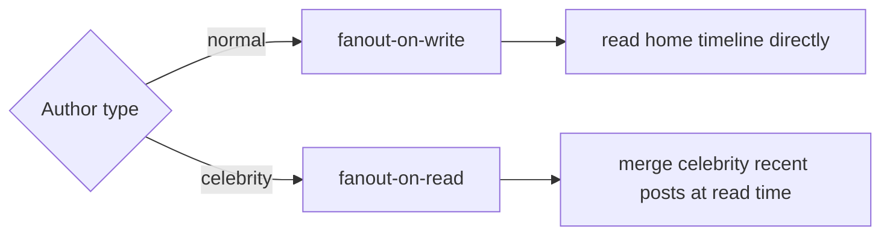
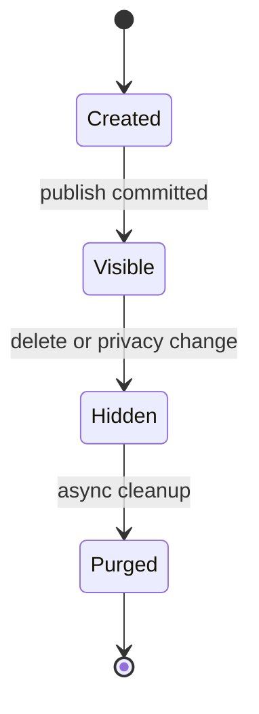

# 微博 Feed 系统设计

微博 Feed 系统的核心不是“发一条动态并查出来”，而是在关注关系、热点用户、实时性和海量读请求之间做取舍。它最典型的设计矛盾是：写扩散能让读很快，但大 V 发文会造成巨大写放大；读扩散写入轻，但每次刷新都要聚合大量关注对象。

## 业务场景与核心挑战

用户可以发布微博、关注他人、刷新首页时间线、查看个人主页、点赞评论转发。首页 Feed 要尽量新、快、稳定，同时能承受热点事件中少数大 V 的巨大影响力。

核心挑战：

- 关注关系是大规模多对多图，读写都很频繁。
- 普通用户和大 V 的 fanout 成本完全不同。
- 首页 Feed 要低延迟，但允许秒级最终一致。
- 热点微博、热点用户容易形成 Redis 热 key。
- Feed 分页必须稳定，不能重复或漏数据。

## 功能需求与非功能需求

功能需求：发布微博、关注/取关、首页 Feed、个人主页、互动计数、删除/可见性控制。

非功能需求：

- 首页 Feed P99 低于 500ms。
- 发布微博后普通关注者秒级可见。
- 大 V 发文不能拖垮写入链路。
- 时间线可以最终一致，但删除和权限变更要尽快生效。
- 系统要能降级：互动计数、推荐插入、非核心卡片可暂时隐藏。

## 核心数据模型

| 表/存储 | 关键字段 | 说明 |
| --- | --- | --- |
| `posts` | `post_id`, `author_id`, `content`, `created_at`, `visibility` | 微博正文权威存储 |
| `follows` | `follower_id`, `followee_id`, `created_at` | 关注关系 |
| `home_timeline` | `user_id`, `post_id`, `author_id`, `score` | 用户首页时间线，可存 KV/宽表 |
| `user_posts` | `author_id`, `post_id`, `created_at` | 个人主页列表 |
| `post_counters` | `post_id`, `likes`, `comments`, `reposts` | 互动计数，可异步聚合 |

首页 Feed 的游标建议使用 `score + post_id`，其中 `score` 可以是发布时间或排序分数，`post_id` 用于打破并列。

## 高层架构图

## 关键流程时序图

普通用户发文适合 fanout-on-write：发布后异步写入粉丝首页时间线，读 Feed 时直接读预计算列表。

大 V 发文不适合完全写扩散，可以使用混合模式：普通作者写扩散，大 V 读扩散或延迟合并。

## 一致性与状态机

Feed 系统通常接受最终一致。发布成功后，个人主页立即可见；首页 Feed 通过 MQ 异步分发，允许短暂延迟。

删除和权限变化需要更谨慎：可以先把 `posts.visibility` 标记为不可见，Feed 读取时做二次过滤；后台再异步清理各用户时间线中的引用。

## 高并发瓶颈分析

- **写扩散瓶颈**：大 V 粉丝过多，单条微博产生千万级 timeline 写入。
- **读扩散瓶颈**：用户关注很多人时，每次刷新需要合并多个作者列表。
- **热点 key**：热点微博详情、互动计数、大 V 最近微博容易打满 Redis 单分片。
- **分页稳定性**：Feed 插入新内容时，offset 分页会重复或漏数据，应使用 cursor。
- **互动计数**：点赞评论计数不应同步强一致更新到主链路。

## 缓存、MQ、数据库的使用方式

- Redis 缓存首页第一页、热点微博详情、作者基础信息和互动计数快照。
- MQ 用于微博发布 fanout、互动计数异步聚合、搜索索引同步和通知。
- 数据库保存微博正文、关注关系和权限状态，是最终权威来源。
- Timeline Store 可以用 Redis ZSet、Cassandra/HBase、MySQL 分库分表或专用 KV，取决于规模。
- Outbox 用于保证微博正文写入成功后，分发事件不会丢。

## 失败场景与补偿

- Fanout worker 失败：事件可重试，失败多次进入 DLQ，修复后按作者和时间范围补发。
- Timeline 写入部分成功：记录 fanout 进度，按粉丝分片重试。
- 删除微博后 Feed 仍看到：读取时根据 post 权限二次过滤，后台异步清理。
- Redis 热点：本地缓存、key 拆分、读副本、返回旧计数。
- MQ 积压：优先保证普通用户发文，降级互动计数和推荐插入。

## 扩展方案与取舍

| 方案 | 优点 | 代价 |
| --- | --- | --- |
| fanout-on-write | 读快，首页 Feed 简单 | 大 V 写放大严重 |
| fanout-on-read | 写轻，适合大 V | 读时聚合成本高 |
| 混合 fanout | 兼顾普通用户和大 V | 逻辑复杂，需要作者分级 |
| 预计算第一页 | 首页极快 | 新鲜度和失效策略复杂 |
| 互动计数异步聚合 | 写链路稳定 | 计数短暂不准 |

## 面试版总结

微博 Feed 可以先讲混合 fanout。普通用户发文走写扩散，把微博 ID 异步写入粉丝时间线；大 V 发文不全量扩散，读首页时把大 V 最近微博和用户 timeline 合并。正文和权限以 Post DB 为准，时间线只存引用。分页用 cursor，热点微博和计数用缓存，发布事件用 Outbox + MQ 保证可靠分发。删除和权限变化通过读时过滤加后台清理保证最终一致。

## 工程检查清单

- 是否区分普通用户和大 V 的 fanout 策略？
- 首页 Feed 是否使用 cursor 分页而不是 offset？
- Timeline 是否只存 post 引用，读取时是否校验可见性？
- 发布事件是否有 Outbox 或可靠投递机制？
- Fanout 是否可分片、可重试、可补偿？
- 热点微博、热点用户和互动计数是否有缓存保护？
- MQ 积压时是否有优先级和降级策略？

## 延伸阅读

- [Designing Data-Intensive Applications](https://dataintensive.net/)
- [Twitter Engineering: Timelines at Scale](https://blog.x.com/engineering/en_us/a/2013/new-tweets-per-second-record-and-how)
- [Redis: Sorted sets](https://redis.io/docs/latest/develop/data-types/sorted-sets/)
- [Microservices.io: Transactional Outbox](https://microservices.io/patterns/data/transactional-outbox.html)
